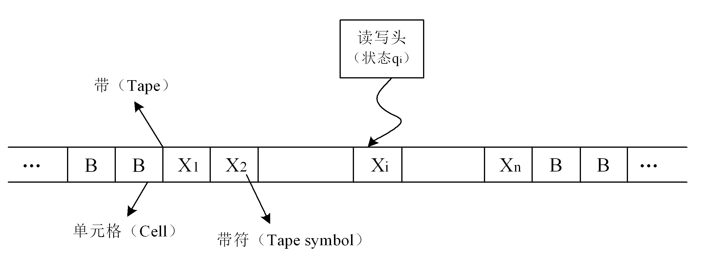
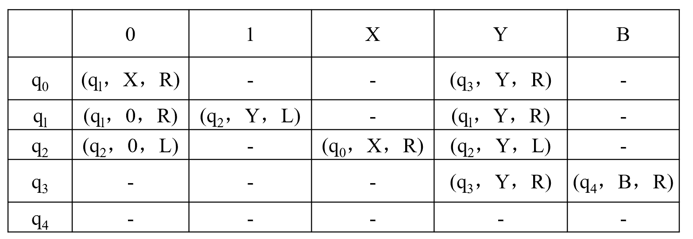

<!-- _class: lead -->

## **计算与计算模型**

---

### **图灵**

> *Alan Mathison Turing* 是英国著名的数学家和逻辑学家，他一生所做出的最大的贡献，就是设计了理论计算机，为后人设计实用计算机奠定了思路和理论基石。由此，图灵也被称为计算机理论之父。

+ 1936年，图灵发表了一篇题为《论可计算数及其在判定问题中的应用》的论文，论文从一个全新的角度给出了可计算函数的定义，即说明了*什么问题是可计算的*。

---

### **图灵机**

> 图灵机（Turing Machine，TM）不是一种具体的机器，而是一种思想模型，所以也称为图灵模型。它的基本思想就是：用机器来模拟人们用笔和纸进行数学运算的过程。或者说，图灵机是将计算与自动进行的机械操作联系在一起的一种模型。
+ 图灵将人的计算过程看作两个简单的动作：（1）在纸上写上或擦除某个符号；（2）将注意力从纸上的一个位置移动到另一个位置，而每一次的下一步动作走向依赖于人当前所关注的纸上某个位置的符号及当前的思维状态。

---

### **图灵机模型**

---

### **图灵机模型**

+ 一条右端可无限延长的纸带Type。纸带被划分成一个个连续的方格，称为单元格。每个单元格中可包含一个来自有限字母表的符号（称为带符），字母表中有一个特殊的符号表示空白。
+ 一个读写头Head。该读写头可以在纸带上左右移动，它能读出当前所指的格子上的符号，并能改变当前格子上的符号。
+ 一套控制规则Table（即程序）。Table包括：当前读写头的内部状态，输入数值，输出数值，下一时刻的内部状态。
+ 一组内部状态（图1-3中盒子上的小方块）。它用来保存图灵机当前所处的状态。

---

### **图灵机的形式化描述**

+ 图灵模型（TM）可以描述为一个五元组：
+ M=（Q，Σ，δ，B，H）

>Q：图灵机状态的有穷集合。
>Σ：带符号的有穷集合。
>δ：控制规则集合
>B：初始状态，属于Q，开始时图灵机就处于q0状态。
> H：停机状态，是Q的子集（H∈Q）。当控制器内部状态为停机状态时，图灵机结束计算。

---

### **图灵机的工作过程**

图灵机只要根据每一时刻读写头读到的信息和当前的内部状态，查规则表，就可以得出它下一时刻的内部状态和输出动作。

---
### **计算**

+ 所谓*计算*，抽象地讲，就是从一个符号串X变成另一个符号串Y的过程。计算是按照一定的、有限的规则和步骤（算法），将输入转换为输出的过程。
+ 从数学的角度，计算主要可以分为数值计算和符号推导两大类。
+ "利用计算机分析和解决相关问题"的能力成为每一位科学工作者应具备的基本素质。这种能力也称为*计算思维*能力，即运用计算机科学的基础概念进行问题求解、系统设计、以及人类行为理解等一系列思维活动。与数学不同的是，计算机科学既要研究算法分析与设计理论，也同时要考虑如何在计算机上实现算法并解决实际问题。

---

### **可计算性理论**

+ 是研究计算的一般性质的数学理论。研究哪些是可计算的，哪些是不可计算的，通常，人们把能用"笔"在"纸"上经有限步计算就可得到结果的问题，称为可计算的问题。
+ 算法具备的特征是：有限性、可执行性、机械性、确定性和终止性。
+ 能用图灵机计算的函数是算法可计算函数（即：是可计算的），而图灵机不能计算的函数则是不可计算的函数。像哥德巴赫猜想这样的问题就不属于"可计算问题"之列，因为计算机没有办法给出数学意义上的证明。
