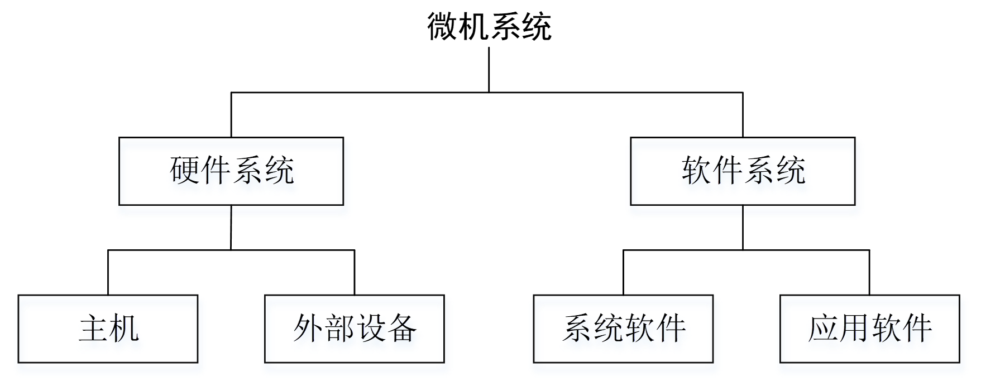
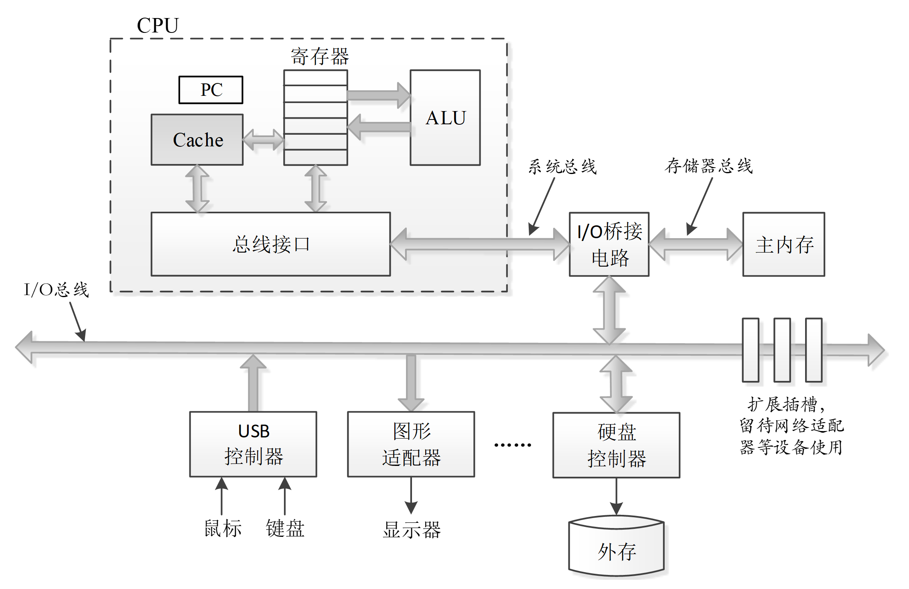
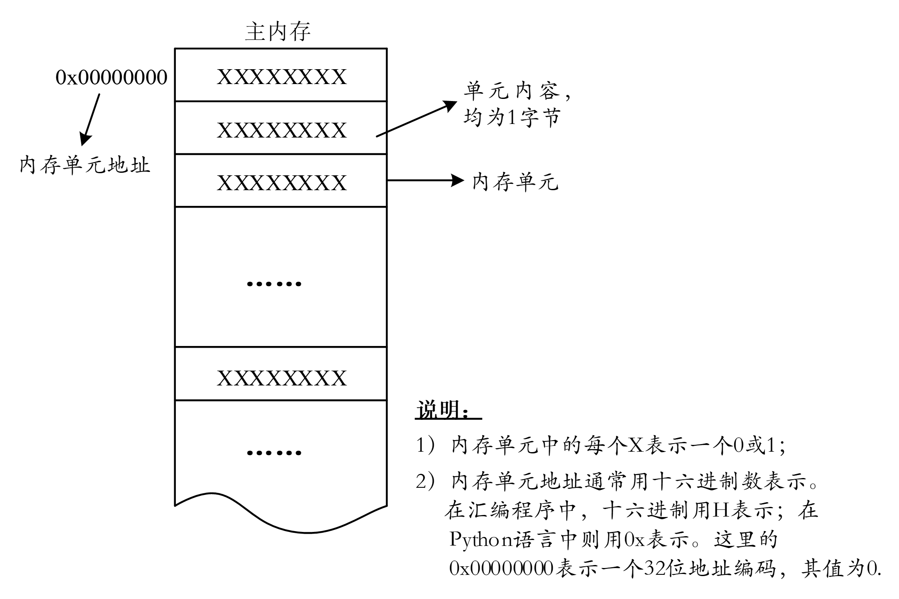
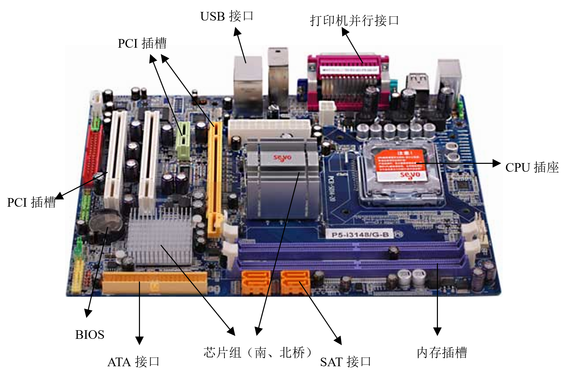

<!-- _class: lead -->

## **程序**

---

### **程序在计算机中的表示与执行**

+ 今天的程序员绝大多数情况下都会使用各种*高级语言*来表述自己的设计思想。

```c
#include<stdio.h>
int main(){
    printf("Hello world!\n");
}
```
无论使用哪种程序设计语言，程序员都需要利用编辑器（如VS Code）编写源程序并保存为源文件。这段源程序起名为Hello.c。

---

### **程序在计算机中的表示与执行**
>计算机中的信息都是0和1
>由于计算机惟一能够直接识别和处理的只有0和1表示的二进制，因此输入计算机的每一个字符或数值，都要用0和1组成的位（bit）序列表示，每8位（bit）被组织成一组，称为1字节（Byte）。

+ 系统中的所有信息，无论是程序、还是程序运行的数据、或文件等，都是用一串0和1表示的位串。区分不同位串的方法是读取这些数据对象时的上下文。一个同样的字节序列在不同的上下文中，可能表示一个整数、机器指令、字符串、图像中的像素点位置等。

---

### **从源程序到能够被计算机执行的程序**

+ 编译：程序中的每条C语句都需要被翻译成用0和1表示的机器指令，编译器就负责完成这一工作。
+ 汇编：在编译器将源程序翻译成汇编语言程序（Hello.s）之后，汇编程序将汇编语言指令翻译成机器语言指令，把这些指令打包成一种称为重定位目标程序。
+ 链接：一些标准库函数都已进行了编译。printf函数是C语言的标准库函数，链接程序就负责完成自编写代码与标准库的合并。链接后，就得到了一个可以执行的、后缀为.exe的可执行文件。

---

## **计算机程序设计语言的分类**

+ 计算机程序设计语言总体上可以分为面向机器的*低级语言*和与具体硬件系统无关的*高级语言*。
+ 各种高级程序设计语言要被计算机识别并执行，需要一个"翻译"过程。
+ 解释程序是从源程序第1行开始，逐行实时解释并执行，不生成独立的可执行文件，每次运行都需要解释器重新解析代码。其主要优势是可以适配不同操作系统平台（称为跨平台）。
+ Python属于解释型语言，而C、C++等语言则为编译型语言。

---

### **微机系统的概念结构**

+ 计算机系统中的资源总体上可以分为*软件和硬件*两大类，也称为软件系统和硬件系统。硬件系统是计算机工作的物理基础，但要使其正常工作并完成各种任务，还必须要有相应的软件支撑。
+ 软件系统包括*系统软件和应用软件两类*。我们开机就能看到的操作系统就是典型的系统软件，而实现各种特定功能的程序则称为应用软件。

---

### **微机系统**



"主机"是一个概念，通常指计算机硬件中除了外部设备之外的部件，在无特殊说明的情况下，计算机的硬件系统都特指主机。

---

### **典型微机系统的硬件组成模型**



---

### **CPU**

中央处理单元（Central Processing Unit，CPU）简称处理器，是执行（或解释）存储在主内存中的程序指令的引擎，是整个系统的核心。总体上，一个处理器内部可以包括*运算器、控制器逻辑单元（Controller）和一组寄存器（Rregister）*。

**运算器**的主要部件是算术逻辑单元ALU（Arithmetic Logical Unit），它是运算器的主体。ALU的主要功能是在控制信号的作用下完成如算术运算（浮点运算）、移位操作、逻辑运算等程序指令的执行。运算产生的中间结果可以存放在CPU的内部寄存器中。

---

### **CPU**

**控制逻辑单元**（也称控制器）主要用于控制和协调整个CPU的工作，是整个CPU的指挥控制中心。CPU的工作基准是时钟信号。这是一组周期恒定的脉冲信号，不同的时刻CPU做不同的工作，它们在时间上有着严格的关系，称为时序。

**内部寄存器**是CPU内部一组小的存储设备，由若干可以存储1个字长的寄存器组成，每个寄存器都有唯一的名字。寄存器的作用主要有两大类，一是用于暂时存储中间运算结果的通用寄存器，二是承担辅助控制角色的各种专用寄存器。

---

### **总线接口**（Bus Interface Unit，BIU）

+ 它是CPU中的一个核心功能模块，是CPU芯片上实际连接到主板总线（地址线、数据线、控制线）的物理引脚或焊点，是CPU内部负责管理所有进出CPU核心的数据传输的专用硬件单元。充当着‌CPU核心与内存和其他输入/输出设备进行通信的桥梁和交通指挥官‌，负责生成地址、收发数据、控制总线时序、进行缓冲、并遵守总线协议等，是CPU不可或缺的一部分，没有它，CPU就无法获取指令、读写数据，也就无法正常工作。

---

### **存储器（Memory）**

+ 计算机中的存储器总体上可以分为*外存储器和内存储器*两种类型。无论是外存还是内存，对它们的操作都有两种，即"读"和"写"。
+ "读"表示从存储器中输出数据，也称为读取，其本质是将指定地址中的内容"复制"到目标地址（如CPU的寄存器）中，并不会改变存储器相应地址中的内容。故读操作是"非破坏性"操作。
+ "写"表示向存储器输入数据，也称为写入，是将目标地址中的内容"放入"到存储器指定地址中，该地址中原先的内容会被覆盖。因此，写操作属于"破坏性"操作。

---

### **总线（Bus）**

+ 总线是贯穿整个系统的一组电子管道，是计算机系统中各功能部件之间传输地址、数据和控制信息的公共通路。一条线路在同一时间内仅能传输1个比特（即1位0或1）。因此，必须同时采用多条线路才能传送更多数据。
+ 线路的条数就是总线的宽度，称为位宽（Width）。现代计算机的字长多为64位或32位（称为1个字），故总线的位宽也就是64位或32位，即每次传送1个字的数据。

---

### **总线带宽**

$$ 总线带宽 = 频率 x 宽度/8（Bytes/sec）$$

>总线带宽表示单位时间内可以传输的总数据量，单位为每秒传输的字节数。

+ 总线由一组导线和相关的控制、驱动电路组成。它的特点在于其公用性，即它可同时挂接多个部件或设备（对于只连接两个部件或设备的信息通道，不称其为总线）。总线上任何一个部件发送的信息，都可被连接到总线上的其他所有设备接收到，但某一个时刻只能有一个设备进行信息传送。所以，当总线上挂接的部件过多时，就容易引起总线争用，使对信号响应的实时性降低。

---

### **输入输出设备和输入输出接口**

+ 输入输出设备（Input/Output Devices，I/O设备）是可以与计算机系统进行通信、但又必须通过输入输出接口（Input/Output Interface）才能进行通信的设备。示例系统中给出了4个输入/输出设备：键盘、鼠标、显示器、以及用于长期存储数据和程序的硬盘。
+ 这些只是微机系统的基本外部设备（I/O设备）。事实上，I/O设备的种类繁多，结构、原理各异，有机械式、电子式、电磁式等。与CPU相比，I/O设备的工作速度较低，处理的信息从数据格式到逻辑时序一般都不可能与计算机直接兼容。因此，计算机与I/O设备间的连接和信息交换不能直接进行，必须通过一个中间部件（即I/O接口）作为两者之间的桥梁。

---

### **微机中的存储器**

>计算机中的存储器总体上可以分为内存储器和外存储器两大类。内存储器主要由半导体材料制成，故也称*半导体存储器*，主要包含两大类：*随机存取存储器（Random Access Memory，RAM）和只读存储器（Read-Only Memory，ROM）*。

---

### **内存储器**

- 可以与CPU直接进行信息交换。常说的系统内核主要就是指处理器和内存。
- 存取速度快、容量小、单位字节容量价格较高。
- 对主要由RAM构成的内存，需要后备电源，*当断电时，其上存放的信息将丢失*。这也是RAM和ROM两类半导体存储器的主要区别之一。ROM可以不需要后备电源，断电后存储的内容不会消失，对此大家从对闪存（如优盘）的使用就可以直接感知到。

---

### **内存结构**

+ 从逻辑上，内存是单元的线性结构，每个单元中的1字节数称为单元内容，单元的数量称为内存容量，取决于系统对内存的管理能力（寻址能力）。由于每个单元均存储1字节（Byte）数据，故内存容量的单位通常用字节表示，如：内存为16GB（Gigabyte）的含义是有16千兆个内存单元。

---

### **内存结构**


---

### **主内存**（Main memory）

+ 就是我们常说的内存条。它在物理上是一个独立于CPU的部件。主内存通常由称为DRAM的半导体器件构成，它是RAM的一种，称为动态随机存取存储器（Dynamic Random-Access Memory），它用电容作为存储元（可以存储1位0或1的器件），电路简单。

---

### **外存储器**

+ 外存储器包括联机外存和脱机外存两种，用于存放CPU不直接执行、但可以长期保留的数据。脱机外存有光驱、磁带、移动存储器等，由复合材料（如光盘）、磁性材料或半导体材料（如优盘）构成。它们可以脱离计算机而存在，所以理论上可以存放无限多的数据。

+ 在个人计算机中，联机外存可以是制作材料以铝合金为主的机械硬盘（Hard Disk Drive，HDD）或由半导体材料制作的固态硬盘（Solid State Disk，SSD）。
+ 存放在外存储器中的信息不会因计算机关闭而丢失，即不受电源断电的影响。这使得我们可以放心地将各种数据信息（音乐、图片、文档等）存放在外存中。

---

### **主机板**

+ 主机板也称主板（Mainboard）或系统板（System Board），位于主机箱内，是计算机最基本的同时也是最重要的部件之一，上面安装了组成计算机的主要电路系统，主要包括芯片、扩展槽和对外接口三种类型的部件，是微机硬件系统的物理构成。可以说，主板的类型和档次决定着整个微机系统的类型和档次，主板的性能影响着整个微机系统的性能。

---

### **主机板**

