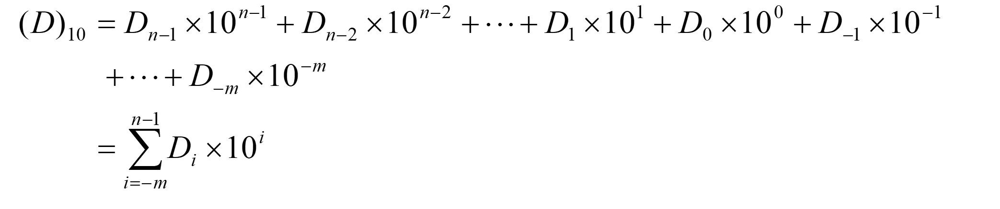
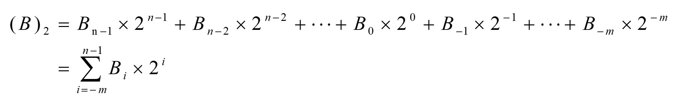
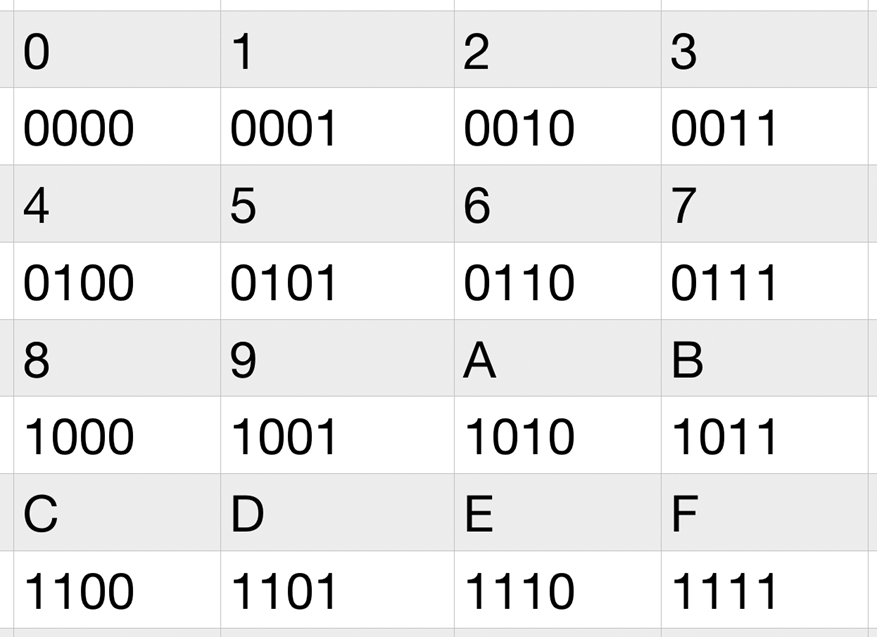

<!-- _class: lead -->
## **第2章 数制与编码**
## **计算机与二进制**

---

### **为什么采用二进制**
> 十进制有10个符号，意味着需要有10种稳定状态与之对应。要实现10种稳定状态的电子器件比较困难，但实现两种稳定状态却非常容易。比如开关的"断开"与"闭合"，晶体管的"导通"和"截止"，等。如果用1位0和1分别表示这两种状态，则两位0和1就可以表示4种不同的状态。

---

### **十进制数**

>最熟悉的计数制，有0～9十个数字符号，用符号D标识。一个任意十进制数可用权展开式表示为：

---

### **二进制数**

二进制（Binary）数由0和1两个符号组成，用符号B标识，遵循逢二进位的法则。一个二进制数B可用其权展开式表示为：

---

### **十六进制数**

> 十六进制（Hex）数共有16个数字符号，0～9及A～F，用符号H标识。其中：A相当于十进制的10，相应地B=11，以此类推。

+ 有了二进制和十进制，已经是既满足了计算机的要求，又满足了人的要求，那为什么还要引入十六进制呢？主要的原因就是我们前边提到的既可以缩短书写长度，又与二进制有直接的对应关系。

---

### **非十进制数转换为十进制数**

>非十进制数转换为十进制数的方法比较简单，只要将它们按相应的权表达式展开，再按十进制运算规则求和，即可得到它们对应的十进制数。

$$1101.101\mathrm{B} = 1\times2^{3} + 1\times2^{2} + 0\times2^{1} + 1\times2^{0} + 1\times2^{-1} + 0\times2^{-2} + 1\times2^{-3} = 13.625$$

---

### **十进制数转换为非十进制数**

+ 十进制转换为非十进制（K进制）数时，整数和小数部分应分别进行转换。整数部分转换为K进制数时采用"除K取余"的方法。即连续除K并取余数作为结果，直至商为0，得到的余数从低位到高位依次排列即得到转换后K进制数的整数部分；
+ 对小数部分，则用"乘K取整"的方法。即对小数部分连续用K乘，以最先得到的乘积的整数部分为最高位，**直至达到所要求的精度或小数部分为零为止**。

---

### **非十进制数之间的转换**

+ 二进制数与十六进制数、八进制数之间都存在有特殊的关系。一位十六进制数可用4位二进制数来表示，而一位八进制数可用3位二进制数表示，且它们之间的关系是唯一的。这就使得十六进制数与二进制数之间、八进制数与二进制数之间的转换都非常容易。

---

### **二进制数转换为十六进制数**

