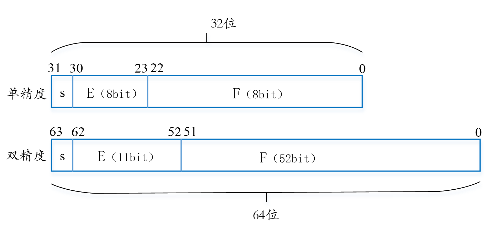

<!-- _class: lead -->

## **二进制数的表示和算术运算**

---

### **无符号数**

> 数有正数和负数。所谓无符号（unsigned）就是没有符号位，故无符号数在一定程度上可以类比于数学中的自然数，都属于没有符号的数（不考虑正负）。

+ 无符号数是表示大于或等于零的数，即非负整数。数中的每一位0或1都是有效的或有意义的数据。如：10010110B是一个二进制数，该数中的每一位都是有意义的，其对应的十进制数值为150。

---

### **无符号数**

+ 无符号n位二进制整数的表数范围为：

$$ 0≤X≤2^{n}-1 $$

> 例如：8位（n=8）无符号数的表数范围是：

$$ 0～2^{8}，即0～255。$$

---

### **无符号数的运算**

> 二进制的算术运算和十进制一样，也包含加、减、乘、除四则运算。由于二进制中只有0和1两个数，故相对于十进制，其运算要更加简单。表2-3给出了在不考虑正负情况下的二进制四则运算法则。

+ 已知两个8位二进制数：10110110B和00001111B。分别计算这两个数的和、差、积。

---

### **有符号整数**

> 十进制数有正数和负数，二进制数也同样有正、负数之分。面向人的数符用"+"和"-"表示，作为面向计算机的二进制数，数符只能用0和1表示。
+ 为了描述方便，通常将一个数值数据的机内编码称为*机器数*，它所代表的实际值称为机器数的*真值*（也可以理解为绝对值）。
+ 为了使负数也能参与运算，并尽可能简化实现二进制算术运算的规则，机器数用"0"表示"+"，用"1"表示"-"，数据的数值则用多位二进制表示（具体的二进制位数与计算机字长相关）。

---

### **符号数的表示**

> 有符号数的最高位不是有意义的数据，而是符号位。因此，有符号数的有效数值就比相同字长的无符号数要小。相应地，其表数范围也就不同。以8位字长为例，其最大正数是+127。

+ 总体上，有符号数有*原码、反码和补码*三种编码方法。

---

### **原码**

> 原码（Sign-Magnitude）是一种简单的二进制编码表达形式，最高位用作符号位，0表示正数，1表示负数，其余位表示数的绝对值（也称真值）。简单地讲，就是：符号位+真值。

+ 已知真值X=+42，Y=-42，

因为(+42)~10~=+0101010B，(-42)~10~=-0101010B，根据原码表示法，有：

$$\boxed{[X]_{\text{原}} = \underline{0}\ \underline{0101010}, \quad [Y]_{\text{原}} = \underline{1}\ \underline{0101010}}$$

---

### **0的原码**

> 根据原码的定义，我们可以发现一个有趣的现象。即：真值0的原码可表示为两种不同的形式：+0和-0。以8位字长数为例：

$$ [+0]_{原} = 00000000 $$
$$ [-0]_{原} = 10000000 $$

+ 作为*数字基准的0在表达形式上不惟一*，这是原码表示法的一大缺点。

---

### **反码**

+ 反码（One's-complement）是原码基础上的变形。
+ 对正数，*反码的表示方法与原码相同*，即最高位为"0"，其余是数值部分。对负数，其最高位依然是符号位，用"1"表示，*但数值部分是对应原码数值的所有二进制位按位取反*。
+ 已知真值X=+42，Y=-42，
$$ [X]_{反} = 00101010 $$
$$ [Y]_{反} = 11010101 $$

+ *对一个用反码表示的负数，其数值部分不再是绝对值。*

---

### **0的反码**

在反码表示法中，同原码一样，数0也有两种表示形式（以8位字长数为例）：

$$ [+0]_{反} = 00000000 $$

$$ [-0]_{反} = 11111111 $$

+ 在原码和反码表示法中，数值0的表示都不唯一，且运算器的设计比较复杂。因此目前在*微处理器中已较少使用这两种表示方法*。

---

### **补码**

+ 补码（Two's-complement）是计算机中最常见的有符号数编码表达方法。
+ 对正数，补码与反码和原码的表示方法相同，即最高位为"0"，其余是数值部分。对负数，补码表示与原码和反码不同，其最高位的符号位不变，但其余数值部分是*反码的数值部分加1*，即将原码的绝对值按位取反再加1。
+ 真值X=+42，Y=-42，

$$ [X]_{补} = [X]_{反} = [X]_{原} = 00101010 $$
$$ [Y]_{补} = [Y]_{反} + 1 = 11010101 + 1 = 11010110 $$

---

### **0的补码**

+ 不同于原码和反码，数0的补码表示是唯一的。仍以8位字长数为例，由补码的定义知：

$$ [+0]_{补} = [+0]_{反} = [+0]_原 = 00000000 $$

$$ [-0]_{补} = [-0]_{反} + 1 = 11111111 + 1 = 00000000 $$

---

### **补码的运算**

> 引入补码的主要目的是将减法运算转换为加法运算（这样可以不必再专门设计硬件减法器）。

设字长n=8，用补码的概念计算96-20。
$$ 96-20=96+(-20)=96+(256-20)=96+236=256+76=76 $$

---

### **浮点数**

> 在计算机系统的发展过程中，曾经提出过多种实数表示方法。每个计算机厂商都在设计自己的浮点数表示规则和对浮点数执行运算的细节。到1985年，IEEE(Institute of Electrical and Electronics Engineers)提出了IEEE-754标准，并以此作为浮点数表示的统一标准。目前，所有的计算机都支持这个被称为IEEE浮点的标准，从而大大改善了应用程序在不同机器上的可移植性。

---

### **二进制小数**

+ 一个二进制数b可以表示为：
$$\sum_{i = - n}^{m}{2^{i} \times b_{i}}$$
小数点右侧各位的权值是2的负幂。可以看出，小数点每向左移动一位，相当于对这个数除以2；小数点每向右移动一位，则相当于对这个数乘以2。

---

### **定点数**

> 早期的计算机中没有执行浮点运算的器件，数的表示均采用定点表示法，即小数点固定在一个规定的位置上。整数可以看作是小数点固定在最低位右侧的数，若将小数点固定在符号位之后，则称为纯小数。
>定点表示法在硬件上较为简单，但存在诸多缺点。首先，定点小数在运算时，通常需要利用软件将数据经过合适的"比例因子"转化为纯小数，计算结果再用比例因子折算成真实值，运算速度慢*。*

---

### **IEEE浮点表示**

+ IEEE浮点标准采用如下形式来表示1个数：

$$ X=±F\times2^{E} $$

+ E称为阶码（Exponent），即指数值，为带符号整数，其作用是为浮点数加权；F表示尾数（Significand），通常是带符号的纯小数。这种用阶码和尾数表示的数称为浮点数。

---

### **IEEE浮点表示**

