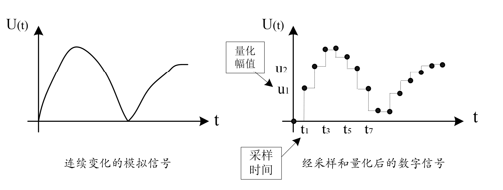
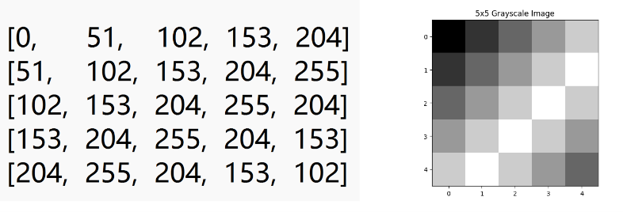
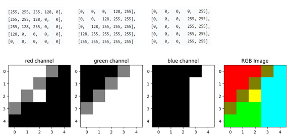

<!-- _class: lead -->

## **二进制信息编码**

---

### **西文字符编码**

>西文字符，包括字母、数字、符号及特殊控制字符。西文字符编码方式很多，目前国际上广泛使用的是为美国英语通信所设计的ASCII码（American Standard Code for Information Interchange，美国标准信息交换码），分为标准ASCII码和扩展ASCII码两种。

+ 标准ASCII码用7位（bit）二进制码表示，可表示128个字符，包含英文大小写字母、数字0～9、标点符号、非打印字符（换行符、制表符等4个）以及控制字符（退格、响铃等）。一个字符对应一个编码。

---

### **扩展的ASCII码**

> 为了表示更多的欧洲常用字符（如德语中的字母Ü），对标准ASCII进行了扩展。扩展ASCII由8位二进制数码组成，这样就可以表示256种不同的符号（128～255之间的字符常用于画图和画线，以及一些特殊的欧洲字符）。

---

### **中文字符的编码**

> 汉字是象形文字，要让计算机能够处理汉字，首先要解决的就是汉字字符的键盘输入问题，之后才是处理和存储。

+ 汉字外码。*汉字外码*也称输入码，主要解决如何将每个汉字变成可以直接从键盘输入的代码。目前的汉字输入码主要可分为：字音编码、字形编码、形音编码和数字编码4类。
>中国国家标准局规定将所有汉字和字符组成一个96×96的矩阵，每个汉字或字符都属于矩阵中的一个点，有对应的行号（称为"区"）和列号（称为"位"），这种编码就是区位码。如：汉字"啊"在矩阵的第16行、第1列，所以其区位码是"1601"。

---

### **机内码**

> 机内码是汉字在计算机中的编码。主要有国标码、BIG5码（主要在台湾和香港地区使用）等。汉字的字符集非常大。国标码GB2312-80中，共收集了6763个汉字，682个非汉字符号（外文、字母、数字、各种图形等），每个汉字对应一个国标码。

+ 由于汉字数量较大，国标码规定汉字机内码用2字节表示，其编码方法是：高字节和低字节分别在区码和位码的基础上加上二进制数10100000。即：

+ 机内码高8位=区码+10100000，机内码低8位=位码+10100000

---

### **unicode**

+ 为了形成一种能涵盖世界不同文字字符的编码，国际标准组织创建了通用字符编码Unicode（Universal Multiple Octet Coded Character Set）。
+ Unicode 编码系统可分为编码方式和实现方式两个层次Unicode是国际组织制定的可以容纳世界上所有文字和符号的字符编码方案。Unicode用数字0-0x10FFFFF来映射这些字符，目前是1,114,112个字符或码位
+ 而UTF-8、UTF-16、UTF-32都是将数字转换到程序数据的编码方案

---

### **UTF**
> UTF（Universal Transformation Format）。最常见的UTF格式是UTF-8。

+ UTF-8（8-bit Unicode Transformation Format）它是一种针对Unicode的可变长度字符编码，用1到4个字节编码UNICODE字符。是又一种可以在计算机中表示汉字的编码。

---

### **输出编码**

+ 要将汉字输出显示，还必须将机内码转换为输出编码。汉字的输出编码用于表示不同字体的汉字字型，分为字形码和矢量汉字两种。
+ 字形码是确定一个汉字字形点阵的代码，字形点阵中的每个点对应一个二进制位。每个汉字对应一个点阵，再编上代号存入存储器中，这就是字模库。汉字在显示时需要在汉字库中查找汉字字模并以字模点阵码形式输出。
+ 汉字的另一种输出码是矢量汉字。矢量字库保存每一个汉字的描述信息，如一个笔划的起始、终止坐标，半径、弧度等。

---

### **音频信息编码**

> 计算机中存储和处理的信息除数值和文字外，还有各类被称为多媒体的信息，包括声音、图像、视频等。与数值和字符信息不同，这些信息都是连续变化的模拟信号，无法直接用计算机进行存储和处理，必须要首先转换为由0和1组成的二进制位串，这一过程称为*数字化*。

---

### **声音信息的数字化**

> 声音是通过空气传播的一种连续的波，将这种在时间和幅值上都连续变化的信号称为模拟信号。相应的，将时间和幅值都不连续的信号称为离散信号。

+ 要使连续变化的声音信号能够被计算机处理，首先需要对其进行数字化，即在时间和幅值上都离散的信号。
+ 将时间和幅值均连续变化的模拟声音信号，通过采样（Sampling）和量化（Measuring），转换为时间和幅值均不连续的离散信号，这种离散的声音信号称为数字音频信号，也就是计算机能够存储和处理的信号。

---

### **离散化**

---

### **采样和量化**

+ 采样是在某些特定的时刻对模拟信号进行测量，由于测量的时间不连续，所以得到的信号在时间上是离散的，称为*离散时间信号*。
+ 虽然采样可以实现时间上的离散性，但得到的信号幅值却可以是无穷多个实数值中的一个，即：幅度还是连续的（数字信号要求时间和幅值都是非连续的离散值）。因此，还需要对幅值进行离散化，这个过程叫做*量化（Measuring）*。
+ 量化是把信号幅值的取值数目加以限定，由有限个数值组成，形成**离散幅度信号**（Discrete amplitude signal）

---

### **采用频率与采用精度**

+ 将单位时间里的采用次数称为*采样频率*；将量化值的取值个数称为量化级别，而将表示量化级别的二进制数位数称为**采样精度**（Sampling precision），也叫**样本位数**或**位深度，**用bit表示。
+ 根据奈奎斯特采用定理（Nyqust Sampling Theory），如果采样频率不低于信号最高频率的两倍，就能把以数字表达的声音还原成原来的声音。例如：一般音频信号的最高频率为20kHz，当采样频率在40kHz以上时，就能无失真地还原出原来的声音。

---

### **占用的空间**

$$ 音频文件(KB) = 采样频率(KHz)×样本位数(bit)×时间长度（秒）/8 $$

+ 采样频率为8kHz，样本位数为8位，计算1分钟的双声道声音文件的数据量。

$$ 数据量=8(bit)×8kHz×2×60/8=960kB $$

---

### **图像信息编码**

>与声音数字化过程类似，图像的数字化也包括采样、量化和编码。

- 采样是在空间上将一幅连续图像变换为f（x，y）坐标中的一个个点，每一个点具有颜色空间中的某一种颜色（灰度值）。

- 量化是用有限位二进制数来表示某个像素点的灰度值（也就是幅值的离散化）。

- 如果对连续图像的坐标，按一定顺序进行等间隔的采样（假设x、y方向上间隔均取N），对每一点的灰度也用等间隔进行整量，就*得到一个N×N的数组*，数组中的每个元素就称为像素（Pixel）。

---

### **图像的颜色模型**

> 图像的颜色模型是用于描述和表示颜色的数学框架，它将颜色分解为若干个分量，通过这些分量的不同组合来表示各种颜色。颜色模型有多种，不同的颜色模型适用于不同的应用场景。这里仅简要介绍数字图像处理中应用较多的两种颜色模型。

---

### **RGB颜色模型**

> RGB颜色模型是图像处理和显示领域中最基础、最常用的颜色模型之一。它基于三基色原理，即：由红（Red）、绿（Green）、蓝（Blue）三种颜色，通过不同强度的组合，就可以产生几乎所有的可见颜色。

+ 在RGB颜色模型中，每种颜色分量通常都用1字节表示，这样每个像素点就需要 24位（3字节）来存储其颜色信息。每种颜色的取值范围为0～255，数值越大，表示该颜色的强度值越高。如，纯红色的RGB值为(255,0, 0)，表示红色分量的强度为最大（255），绿色和蓝色分量的强度为0。

---

### **RGB颜色模型**

+ RGB模型常用于电子显示设备（计算机显示器、电视机、手机屏幕等）。在数字图像处理、计算机视觉领域，RGB颜色模型也是常用的颜色空间之一。如在目标检测、图像分类等任务中，RGB图像可以作为输入数据，通过深度学习算法进行处理和分析。

+ RGB颜色模型基于人眼对三基色的感知，符合人类的视觉习惯，因此非常直观易懂。但由于是基于光的加色混色原理，对光照条件比较敏感。在不同的光照环境下，同一物体的RGB颜色值可能会发生变化，这容易给颜色识别和匹配带来一定困难。

---

### **HSV颜色模型**

> HSV（Hue, Saturation, Value）是一种基于人类视觉感知的颜色表示方式，该模型将颜色分解为色调、饱和度和明度三个分量，更符合人类对颜色的直观感受，在图像处理、计算机视觉、视频监控等领域应用广泛。

+ 色调（Hue）指颜色的外观，表示了颜色的基本属性，如红色、黄色、蓝色等。饱和度（Saturation）指颜色的纯洁性，也就是纯度。饱和度越高，颜色越鲜艳。明度（Value）表示颜色的明亮程度，是视觉系统对可见物体发光明亮度的感知属性。如，一根点燃的蜡烛在暗处就比在明处看起来亮。所以明度有时也称亮度。

---

### **单色图像（灰度图像）的矩阵存储**

> 在计算机中，图像的存储本质是将视觉信息转化为数字矩阵，不同类型的图像（单色、彩色）在矩阵结构和数值含义上存在显著差异。以下以5×5 的图像为例，详细说明两者的存储方式：

+ 单色图像（通常指灰度图像）仅包含明暗信息，没有色彩，仅用一个二维矩阵表示，矩阵的行和列对应图像的像素行数和列数（5×5图像对应5行5列矩阵）。矩阵中的每个元素值表示对应像素的灰度值，范围通常为 0-255（0代表纯黑，255代表纯白，中间值为不同深浅的灰色）。

---

### **单色图像（灰度图像）的矩阵存储**

---

### **彩色图像的矩阵存储**

> 彩色图像包含色彩信息，对于*RGB模型*存储，彩色图像用*三维矩阵*表示，可理解为 "多个二维矩阵叠加"。

- 第一维度：图像的像素行数（5 行）。
- 第二维度：图像的像素列数（5 列）。
- 第三维度：颜色通道（通常为 3 个，对应 R、G、B；部分含 Alpha 通道时为 4个，Alpha 表示透明度）。

---

### **彩色图像的矩阵存储**

+ 每个通道的二维矩阵中，元素值为0-255，分别表示该位置像素中红、绿、蓝成分的强度（0 为无该颜色，255为该颜色最强）。这三个维度的次序可以简记为HWC（H为图像的高度，也就是矩阵的行数，W为图像的宽度，也就是矩阵的列数，C表示颜色通道数）。但是也有的处理软件采用CHW的约定，也即是颜色通道数为第一维。

---

### **彩色图像的矩阵存储**

图中某位置的像素颜色，由 R、G、B矩阵中对应位置的三个值共同决定

---

### **图像文件格式**

> 图像文件格式是图像数据在计算机中的存放形式。常用格式有：位图文件格式（BMP）、索引文件格式（GIF）和JPEG压缩文件格式（JPG）等。

+ *BMP格式*是Windows采用的图像文件存储格式，在Windows环境下运行的所有图像处理软件都支持这种格式，能够在任何类型的显示设备上显示。BMP位图文件默认的文件扩展名是BMP或bmp。位图文件是一种不压缩的存储格式，图像质量较高，没有数据损失，但占有的存储空间较大。

---

### **图像文件格式**

+ *GIF(Graphics Interchange Format)格式*是CompuServe公司开发的图像文件格式，属于压缩存储方式，因此占用的存储空间很小，在网络中被广泛采用。GIF格式文件还支持透明图像属性和动画图像属性，但表示的颜色数量有限，适合存储颜色较少的卡通图像、徽标等手绘图像。

+ JPEG(Joint Photographic Experts Group)是由国际标准化组织和国际电工委员会两个组织联合开发的一种算法，称为JPEG算法，又称JPEG标准，相应的文件存储格式为JPG（或jpg）格式。JPEG是一个适用范围很广的静态图像数据压缩标准，既可用于灰度图像又可用于彩色图像。

---

### **图像文件格式**

+ 除了图像，"图"还包括图形。图形（graphics）也称矢量图，是通过数学公式计算、由程序设计语言实现的图，使用直线和曲线来描述。例如，对于直线，可以通过line，start_point，end_point表示；对于圆，则表示为：circle，center_x，center_y，radius；而一幅花的矢量图可以由线段形成外框轮廓，通过设定外框的颜色及外框所封闭的颜色决定花所显示出的颜色。