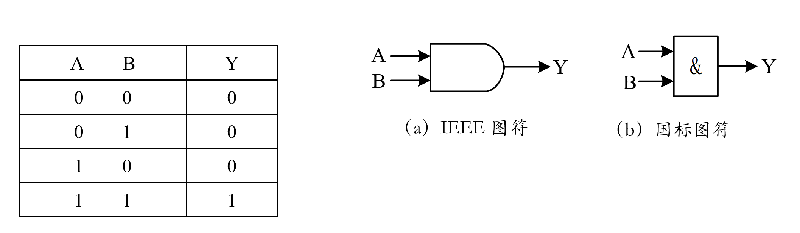
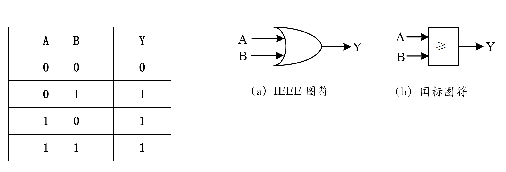
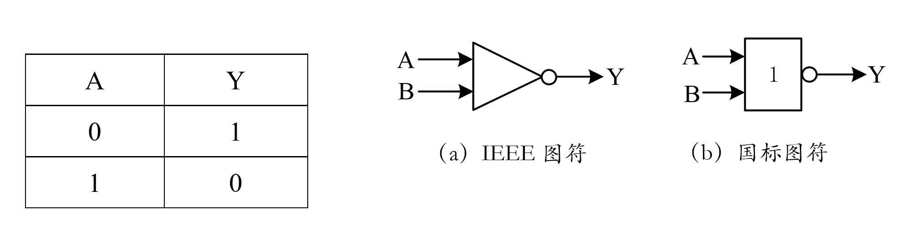
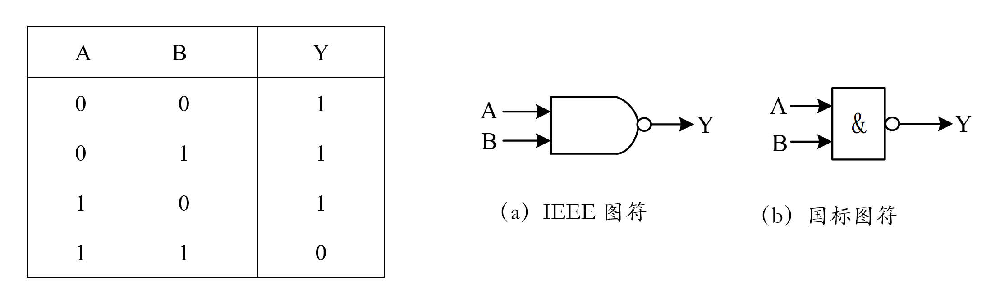
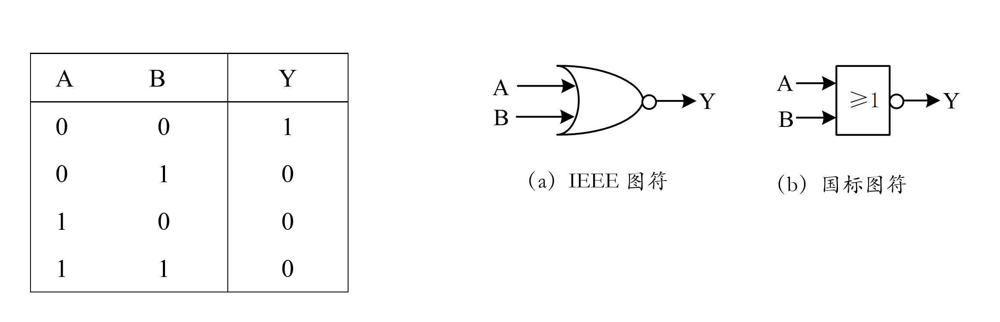
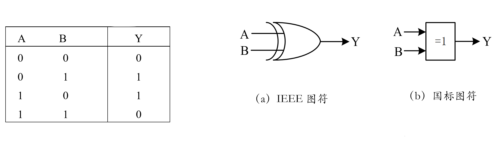
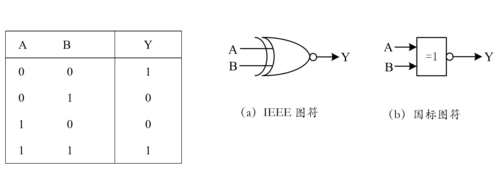

<!-- _class: lead -->

## **第3章 硬件体系结构**
## **逻辑与逻辑门**

---

### **逻辑**

+ *逻辑*(Logic)是研究推理的一门学科。或者说，是推论和证明的思想过程。逻辑的基本表现形式是命题和推理。

+ *推理*是从前提推出结论的思维过程，前提是已知的命题，结论是通过推理规则得出的命题。所以，归根结底，要说清楚逻辑运算，我们需要先说清楚什么是命题。

+ *命题*，就是能判断真假的陈述语句。这种陈述句的判断只有两种可能，即：正确和错误。命题的判断叫做**真值**。真值为正确的命题称为"真"，为错误的命题称为"假"。比如："水是无色的"，这是真命题；"冰是有色的"，就是假命题。

---

### **复合命题**

+ 任何复合命题都可以由简单命题通过"联结词"所表示的某种运算得到。
+ 命题有"真"和"假"，故逻辑运算的结果就是"真"和"假"。
+ 将*一个简单命题用英文字母*来表示，称为*命题的符号化*。
> A：雪是黑色的
> B：2是素数

+ 简单命题的真值是确定的，所以真值也可以符号化。通常用1表示真，用0表示假。

---

### **复合命题**

+ 联结词也可以符号化。如果将我们上文提到的联结词"并且"、"或者"、"并非"，分别用and、or、not来表示，

> A and B 
> A or B

+ 可以看出，命题符号化之后，一个复杂的命题可以由简单命题通过逻辑运算得到。

---

### **复合命题**

- **and**所表示的"并且"的含义是：同时存在，或同时为"真"。这种关系称为逻辑"与"；
- **or**表示的"或者"，是意味着只要有一个存在或者说一个为"真"就可以，这种关系称为逻辑"或"
- **not**表示了"并非"，意即取反（将"3是偶数"反意为"3不是偶数"），称为逻辑"非"。

> 命题是逻辑的基本表现形式，所以，**联结词**所表示的运算就是逻辑运算。由于逻辑的"真（True）"和"假（False）"可以符号化为二进制的1和0，因此逻辑运算也就是1和0之间的运算。

---

### **基本逻辑运算**

+ 1847年，英国数学家乔治·布尔（George Boole）提出了一种用于描述客观事物逻辑关系的数学方法，称为逻辑代数或布尔代数。
+ 逻辑代数有一套完整的运算规则，被广泛应用于开关电路和数字逻辑电路的分析中。与算术运算不同，逻辑运算是对数据的每一位"**按位**"进行运算，其低位运算结果不会对高位产生影响。即逻辑运算没有进位或借位。
+ 基本逻辑运算有"与"、"或"、"非"三种，实现基本逻辑运算的电路称为基本**逻辑门**。通过对三种基本逻辑门的组合使用，‌可以构建出各种复杂的逻辑电路。

---

### **"与"运算**

+ 逻辑"与"的含义是：当全部条件都满足时，结果才会发生。"与"运算用符号"∧"或者"·"表示，遵循如下运算规则：

$$ 1∧1=1 \qquad 1∧0=0 \qquad 0∧1=0 \qquad 0∧0=0 $$

A=10110110 B=11110000
A∧B=10110000B

---

### **"或"运算**

+ 逻辑"或"的含义是：在全部输入中，只要有一项条件满足，结果就会发生。"或"运算用符号"∨"表示：

$$ 0∨0=0 \qquad 0∨1=1 \qquad 1∨0=1 \qquad 1∨1=1 $$

+ 参加"或"运算的两位二进制数中，仅当两位均为0时，其结果才为0，只要有一位为1，则"或\"的结果就为1。该规则还可以表述为：当且仅当输入全部为假时，输出结果才为假。

A=10110110 B=11110000
A∨B=11110110B

---

### **"非"运算**

+ 逻辑"非"的含义是：当决定事件结果的条件满足时，事件不发生。"非"运算是按位取反的运算，属于单边运算，即只有一个运算对象，其运算符为一条上横线。"非"运算的逻辑代数表达式是：

$$ \overline{A} = A $$

即输出是对输入的取反。若输入为1，则输出为0；输入为1，则输出为0。

---

### **基本逻辑门**

+ 实现基本逻辑运算的电路称为基本逻辑门。**逻辑门**是由若干半导体元件经过一定的组合、能够实现某一种逻辑关系的集成电路。一片集成电路芯片上，通常会集成若干个具有同样逻辑关系的逻辑门（如：可以将4个与门电路集成在1片芯片上构成4与门电路）。

---

### **与门（AND gate）**

+ *与门*是实现对多个逻辑变量进行"与"运算的电路，可以有多位输入，但*只有1位输出*。如图所示是两输入与门的两种逻辑图符。图中，A和B为与门的输入，Y为输出。输入与输出之间的逻辑关系可以用表所示的**逻辑真值表**表示。
+ 若从电平变化的角度描述，则仅当与门的输入A和B都是高电平时，输出Y才是高电平，否则Y就输出低电平。符合所示的逻辑关系。

---

### **与门（AND gate）**

 

- 图中仅画出了2位输入（A和B），实际的与门电路可以有多位输入。图中给出了与门的两种表示方法，其中，（a）为IEEE推荐符号，（b）为中国国家标准规定使用的符号（以下简称国标图符）

---

### **或门（OR gate）**

+ *或门*是对多个逻辑变量进行"或"运算的门电路。和"与"门一样，也是*多输入、单输出的门电路*。

---

### **非门（NOT gate）**

+ *非门*又称反相器，是对单一逻辑变量进行"非"运算的门电路其输入变量A与输出变量Y之间的关系为：

---

### **复合逻辑运算及其逻辑电路**

> 由三种基本逻辑运算组合而成的运算称为复合逻辑运算。相应地，由三种基本逻辑门组合而成的逻辑电路就称为复合逻辑电路。常见的有"与非"、"或非"、"异或"和"同或"等。

---

### **"与非"逻辑电路**

---

### **"或非"逻辑电路**

---

### **"异或"**

---

### **"同或"运算**

