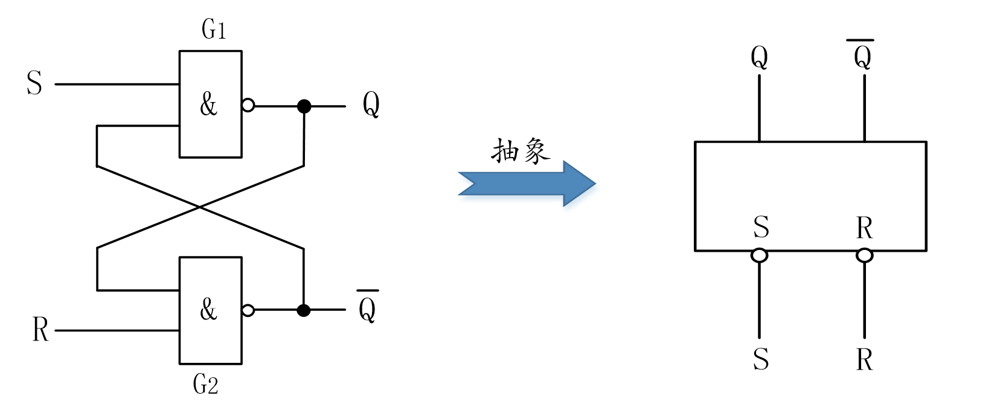
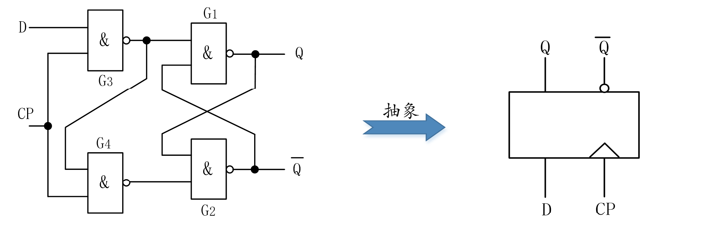
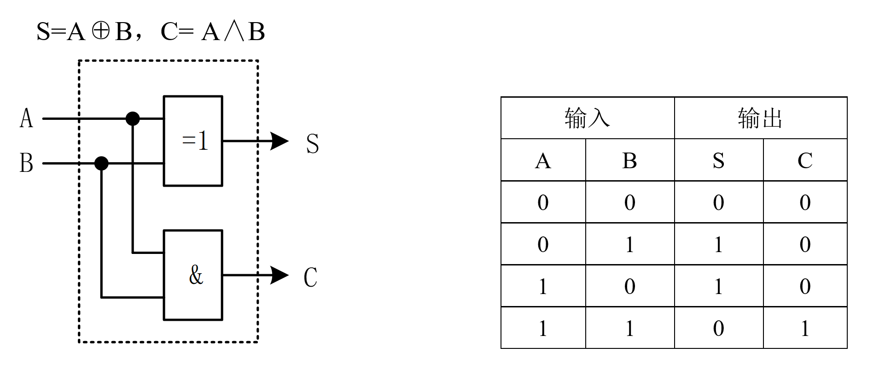
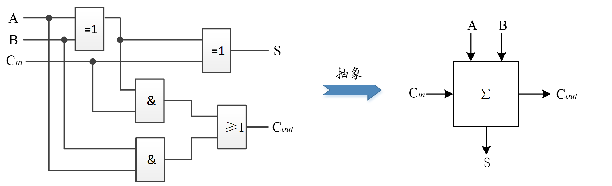
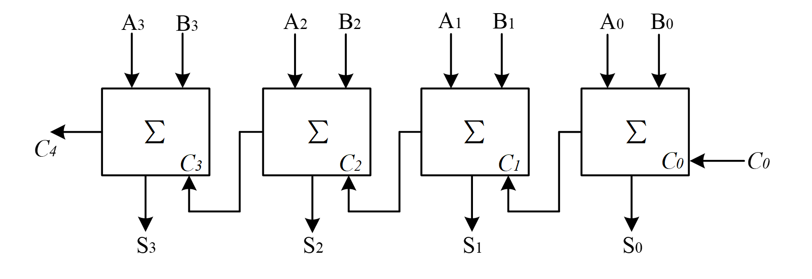

<!-- _class: lead -->

## **触发器与加法器 **

---

### **触发器**

+ **触发器**（Trigger，Flip-flop）也称为双稳态多谐振荡器，是一种可以使其输出端在高电平和低电平两种状态间相互翻转的逻辑电路。即：可以通过外部时钟控制信号（触发信号），使输出由高电平变为低电平，或由低电平变换为高电平。而当外部触发信号不出现时，只要保持供电，*其输出端的状态就可以稳定地保持不变*。
+ 触发器的这一特性，使其可以用于*存储二进制数"0"和"1"*，也就是说，它是具有记忆功能的逻辑组件。

---

### **RS触发器**

将两个与非门G1、G2的输入和输出分别交叉连接在一起，就构成了一种称为RS触发器的新的功能器件。

---

### **RS触发器**

+ RS触发器是最简单的一种触发器，有两个输入端R、S和两个输出端Q、#Q。当S=0，R=1时，Q端输出高电平，#Q端输出低电平；而当S=1，R=0时，#Q端输出高电平，Q端输出低电平。即：**当在触发器的两个输入端加上不同逻辑电平时，其输出端Q和#Q存在两种互补的稳定状态。**所以，RS触发器属于双稳态电路。

---

### **D触发器**

>在RS触发器的前边再加上两个与非门，就构成了另一种常见触发器，称为D触发器。

---

### **D触发器**

+ 其中，D为输入端，CP为控制端。由图可知，当CP=0时，输入端D被封锁，输出保持不变；当CP=1时，输出Q将会随着D端状态的变换而变换。例如：当CP=1时，此时若D=0，则G3输出1，G4输出0，
+ #Q端状态为1，最终使Q端状态为0，与D端状态相同。当CP=0时，G3和G4两个与非门均输出1，由表3-9知，此时Q端和#Q端状态保持不变。

---

### **加法器**

> 计算机的功能是执行程序，程序执行的对象是数据，对数据的各种运算由CPU的运算器完成，运算器的核心部件则是算术逻辑单元（ALU）。虽然现代处理器通过集成多种专用运算单元（结合算法优化），实现了算术、逻辑和并行计算的高效协同，但加法运算依然是算术运算的基石。
+ **加法器**（Adder）是一种用于执行加法运算的数字电路，是构成CPU中算术逻辑单元的基础。属于组合逻辑电路，即输入的变化会立即引发输出变化，逻辑透明。
+ 加法器又分为半加器和全加器。

---

### **半加器**

> **半加器**是实现两个1位二进制数相加，不考虑来自低位进位的加法器。

---

### **全加器**

如果在半加器中添加一个或门来接收低位的进位输出信号，则两个半加器就构成了一个全加器

---

### **涟波进位加法器**

> 全加器只能实现1位二进制的加法，而CPU的字长从早期的8位、16位，到现在的32位或64位，都不是只完成1位二进制运算。因此，需要在全加器的基础上构造多位加法器，以实现同时进行多位二进制数的运算。

+ 多位加法器主要有涟波进位加法器和超前进位加法器两种。
+ 涟波进位加法器的实现方法比较简单，它用N个全加器构成，其中对应低位的全加器将其进位输出信号$C_{out}$连接到高一位全加器的进位输入端$C_{in}，并依次象"涟波"一样将进位信号向前传递。

---

### **涟波进位加法器**

