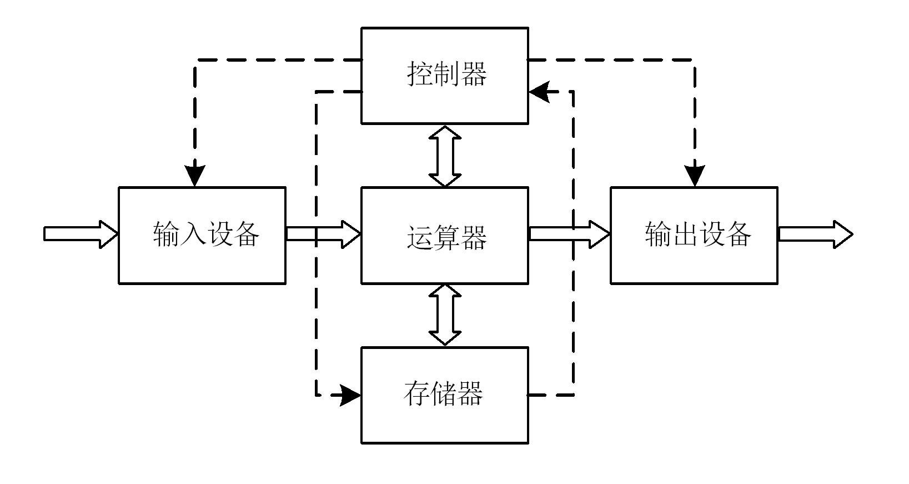
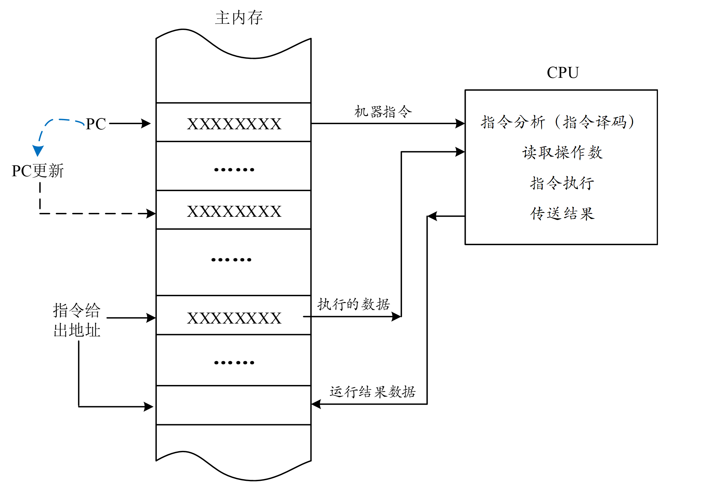

<!-- _class: lead -->

## **冯·诺依曼结构**

---

### **程序和指令**

> 现代计算机不仅能够进行各种复杂的数值计算，还能在一定程度上模拟人类的思维进行分析和处理各种事物。计算机之所以能够按照要求完成一项一项的工作，是因为人向它发出了一系列的"命令"，这些命令通过输入设备以一定的方式送入计算机，并且能够为计算机所识别。我们将这种能够被计算机识别的命令称为*指令*。
+ **指令**是人向计算机发出的、能够被计算机所识别的命令。这句话的含义是：一条指令要能被人认识，也要能被计算机（确切地说是要能被CPU识别，因为指令由CPU执行）识别。因此，不同型号的处理器识别"命令"的能力不同，亦即其能够执行的指令不同。我们将一类CPU能够识别的所有指令的集合称为该*CPU的指令系统*。

---

### **程序**

+ 若干条指令按一定顺序组织在一起，就构成了程序。所以，**程序**是指令的有序集合。指令的不同组合方式，可以构成完成不同任务的程序。
+ 由于指令是控制计算机完成某项操作的命令，所以一条指令中必须包含两种信息：一是执行何种操作，由**操作码**（或指令码）给出；二是指令执行的对象，即运算的数据。在指令中表示为**操作数**。

---

### **指令格式**

+ 由于执行指令的是处理器，而处理器由逻辑电路组成，只能直接识别0和1表示的脉冲信号，故这里的"指令"特指0和1组成的机器语言指令。

---

### **冯·诺依曼结构特点**

> 冯·诺依曼结构是一种将程序指令和数据合并存储的结构。其核心思想主要体现在：存储程序原理、以运算器为核心、采用二进制。

---

### **冯·诺依曼结构的主要特点**

1. 采用二进制逻辑。冯·诺依曼计算机中的程序指令和数据都采用二进制，且设计的编码能够被执行该程序的计算机所识别；
2. 将计算过程描述为由许多条指令按一定顺序组成的程序，并放入存储器保存；
3. 程序指令和数据用同样的方式混合存储在同一个存储器中。

---

### **冯·诺依曼结构的主要特点**

4. 指令按其在存储器中存放的顺序执行，存储器的字长固定并按顺序线性编址；
5. 由控制器控制整个程序和数据的存取以及程序的执行；
6. 将计算机描述为由运算器、控制器、存储器、输入设备和输出设备五个部分组，并以运算器为核心，所有的执行都经过运算器。

---

### **冯·诺依曼结构的主要特点**

> 进入内存后的程序是逻辑上有序的指令序列。CPU在控制器的统一控制下，按一定顺序依次从内存中取出执行，直到执行完全部指令为止。这一原理称为**存储程序原理**。

+ 半个多世纪过去，虽然计算机软硬件技术都有了飞速地发展，存在脱离了冯·诺依曼结构原有模式的计算机，‌如光子计算机、‌并行计算机、‌数据流计算机以及量子计算机等，但现代主流计算机系统结构形式并没有明显的突破，仍属于冯·诺依曼结构。计算机的基本工作原理仍然是存储程序控制原理。当然，二进制也依然是计算机硬件惟一能够直接识别的数制。

---

### **冯·诺依曼计算机一般工作过程**

> 计算机的工作就是执行各种程序，程序是指令序列的集合，因此计算机的工作过程也就是逐条执行指令的过程。

+ 每一条指令的执行过程都包括了5个步骤：取指，译码，取数，执行，写回。

+ *取指*是指按照指令在内存储器中的地址将其取回到CPU中以备执行。指令在存中的地址由程序计数器（Program Counter，PC）指定，CPU根据PC指向的内存地址读取指令，同时根据指令的字长更新PC的值，使其指向下一条将要读取的指令在内存中的地址；

---

### **冯·诺依曼计算机一般工作过程**

+ *译码*也称为指令分析，是CPU将读取回来的二进制指令解析成一系列的控制信号。
+ *取数*是获取指令执行的对象，即操作的数据。CPU根据译码结果，从内存中获取相关数据；
+ *执行*即执行指令，由CPU中的算术逻辑单元（ALU）完成。
+ *写回*是CPU将计算结果写入到指定的寄存器或存储器中。

---

### **冯·诺依曼计算机一般工作过程**

---

### **冯·诺依曼计算机一般工作过程**

+ *程序计数器PC*是CPU内部的一个专用寄存器。在任何时刻，PC的内容都是某条机器语言指令在内存中的地址，或说PC总是指向内存中某条机器语言指令，因此也称它为指令指针（指针即地址）。
+ 需要说明的是：PC所指向的下一条指令并不一定与内存中刚读取的指令相邻。如：对顺序结构程序，指令会指向相邻的下一条指令。若指令字长为1字节，则PC+1。若指令字长为5字节，则PC+5。*但无论怎样，PC都永远指向下一条即将读取的指令。*

