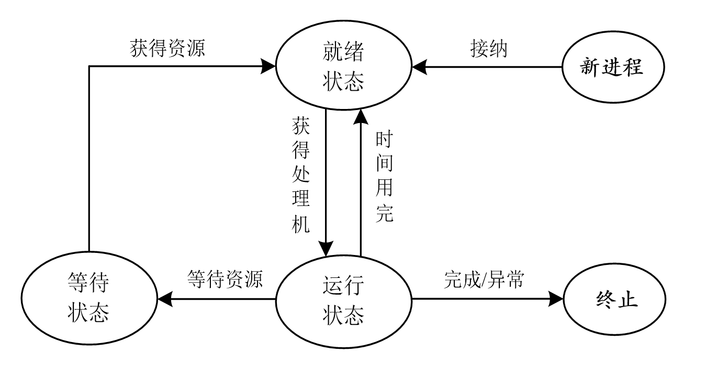

<!-- _class: lead -->

## **处理器管理**

---

> 处理器管理又称进程管理或作业管理，其主要任务是对处理器进行分配，并对其运行进行有效的控制和管理。简单地说就是*解决谁来使用处理器和怎样使用处理器的问题*。在操作系统中，把用户请求处理器完成一项完整的工作任务称为一个*作业*。当有多个用户同时要求使用处理器时，允许哪些作业进入、不允许哪些进入、怎样安排已进入作业的执行顺序等，这些就是处理机管理模块的任务。

---

### **进程**

程序是实现某一特定功能的指令序列，包含若干指令语句。
```
S1：a=x+2
S2：b=y+4
S3：c=z+9
S4：d=a+b+c

S1：a=x+y
S2：b=a+4
S3：c=b+1
S4：d=a+b+c
```
+ 程序的执行总体上可以有顺序执行和"同时"执行两种方式。

---

### **并发的概念**

+ *顺序执行*方式，由于总是在一道程序执行结束后才能执行下一道程序，使得任意时刻系统中*都只有一道程序在执行*，系统中所有的资源（处理器、存储器、I/O设备等）都被这道程序所*独占*，程序无论执行多少遍，只要初始条件不变，结果都会一样。
+ *并发执行*方式显然看上去效率更高。*并发*是指在同一时间段内可以同时有多道程序在同时执行。自20世纪60年代开始，计算机开始有了对并发执行的支持。在传统意义上，这种并发执行是模拟出来的，它通过使一台计算机在它正在执行的多道程序间进行快速切换来实现。
+ 这种并发执行方式允许多道程序同时在系统中运行。比如我们使用计算机时常常可以打开多个窗口。

---

### **进程**

+ *进程*的经典定义是一个执行中的程序实例。程序本身是静态的，但作为执行中的程序，进程就是动态的，可以形象地说是"活着"的程序。一段程序可以对应多个进程，一个进程也可以对应多段程序。
+ 进程是具有生命周期的。其主要特征有：
- **动态性**。这是进程最基本的特征。表现在：因创建而产生，由调度而执行，因得不到所需资源而暂停，因被撤消而消亡。4.2.2节将介绍进程的这些不同状态及其转换。
- **并发性**。这是进程的重要特征，也是操作系统的重要特征。表示一个进程的指令和另一个进程的指令交错执行，如同例3-10所描述的那样。

---

### **进程**

- *独立性*。进程是一个能独立运行的基本单位，也是进行资源分配和调度的独立单位。一个系统中可以同时运行多个进程，每个进程都好像在独占系统资源。
- *异步性*。每个进程都按独立的、不可预知的速度向前推进，即：各个进程并不是按相同的速度运行，而是异步运行，这一特征就导致了程序执行的不可再现性。为了避免这一点，操作系统中专门设置了一个称为**进程控制块**（Process Control Block，PCB）的数据结构，它负责记录进程的所有相关相信，保证进程从暂停到重新运行时能获得其暂停时的状态。

---

### **进程的基本状态**

> 在大多数系统中，需要运行的进程数远多于可以运行它们的CPU个数。但无论是单核处理器还是多核处理器，一个CPU都好像在并发地执行多个进程（图4-10）。这实际上是系统给出的一种"错觉"，因为一个CPU在任意一个时间点上都只能运行一个进程，造成这种"错觉"的主要原因是处理器在不同进程间切换。即：各个进程在轮流占用CPU。如果将进程占有CPU时的状态称为运行状态，那么在任意一个时间点上，系统中只有1个进程处于运行状态。

---

### **进程的基本状态**

1个进程的运行需要占用系统多种资源。除了CPU，可能还需I/O请求、运行的数据、存储地址空间等。如果它需要的资源正被其他进程占用，就只能停下来等待。所以，进程的执行过程是间断性的，其状态处于不断变化中。通常，一个进程必须具有以下三种基本状态：

- **就绪（Ready）状态**。进程已经获得了除CPU之外所必需的一切资源，一旦分配到CPU，就可以立即执行（"万事具备，只欠东风"）。在多道程序环境下，可能有多个处于就绪状态的进程，通常将它们排成一队，称为就绪队列。

---

### **进程的基本状态**

- **运行状态**。进程获得了CPU及其它一切所需资源，正在运行。对单个CPU系统而言，只能有一个进程处于运行状态；在多处理器系统中，则可能有多个进程处于运行状态（若两个进程在不同处理器上同时处于运行状态，就是并行执行）。

- **等待状态**。由于某种资源得不到满足，进程运行受阻，处于暂停状态（等待状态），等待分配到所需资源后，再投入运行。处于等待状态的进程也可能有多个，也将它们组成排队队列。

多个进程轮流运行的概念称为多任务，一个进程占有CPU的时间段叫做时间片。现代个人计算机是多任务系统，多个任务按时间分片运行。

---

### **进程控制与进程调度**

+ 进程控制的主要任务是调度和管理进程从"创建"到"消亡"整个生存周期过程中的所有活动，包括创建进程、转变进程的状态、执行进程、撤消进程等操作。

+ 进程具有就绪、运行、等待三种基本状态，在多数操作系统中还增加了"新状态"和"终止状态"两种。进程在它的整个生命周期中，就是不断地从一个状态转换到另一个状态，直到运行完成或出现异常结束，才进入终止状态。进程状态的转换过程可以简述为：

---

### **不同进程状态间的转换**

- OS创建一个新进程，先为其分配相应的资源，并使其处于"新状态"；
- 当就绪队列能够接纳新进程时，OS就将其送入就绪队列，处于就绪状态；
- OS根据进程在就绪队列中的位置、优先级等（这些都在PCB中）信息及进程调度算法，为进程分配CPU，从而使其转入运行状态（此时的进程称为当前进程）；
- 运行中的进程可能因所需资源不能得到（或许该资源正在被其他进程使用）而无法进行执行，则转入等待状态处于等待状态的多个进程也同样按队列管理。

---

### **不同进程状态间的转换**

- 运行中的进程也有可能虽然拥有所需的全部资源，但分给它的CPU时间片已用完或有更高优先级的进程出现，则只好退出处理器，转入就绪队列。
- 当处于等待队列中的进程（等待状态）获得所需资源时，并不能直接进入运行状态，而必须重修进入就绪队列，直到被调入处理器执行。
- 执行完成或出现异常，则进成转入终止状态。

一个进程可以在三种基本状态之间多次转换，但新状态及终止状态只能出现一次。

---

### **不同进程状态间的转换**



---

### **进程调度**

+ 进程调度就是根据具体情况为每个进程分配CPU。不同的OS所采用的调度方式（算法）不完全一样，其中有一种方式就是"分时"原理，或称为时间片轮换算法。即所有进程轮换进入CPU运行，每个进程轮流占用处理器一段很小的时间，时间到了就退出等待，直到下次轮到再继续。

+ 进程控制块是操作系统中用于管理进程的重要数据结构，它包含了进程运行所需的全部信息，以保障操作系统对进程的有效调度、管理和控制。

---

### **线程的概念**

+ 引入进程的目的是为了使多道程序能够并发执行，但实际上一个进程还可以由多个称为线程（Thread）的执行单元组成。1个进程中可以拥有多个线程（当然也可以只有1个线程），它们被包含在进程中，是操作系统运行和调度的最小单位。
+ 为了使多道程序能够并发执行，系统需要创建进程、切换进程、撤销进程等一系列操作，这些操作需要付出较大的时空开销（上下文保存与恢复，PCB初始化等）。故系统中的进程通常不易过多，进程间切换的频率也不易过高。
+ 但线程只拥有运行所需的很少的资源，因此相比于进程，系统付出的时空开销要小得多。
