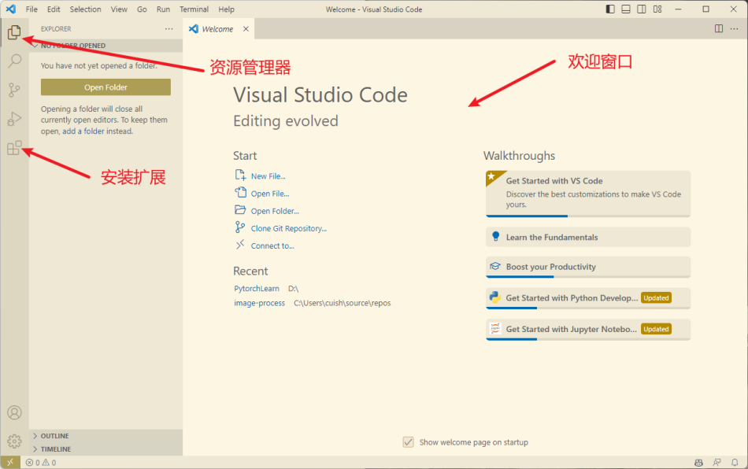
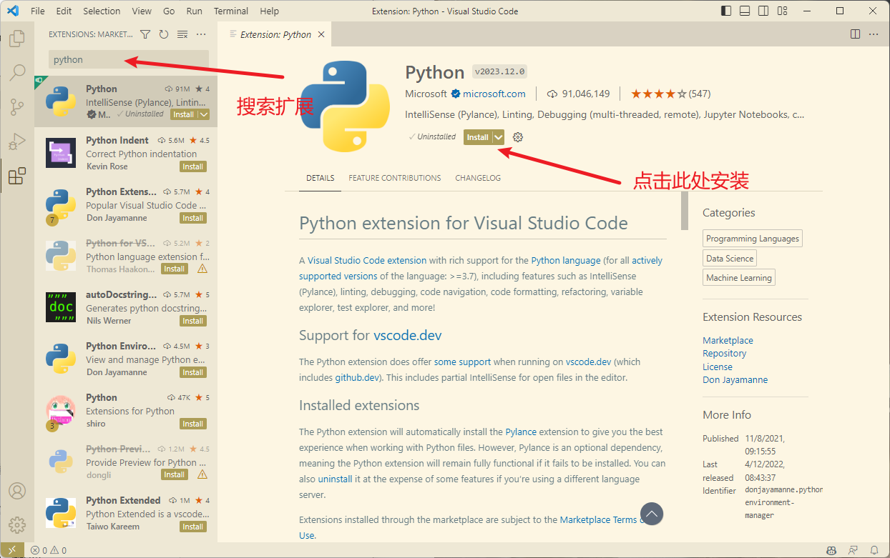
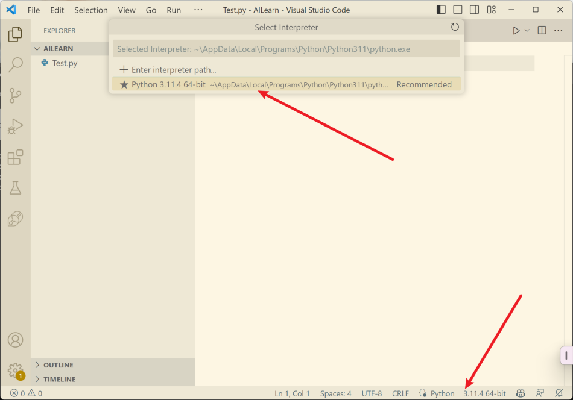
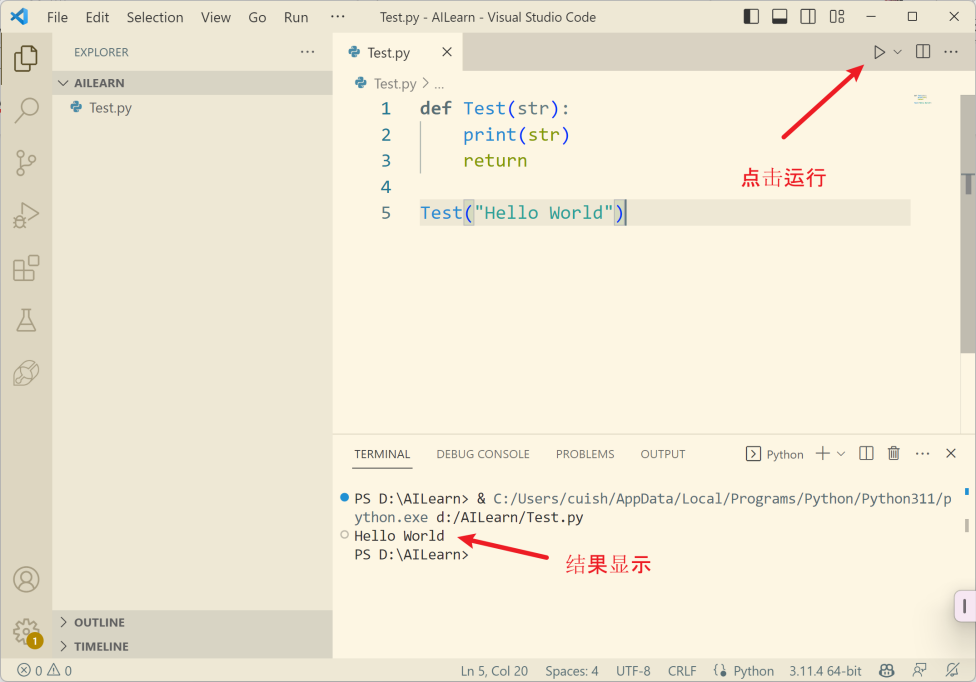
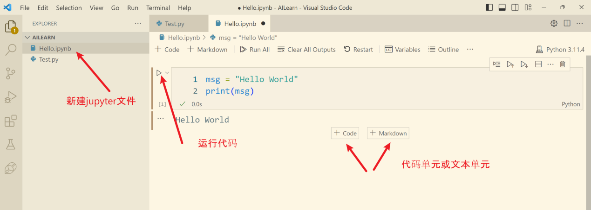

<!-- _class: lead -->
## **Python语言及运行环境** 

---

### **安装Python解释器**

> Python 是一种解释型语言，代码需要通过 Python 解释器来逐行读取、分析并执行。解释器就像翻译官，能将人类可读的Python代码转换为计算机可执行的机器语言指令。没有Python解释器，计算机无法识别和运行 Python 代码。

---

### **Windows 系统**

1.  **官方网站下载安装包**：

- 打开浏览器，访问 Python 官方网站（<https://www.python.org/> ）。

- 在首页点击 "Downloads"，选择适合你系统版本（32 位或 64 位）的 Python
  安装包下载。

---
### **Windows 系统**
2.  **运行安装程序**：

- 下载完成后，双击安装包运行。

- 在安装界面中，*勾选 "Add Python to PATH"*（这一步很重要，能让系统在任何路径下都能找到 Python 命令）。

- 选择 "Install Now"（默认安装）或者 "Customize installation"（自定义安装，可选择安装路径等），然后按照提示完成安装。

---

### **Windows 系统**
3.  **验证安装**：打开命令提示符（Win + R，输入 "cmd" 回车），输入
    "python --version"，如果能正确显示 Python 版本号，说明安装成功。

---

### **macOS 系统**

1.  同样在 Python 官方网站下载适合 macOS系统的安装包。下载完成后，双击安装包，按照安装向导的提示一步步操作，完成安装。

2.  验证：打开 "终端" 应用，输入 "python3 --version"（macOS
    系统一般默认 Python 2和Python 3并存，Python 3常用命令是 python3），若能显示Python版本号，即安装成功。

---
### **Linux 系统（以 Ubuntu 为例）**

使用包管理器安装：打开终端，输入以下命令：

- sudo apt-get update （更新软件包列表）
- sudo apt-get install python3 （安装 Python 3，Ubuntu 系统一般默认Python 2，Python 3 是单独安装的）

验证：在终端输入 "python3 \--version"，若能显示版本号，则安装成功。

---

### **VSCode的安装**

> 有很多方法可以在 Python 中运行和开发代码。可以从命令行运行 Python解释器，并使用内置shell进行交互，也可以在文本编辑器中编写代码。还可以使用面向教育的集成开发环境（IDE），如IDLE（随 Python 提供）、Mu 或 Thonny，或者选择更高级的 Python IDE，如VSCode、Wingware 或PyCharm。*本书使用VSCode*进行教学，读者也可以选择自己熟悉的环境。

**visual Studio Code**
(VSCode)是微软为Windows、Linux和macOS创建的开源代码编辑器。VSCode支持调试、语法高亮、自动代码补全、代码片段、代码重组和嵌入式Git。

---
### **VSCode的安装**
1. 下载安装程序：通过以下链接下载并安装VSCode：<https://code.visualstudio.com/Download>，选择和你的操作系统相对应的版本进行下载。
2. 运行安装程序：在安装的过程中注意*勾选将"code加入到Path"的选项*，该选项在安装界面的首页，默认是未勾选。
3. 运行VSCode：运行VS Code，将会看到图5-1的界面。通常是第一次运行VS Code的界面，界面的颜色取决于选择的主题。本书没有使用默认的暗色主题，而是选择了一个较为明亮的主题"solarized light"。可以在文件菜单中的首选项-颜色主题中改变配色方案。
---


VS Code的欢迎页面，以及资源管理器和扩展管理面板

---

### **安装VSCode扩展**

> VSCode仅仅只是一个编辑器，要让执行更多的任务（如运行代码、调试代码等）需要安装相应的扩展。本文仅仅示例如何安装python的扩展，其他语言请参考VSCode官方网站上的帮助。
> 
> 为了能完成本书后面的例子，请至少安装以下6个扩展：python、pylance和Jupyter扩展包。Jupyter扩展包包含了4个扩展（选择jupyter包会自动安装这几个扩展），JupyterCell Tag、Jupyter Keymap、Jupyter NoteBook Renderers和Jupyter SlideShow。

---
### **安装VSCode扩展**


点击左侧栏的扩展图标，先搜索扩展，再点击安装

---

### **运行python脚本（.py文件）**

>扩展安装完成后，回到电脑的资源管理器，在选择好的位置新建一个文件夹。这个文件夹将成为VSCode的工作文件夹，继续下面的编程。

+ 启动后VSCode从文件菜单选择打开文件夹，随后打开刚才创建的空文件夹。由于还没有开始任何代码，所以这个文件夹在VSCode的资源管理器里是空的。

---

### **运行python脚本（.py文件）**

+ 现在选择新建文件，并键入文件名Test.py，注意文件的后缀名很重要，要确保它正确。VSCode会同时打开编辑窗口，等待输入代码。在键入代码之前，首先检查一下python环境，在编辑窗口的底部.

+ 如果没有选择，会在底部显示"选择一个python交互换环境"或者已经有了一个。如果你的机器安装有不同版本或者虚拟环境点击底部可以选择或者重新选择一个交互环境。点击后，会在VSCode的顶部中间列出你安装的所有python环境，选择一个你需要的即可。如果没有任何可以选择的，请重新安装python。

---



选择python环境（python解释器）

---

选择好python解释器之后，可以编写一个简单的测试代码

```python
def Test(str):
    print(str)
    return
Test("Hello World")
```

---



测试运行python程序. 点击右上角的三角形图标，运行程序，如果没有错误的，vscode打开一个新的终端窗口（在底部），并在终端窗口中显示运行结果。

---

### **VS Code运行Jupyter Notebook**

>JupyterNotebook可以创建和共享包含实时代码、算式、文本和可视化的文件，由于其简单性和交互性，被认为是数据科学最好的工具之一。Jupyter扩展为目前Jupyter notebook中支持的任何语言内核提供基本的notebook支持。大多数语言内核将在不需要任何修改的情况下运行Jupyter。VSCode安装前面讲述的jupyter扩展后就可以使用了。

---
### **VS Code运行Jupyter Notebook**

新建一个文件Hello.ipynb（注意文件的后缀名！）



VSCode可以直接支持jupyter Notebook

---
### **VS Code运行Jupyter Notebook**

>jupyter Notebook有2种类型的单元，Code或者MarkDown。
>Code单元格键入代码，点击单元格左上角的三角可以运行代码。
>Markdown单元格时文本单元，支持Markdown格式。在第一次运行时，VSCODE可能会提示需要安装ipykernel，请点击安装。

完成安装后，运行该单元格的代码，结果会显示在单元格的下方。

---

### **VS Code运行Jupyter Notebook**

>**特别提示**
>ipykernel依赖网络环境在线安装，需根据网络情况耐心等待。如果因为网络原因无法下载，一直安装失败，则在VSCode的终端中键入以下命令安装：

```
pip install ipykernel -U --user --force-reinstall -i
https://pypi.tuna.tsinghua.edu.cn/simple
```
---

### **python包的安装**

>Python的包管理器pip用于安装和管理第三方包。它是一个独立于Python的程序，不过当下载并安装Python时，计算机上已经安装了pip。pip是一个命令行工具。这意味着必须从命令行窗口或终端程序运行它。如何打开终端程序取决于操作系统。

可以在VSCode的命令行终端中运行pip。也可以不通过VSCode直接在Windows中打开一个命令行。Windows中的终端或命令行有2种，对于要完成的任务来说，这2种都可以。一种是CommandPrompt（命令提示符），一种是powershell。VSCode集成了这2种终端，从VSCode的显示菜单选择终端，可以在VSCode的底部显示一个终端窗口，

---

### **更新pip自身**
在使用pip安装包以前，应该将pip更新到最新版。在终端窗口键入如下命令：
```cmd
python -m pip install --upgrade pip
```
将pip更新到最新版。

---

### **查看安装的包**
使用pip list命令可以查看目前安装了那些包：
```cmd
pip list
```
Package Version
\-\-\-\-\-\-\-\-\-\-\-\-\-\-\-\-\-\-\-\-\-\--
asttokens 2.2.1
backcall 0.2.0
colorama 0.4.6
comm 0.1.3
....

---

### **安装包**
使用pip install <包的名字>可以安装一个新包，例如安装下一节需要的Numpy包：
```cmd
pip install numpy
```
>特别提示：
pip将从默认的服务器上下载python包并安装。默认的服务器有时受网络的影响，可能会安装失败。这时可以指定一个下载源，例如清华大学提供的下载服务，要指定下载源，可以使用如下的命令：
```cmd
PS C:\\Users\\cuish\> **pip install numpy -i https://pypi.tuna.tsinghua.edu.cn/simple
```
---

### **安装时指定版本**
此外在pip安装时，可以使用\>=、\<=、\>、\<和==来指定版本号。如不指定，则安装最新版。某些包可能只能工作或依赖特定版本的包，此时就需要指定版本号了：
```cmd
pip install numpy==1.25
```
---
### **显示一个包的具体信息**
```cmd
pip show numpy
```
Name: numpy
Version: 1.25.1
Summary: Fundamental package for array computing in Python
Home-page: https://www.numpy.org
Author: Travis E. Oliphant et al.
Author-email:
License: BSD-3-Clause
......

---

### **卸载一个包**
```cmd
pip uninstall numpy
```
