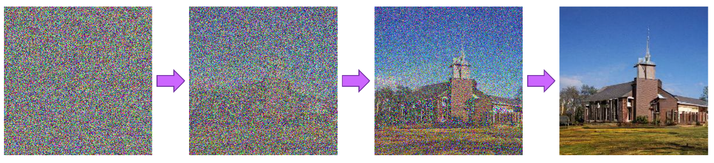

<!-- _class: lead -->
## 人工智能大模型

---

### **大模型**
>大模型通常是指那些通过大规模数据和强大计算能力训练出来的具有海量参数的模型。这些模型的参数数量可达数亿甚至上百亿、千亿级别，远远超过传统的机器学习模型。其核心在于利用深度学习技术，构建复杂的神经网络架构，以对海量数据进行深度挖掘和学习，从而具备强大的表示能力和泛化能力。

---

### **大模型**

+ 大模型能够自动从数据中提取特征和模式，不仅可以精准地捕捉到数据中的细微差别和潜在规律，还能够在不同的领域和任务中展现出通用性，无需针对每个具体任务进行大规模的重新训练，只需通过微调调整，甚至直接应用，即可完成如自然语言处理、图像识别、语音识别、机器翻译等多样化的复杂任务。
+ 大模型为人工智能的广泛应用提供了坚实的技术支撑，极大地推动了人工智能向更高水平发展，成为当今人工智能领域的关键技术之一，引领着人工智能技术的发展潮流。
+ 大模型本质上是一个使用海量数据训练而成的深度神经网络模型，其巨大的数据和参数规模，实现了智能涌现，展现出类似人类的智能。

---

### **大模型的发展历史**

>大模型的发展历程可以追溯到上世纪中叶，经历了多个重要阶段，逐步演进并走向成熟。

**萌芽期（1950-2005）**

这一时期是以CNN（卷积神经网络）为代表的传统神经网络模型阶段。1980年，卷积神经网络的雏形诞生。1998年，现代卷积神经网络的基本结构LeNet-5出现，机器学习方法从早期的浅层机器学习模型转变为基于深度学习的模型，为自然语言生成、计算机视觉等领域的深入研究奠定了基础，对后续深度学习框架的迭代及大模型发展具有开创性意义，标志着人工智能开始向大规模模型探索的方向迈出了第一步。

---

**沉淀期（2006-2019）**

>此阶段是以Transformer为代表的全新神经网络模型的发展时期。
+ 2013年，自然语言处理模型Word2Vec诞生，首次提出将单词转换为向量的"词向量模型"，便于计算机更好地理解和处理文本数据。
+ 2014年，GAN（对抗式生成网络）诞生，被誉为21世纪最强大算法模型之一，标志着深度学习进入了生成模型研究的新阶段。

---

**沉淀期（2006-2019）**

+ 2017年，Google提出基于自注意力机制的神经网络结构，Transformer架构，为大模型预训练算法架构奠定了基础，极大地提升了模型处理长序列数据的能力，使得模型能够更好地捕捉数据中的复杂依赖关系。
+ 2018年，OpenAI和Google分别发布了GPT-1与BERT大模型，预训练大模型开始成为自然语言处理领域的主流，推动了大模型技术在自然语言处理等领域的广泛应用和深入研究，众多研究团队开始基于这些基础模型进行拓展和优化，大模型技术在这一时期得到了不断沉淀和积累，性能逐步提升，应用范围也逐渐扩大。

---

**爆发期（2020-至今）**

+ 以GPT为代表的预训练大模型阶段开启了大模型的爆发式增长。2020年，OpenAI公司推出了GPT-3，其模型参数规模达到了1750亿，成为当时最大的语言模型，并且在零样本学习任务上实现了巨大性能提升，展示了大模型强大的语言生成和理解能力，引发了全球范围内对大模型的广泛关注和研究热潮。
+ 随后，一系列基于人类反馈的强化学习（RHLF）、代码预训练、指令微调等策略被应用于进一步提高大模型的推理能力和任务泛化能力，使得大模型能够更好地理解和执行人类的指令，在各种复杂任务中表现出更加优异的性能。

---

**爆发期（2020-至今）**

+ 2022年11月，搭载了GPT3.5的ChatGPT问世，凭借其逼真的自然语言交互与多场景内容生成能力，迅速在互联网上引起轰动，吸引了大量用户的使用和关注，进一步推动了大模型在自然语言处理领域的应用普及和商业价值的挖掘，也促使更多的企业和研究机构加大在大模型领域的投入和研发力度。
+ 2023年3月，GPT-4发布，具备了多模态理解与多类型内容生成能力，不仅能够处理文本数据，还能够理解和生成图像等其他模态的数据，进一步拓展了大模型的应用场景和能力边界，标志着大模型技术进入了一个新的发展阶段，朝着更加通用、智能和强大的方向发展。

---

**爆发期（2020-至今）**

+ 在国内，大模型的研究也呈现出蓬勃发展的态势。百度的*文心大模型*涵盖了语言、视觉、跨模态等多个领域，通过不断优化模型架构和训练算法，提升了模型的性能和应用能力，在智能搜索、智能写作、智能对话等场景中得到了广泛应用。
+ 华为的*盘古大模型*在自然语言处理、计算机视觉、多模态等领域也取得了显著进展，其在大规模数据处理和模型训练优化方面的技术优势，使得盘古大模型能够在复杂的工业场景中发挥重要作用。
+ 此外，字节跳动、腾讯、阿里等科技巨头也纷纷加大在大模型领域的研发投入，推出了各自的大模型产品，并在实际应用中不断探索和创新，推动了国内大模型技术的整体发展水平不断提升。

---

### **大模型的关键技术和特点**

**1. 深度学习是基础**

+ 深度学习作为大模型的核心技术基石，其原理在于构建具有多个层次的神经网络，旨在模拟人类大脑神经元的信息处理方式，以实现对复杂数据的深度理解和特征提取。在大模型中，深度学习的多层神经网络结构发挥着关键作用，通过堆叠多个神经元层，使得模型能够自动从海量数据中学习到高度抽象和复杂的特征表示，从而具备强大的模式识别能力。

---

**1. 深度学习是基础**
+ 在图像领域，大模型首先通过卷积神经网络（CNN）的卷积层对图像数据进行局部特征提取，这些特征可以是图像的边缘、纹理、颜色等信息，随着网络层数的增加，后续的全连接层能够将这些局部特征进一步整合为更高级、更抽象的语义特征，从而实现对图像中物体的准确识别和分类。
+ 在自然语言处理领域，循环神经网络（RNN）及其变体如长短期记忆网络（LSTM）和门控循环单元（GRU），能够有效处理文本序列中的上下文信息，捕捉词语之间的语义关联和语法结构，使得模型能够理解文本的含义并生成连贯、合理的回复，为语言模型的发展奠定了基础。

---

**2. 核心组件与算法**

+ 神经网络架构在大模型中占据着核心地位，其设计的合理性和先进性直接决定了模型的性能表现。主流的神经网络架构如Transformer架构，通过引入自注意力机制，彻底改变了模型对序列数据的处理方式。在自然语言处理任务中，自注意力机制使得模型能够在处理文本时，动态地关注输入序列中的不同部分，根据上下文信息为每个单词分配不同的权重，从而更加精准地捕捉单词之间的语义关系和语法结构，有效解决了传统神经网络在处理长序列数据时面临的信息丢失和梯度消失等问题，极大地提升了模型对自然语言的理解和生成能力。

---

**2. 核心组件与算法**
+ 参数优化算法是大模型训练过程中的关键环节，其作用在于通过不断调整模型的参数，使得模型的预测结果与真实值之间的误差最小化，从而提高模型的准确性和泛化能力。常见的参数优化算法包括随机梯度下降（SGD）及其变种Adagrad、Adadelta、Adam等。这些算法在训练过程中，根据损失函数对模型参数的梯度信息，以一定的学习率逐步更新参数，使得模型能够朝着最优解的方向不断逼近。例如，Adam优化算法结合了动量法和自适应学习率的思想，在训练过程中能够根据参数的梯度历史信息，自适应地调整每个参数的学习率，使得模型在训练过程中能够更快地收敛到较好的结果，同时减少了训练过程中的震荡和过拟合风险，提高了模型的训练效率和稳定性。

---

**2. 核心组件与算法**
+ 注意力机制作为大模型中的重要创新点，除了在Transformer架构中的自注意力机制外，还包括多头注意力机制等扩展形式。多头注意力机制通过并行地使用多个注意力头，每个注意力头关注输入序列的不同方面，然后将各个注意力头的结果进行拼接和线性变换，进一步增强了模型对复杂语义信息的捕捉能力。在机器翻译任务中，多头注意力机制能够同时关注源语言句子中的词汇、语法、语义等多个层面的信息，以及目标语言句子中的上下文信息，从而更加准确地生成高质量的翻译结果，提升了模型在跨语言交流中的性能表现，为自然语言处理领域的发展带来了新的突破和机遇。

---

**3. 大规模数据采集与预处理**

+ 大规模数据采集是大模型训练的基础，其来源广泛，涵盖了互联网文本、社交媒体数据、学术文献、书籍、新闻报道以及各类专业数据库等多个领域，为模型提供了丰富多样的信息，使其能够学习到不同领域、不同语境下的语言表达和知识体系，从而具备广泛的适用性和强大的泛化能力。

---

**3. 大规模数据采集与预处理**

+以社交媒体数据采集为例，推特（Twitter）、微博等平台每天都会产生海量的用户生成内容，包括文本、图片、视频等多种形式。通过网络爬虫技术，可以按照特定的规则和关键词，从这些平台上抓取大量与特定主题相关的数据，如对于自然语言处理中的情感分析任务，可以采集用户在社交媒体上对某一产品、事件或话题的评论和讨论数据。然而，采集到的数据往往存在着噪声大、质量参差不齐、格式不统一等问题，因此需要进行有效的预处理，以提高数据的质量和可用性，为后续的模型训练提供坚实的基础。

---

**3. 大规模数据采集与预处理**
+ 数据清洗是预处理的重要环节之一，其目的在于去除数据中的无效、重复、错误或不完整的部分。在文本数据中，可能存在大量的HTML标签、特殊字符、乱码、拼写错误以及无意义的停用词等，这些都会干扰模型的学习和理解。通过使用正则表达式、自然语言处理工具和字典匹配等方法，可以有效地去除这些噪声信息，将文本数据转换为干净、规范的格式。例如，对于HTML标签，可以使用正则表达式匹配并删除；对于拼写错误的单词，可以借助拼写检查工具或基于词典的方法进行纠正；对于停用词，如常见的"的""是""在"等，由于它们在语义表达上的贡献相对较小，可以将其从文本中过滤掉，从而减少数据的冗余，提高数据的质量和处理效率。

---

**3. 大规模数据采集与预处理**
+ 数据标注是为数据赋予特定的标签或注释，以便模型能够学习到数据中的语义信息和任务相关的特征。在图像识别任务中，需要对采集到的图像数据进行标注，标注内容可以包括图像中物体的类别、位置、大小等信息；在自然语言处理任务中，数据标注可以是对文本的情感倾向（如正面、负面、中性）、文本的主题类别（如体育、科技、娱乐等）、词性标注、命名实体识别（如人名、地名、组织机构名等）等。标注的准确性和一致性对于模型的训练效果至关重要，通常需要专业的标注人员或使用自动化标注工具与人工审核相结合的方式来确保标注质量。

---

**3. 大规模数据采集与预处理**
+ 数据增强是通过对原始数据进行一系列变换操作，生成更多具有多样性的数据样本，从而扩充数据集的规模，增强模型的泛化能力，避免过拟合现象的发生。在图像数据中，常见的数据增强方法包括随机裁剪、翻转、旋转、缩放、颜色变换等，这些操作可以在不改变图像语义信息的前提下，增加图像的多样性，使模型能够学习到图像在不同视角、光照条件和姿态下的特征表示。例如，对于一张汽车的图片，可以通过随机裁剪出汽车的不同部位，或者对图片进行水平翻转、垂直翻转等操作，生成多个不同的图像样本，让模型学习到汽车的各种特征，提高其对不同形态汽车的识别能力。在文本数据中，数据增强的方法包括同义词替换、随机插入、随机删除、语序变换等，例如将文本中的"美丽"替换为"漂亮""秀丽"等同义词，或者在文本中随机插入一些修饰词，改变句子的语序等，从而生成与原始文本语义相近但表述略有不同的新文本，丰富模型的训练数据，提升其对语言的理解和生成能力。

---

**4. 特点**

+ **巨大的规模** 大模型包含数十亿个参数，模型大小可以达到数百 GB甚至更大。巨大的模型规模使大模型具有强大的表达能力和学习能力。

- **涌现能力** 或称创发、突现、呈展、演生，是一种现象。为许多小实体相互作用后产生了大实体，而这个大实体展现了组成它的小实体所不具有的特性。引申到模型层面，涌现能力指的是当模型的训练数据突破一定规模，模型突然涌现出之前小模型所没有的、意料之外的、能够综合分析和解决更深层次问题的复杂能力和特性，展现出类似人类的思维和智能。涌现能力也是大模型最显著的特点之一。

---

**4. 特点**

+ **更好的性能和泛化能力** 大模型通常具有更强大的学习能力和泛化能力，能够在各种任务上表现出色，包括自然语言处理、图像识别、语音识别等。
+ **多任务学习** 大模型通常会一起学习多种不同的NLP任务,如机器翻译、文本摘要、问答系统等。这可以使模型学习到更广泛和泛化的语言理解能力。
+ **大数据训练** 大模型需要海量的数据来训练,通常在 TB 以上甚至 PB级别的数据集。只有大量的数据才能发挥大模型的参数规模优势。

---

**4. 特点**

+ **强大的计算资源** 训练大模型通常需要数百甚至上千个GPU,以及大量的时间,通常在几周到几个月。
+ **迁移学习和预训练** 大模型可以通过在大规模数据上进行预训练，然后在特定任务上进行微调，从而提高模型在新任务上的性能。
+ **自监督学习** 大模型可以通过自监督学习在大规模未标记数据上进行训练，从而减少对标记数据的依赖，提高模型的效能。
+ **领域知识融合** 大模型可以从多个领域的数据中学习知识，并在不同领域中进行应用，促进跨领域的创新。
+ **自动化和效率** 大模型可以自动化许多复杂的任务，提高工作效率，如自动编程、自动翻译、自动摘要等。

---

### **自然语言处理大模型**

>自然语言处理（Natural Language Processing，NLP）是人工神经网络最复杂的问题。除了前面的所有技术之外，我们还需要语言模型Language Model，LM）才能完成对自然语言的处理。我们生成了一些语言模型，而这当中最有名的一个语言模型当属GPT（Generative Pre-Trained Transformer）。

---

**1. OpenAI GPT-4 系列**

>Radford, A. et al 在2018年的论文"Language Models are Unsupervised Multitask Learners"介绍了生成的预训练模型GPT-2。
+ 目前，GPT-4系列发布。该模型基于Transformer架构，核心是自注意力机制。这种机制能够让模型在处理文本时，动态地关注输入序列中的不同部分，从而更好地捕捉文本中的长距离依赖关系和上下文信息，例如在处理长篇小说、复杂的技术文档等时，能够理解各部分之间的语义关联。

---

**1. OpenAI GPT-4 系列**
+ 同时，在模型中混合了专家模型。GPT-4是由多个混合专家模型组成的集成系统，每个专家模型都有庞大的参数数量，共有16个专家模型。
+ GPT-4拥有约1.8万亿个参数，是GPT-3的10倍以上，这使其能够学习到更丰富的语言知识和语义表示，从而生成更准确、更复杂、更符合逻辑的文本。
+ GPT-4具备多模态能力，在纯文本的预训练基础上，增加了独立的视觉编码器，并通过交叉注意力机制实现文本与图像的融合，使其能够处理图像输入并生成相关的文本描述。例如可以根据输入的图片生成图片的文字说明以及回答与图片内容相关的问题等。

---
**2. Google DeepMind Gemini**

+ Gemini的基础架构是Transformer架构，并结合了混合专家模型。和ChatGPT一样，每个专家模型在训练数据的不同子集上进行训练，然后通过门控网络根据输入来分配权重，将这些专家模型的预测结果进行组合，从而得到最终的预测，这种结构让模型能够处理非常复杂的任务并泛化到各种领域。

---

**2. Google DeepMind Gemini**

+ Gemini 2.0具有原生多模态架构，支持文本、图像、视频、音频和代码的统一理解与生成。输入端多模态能够直接摄取不同模态的数据作为交错序列，在处理多模态信息时，不是简单的模态拼接，而是从一开始就在不同模态上进行预训练，并利用额外的多模态数据微调，使其在初始输入阶段就能对各种内容进行快速理解和推理。输出端多模态首次实现原生图像生成和定向文本转语音（TTS）能力，还新增了Multimodal Live API，支持音视频实时流处理。

---

**2. Google DeepMind Gemini**

>Gemini 有不同的版本，如 Gemini Ultra、Gemini Pro 和 Gemini Nano等，以适应不同的应用场景和设备。
+ Gemini ultra是最强大的版本，具备卓越的性能，可在各种高度复杂的任务中提供先进性能；
+ GeminiPro在成本和延迟方面进行了性能优化，能在广泛任务范围内提供较优性能，并表现出强大的推理性能和广泛的多模态能力；
+ GeminiNano则是针对数码设备优化的最高效模型，可在移动设备上执行本地任务，如聊天应用中的建议回复或文本总结等，通过从更大的Gemini 模型中提取精髓进行训练，并经过量化以实现最佳性能。

---

**2. Google DeepMind Gemini**

该模型与谷歌基础设施的深度融合，借助谷歌的张量处理单元（TPU）进行训练和推理。TPU是谷歌专门为机器学习发明并针对TensorFlow进行优化的定制设计硅芯片，能够更快地训练和运行人工智能模型，为Gemini 的大规模训练和高效服务提供了强大的计算支持。从最初的 TPUv1发展到如今的 TPUv5p 等版本，不断提升模型的训练速度和性能。

---

**3. 文心一言**

文心一言的基础架构也是Transformer架构，并在此基础上进行了知识增强。知识增强则是通过引入大规模的知识图谱等知识数据，让模型能够更好地理解和生成与知识相关的文本内容，使生成的文本更具专业性和准确性。文心大模型形成了基础-任务-行业三级大模型体系。基础大模型包括自然语言处理、视觉、跨模态等基础模型，为各种任务和行业应用提供基础支撑；任务大模型则针对对话、跨语言、搜索、信息抽取等具体任务进行优化和定制；行业大模型则进一步结合特定行业的数据和需求，为不同行业提供更具针对性的解决方案。

---

**3. 文心一言**

+ 支持多模态输入与输出，能够处理文本、语音、图像等多种模态的信息，并实现跨模态的理解和生成。用户可以输入文本描述，要求生成相应的图像，或者输入图像，要求文心一言生成与之相关的文本描述等。
+ 文心一言3.5版本新增了插件机制，如官方插件百度搜索和chatfile等。百度搜索插件可以让模型实时获取最新的信息，生成更准确、更具时效性的回答。chatfile插件则可以帮助用户快速生成长文本摘要，提高信息处理效率，进一步拓展了大模型的能力边界。

---

**4. Meta AI LLaMA 3**

+ 语言大模型的基础架构基本上大同小异。但是LLaMA采用仅解码的 Transformer架构，这种架构在处理语言生成任务时具有高效性和灵活性。它能够根据输入的文本序列，逐步生成后续的文本，适用于各种自然语言处理任务，如文本生成、问答、翻译等。
+ 在第3版中，LLaMA使用了包含128k tokens 的分词器，相较于 LLaMA 2 的 32,000tokens，词汇表得到了显著扩展。更大的词汇表能够更精确地对语言进行编码，使模型能够更好地理解和生成各种文本内容，从而提高语言表达的丰富度和准确性。模型在8b 和 70b尺寸的模型中均采用了分组查询注意力机制，该机制可以在不显著增加计算成本的情况下，提高模型的推理效率，使模型能够更快地生成文本响应，适用于对实时性要求较高的应用场景。

---

**4. Meta AI LLaMA 3**

+ 模型对多语言有着良好的支持。模型训练数据涵盖30多种语言，使其具备了较强的多语言处理能力，能够为不同语言背景的用户提供服务，并在跨语言的文本生成、翻译等任务中表现出色。作为开源模型，LLaMA3为开发者、研究人员和企业提供了一个强大且免费的工具，促进了人工智能技术的广泛应用和创新发展。全球范围内已有超过30000 个基于 LLaMA开发的新模型。

---

### **计算机视觉大模型**

>计算机视觉大模型是一类专为处理和理解视觉数据（如图像、视频等）而设计的先进人工智能模型。早期在计算机视觉领域占据主导地位，通过卷积层、池化层等结构，自动提取图像中的特征，如边缘、纹理、形状等，能够有效处理像素数据和检测层级模式，为图像分类、目标检测等任务提供了基础支持。
+ 例如经典的LeNet、AlexNet、ResNet等模型，在图像识别领域取得了显著成果。Transformer被引入计算机视觉后，以自注意力机制为核心，能够捕捉图像中的长距离依赖关系，更好地理解图像的全局信息。Vision Transformer（ViT）是将Transformer 架构应用于图像识别任务的典型代表。

---

**1. 生成对抗网络 (Generative Adversarial Networks, GANs)**

+ 传统上，生成问题是通过基于统计的方法来解决的，如玻尔兹曼机，马尔可夫链或变分编码器。尽管它们在数学上很深奥，但生成的样本还远远不够完美。
+ 分类模型将高维数据映射到低维数据，而生成模型通常将低维数据映射到高维数据。这两个领域的人们一直在努力改进他们的模型。那么我们能否让这两种不同的模型相互对抗，同时改进自己？
+ 如果我们将生成模型的输出作为分类模型的输入，可以用分类模型（矛）来衡量生成模型（盾）的性能。同时，我们可以通过将生成的样本（盾）与真实样本一起输入来改进分类模型（矛）。数据越多通常对机器学习模型的训练越好。两个模型试图战胜对方，提高自身训练过程称为对抗性学习。

---

**GANS**

模型A和B具有完全相反的议程(例如，分类和生成)。然而，在训练的每一步中，模型A的输出都会改进模型B，模型B的输出也会改进模型A

---

**GANS**

GANs正是基于Goodfellow、Pouget-Abadie、Mirza等人在2014年提出的这个想法设计的。现在，GANs已经成为机器学习中合成音频、文本、图像、视频和3D模型最蓬勃和最流行的方法。

GANs的典型结构包含两个不同的网络：生成器网络和鉴别器网络。生成器网络通常将随机噪声作为输入并生成假样本。我们的目标是让假样本尽可能接近真实样本。这就是鉴别器的作用。判别器实际上是一个分类网络，它的工作是判断给定样本是假还是真。生成器试图欺骗和混淆鉴别器以做出错误的决定，而鉴别器则试图区分假样本和真样本。

---

**GANS**

在此过程中，利用假样本和真样本之间的差异来改进生成器。因此，生成器在生成看起来真实的样本方面变得更好，而鉴别器在分类它们方面变得更好。由于使用真实样本来训练鉴别器，因此训练过程是有监督的。即使生成器总是在不知情下给出假样本，GANs的整体训练仍然是有监督的。

---

**GANS**

---

**GANS**

通过让模型学习手写数字MNIST库中图像，最终，模型产生了自己手写数字的图像。

---

**2. diffusion扩散模型**

>扩散模型（Diffusion Model）是一类生成式模型，主要用于生成数据，如生成图像、音频等，在计算机视觉和其他数据生成领域应用广泛。它的核心思想是通过对数据分布的逐步学习来生成新的数据样本。

+ 以生成图像为例，扩散模型的目标是从一个简单的分布（如高斯噪声分布）开始，逐步对随机高斯噪声进行去噪，经过一定数量的步骤后，就能得到一个样本，最终生成符合训练数据分布的图像。例如，如果模型是在大量风景图片上训练的，那么最终它能生成新的风景图片。

---

**2. diffusion扩散模型**

>扩散过程分为正向过程和反向过程。扩散模型的正向过程是一个逐渐添加噪声的过程。假设有一个真实的数据样本，如一张图像。在每一个时间步，会向数据样本添加一定量的高斯噪声。随着时间步的增加，数据样本逐渐被噪声淹没，最终变成一个纯粹的高斯噪声分布。这个正向过程类似于一个马尔可夫链，每一步只依赖于前一步的状态。

---

**2. diffusion扩散模型**

反向过程也就是生成过程，是扩散模型用于生成数据的过程，它试图从纯粹的高斯噪声中恢复出符合训练数据分布的样本。在这个过程中，通过多次迭代这个反向过程，从高斯噪声开始，逐步恢复出数据样本。扩散模型的训练目标是最小化预测噪声和真实噪声之间的差异。在训练过程中，会给定一系列带有噪声的数据样本，这些样本是通过正向过程从真实数据样本中生成的。通过大量的训练数据和多次迭代训练，模型学习到如何在反向过程中有效地去除噪声，从而生成符合训练数据分布的样本。

---

**2. diffusion扩散模型**

用扩散模型生成的一副图像。使用了stable-diffusion-xl-refiner-1.0预训练大模型

---

## **大模型的应用**

**新闻写作与故事创作**

在当今数字化时代，新闻行业面临着信息快速传播和内容需求多样化的挑战，大模型的出现为新闻写作带来了新的变革。许多新闻机构已经开始运用大模型来自动生成新闻稿件，尤其是在一些数据驱动的领域，如财经、体育、科技等。以财经新闻为例，大模型可以实时监控股票市场的数据变化，包括股价波动、成交量、公司财报等信息，然后根据预设的新闻模板和语言风格，快速生成关于某公司股价走势、市场动态分析等新闻稿件，其速度远远超过传统的记者撰写方式，能够在第一时间为投资者提供最新的市场信息。

---

**新闻写作与故事创作**

在故事创作方面，大模型同样展现出了惊人的潜力。一些在线文学平台利用大模型为创作者提供创意启发和故事框架构建的辅助工具。创作者只需输入一些关键元素，如故事背景、人物设定、主题等，大模型就能基于海量的文学作品数据，生成一个初步的故事大纲，包括情节发展、人物关系的演变等，创作者可以在此基础上进行进一步的创作和润色，大大提高了创作效率，也为一些缺乏灵感的创作者提供了新的思路和方向，激发了更多新颖独特的故事诞生，丰富了文学创作的生态。

---

**文本摘要自动生成**

随着信息的爆炸式增长，人们每天需要处理大量的文本信息，文本摘要自动生成技术的重要性日益凸显，大模型在这一领域发挥着关键作用。在科研领域，研究人员需要快速了解大量文献的核心内容，大模型能够对科研文献进行高效的摘要生成。例如，对于一篇复杂的生物学研究论文，大模型可以通过对论文中的实验数据、研究方法、结论等关键部分的分析，提取出主要的研究成果和创新点，生成简洁明了的摘要，帮助研究人员在短时间内判断该文献是否与自己的研究方向相关，是否值得深入阅读，从而大大提高了文献筛选的效率，节省了科研人员的宝贵时间，使得他们能够将更多的精力投入到创新性的研究工作中。

---

**文本摘要自动生成**

在商业领域，企业需要对市场调研报告、竞争对手分析报告等大量文本资料进行快速处理和决策参考，大模型生成的文本摘要能够准确提炼出关键信息，如市场趋势、潜在机会、风险因素等，为企业管理层提供清晰、简洁的决策依据，助力企业在激烈的市场竞争中迅速做出明智的决策，把握市场机遇，应对各种挑战，提升企业的竞争力和市场应变能力。

---

**机器翻译与问答系统**

在机器翻译领域，大模型的出现带来了质的飞跃，显著提升了翻译的质量和效率，使得跨语言交流更加流畅和自然。例如，谷歌的神经网络机器翻译系统，涵盖了全球多种语言的丰富文本数据，包括但不限于新闻、小说、学术论文、社交媒体等领域的内容。通过对这些海量数据的学习，模型能够捕捉到不同语言之间的语义、语法、词汇用法、文化背景等多方面的复杂关系和细微差异，从而在翻译过程中能够更加准确地将源语言的含义转化为目标语言的自然表达。

---

**机器翻译与问答系统**

在实际应用中，对于一些复杂的句子结构和具有文化内涵的词汇，大模型的优势尤为明显。例如，英语中的习语"kick the bucket"，字面意思为"踢水桶"，但实际含义是"去世"，谷歌的神经网络机器翻译系统能够利用其对大量英语文本的学习，准确理解该习语的隐喻意义，并在翻译成其他语言（如中文）时，给出符合中文表达习惯的"去世"这一译文，而不是简单地逐字翻译，从而避免了翻译中的歧义。

---

**智能问答系统的应用**

在客服领域，许多企业纷纷采用基于大模型的智能客服系统来应对客户的咨询和问题解答。以苹果公司为例，其Siri智能助手集成了先进的大语言模型，能够理解用户提出的各种关于苹果产品的问题，如iPhone的功能操作、故障排除、软件使用方法等，并快速给出准确、详细的解答。当用户询问"Siri，我的iPhone屏幕突然变暗了怎么办？"时，Siri能够迅速分析问题，结合其预训练的知识和对常见iPhone问题的学习，给出诸如"您可以尝试调整屏幕亮度设置，或者检查是否开启了自动亮度调节功能。如果问题仍然存在，可能是由于电池电量低或系统故障导致，建议您充电后重启手机"等实用的解决方案，大大提高了客户服务的效率和质量，减轻了人工客服的工作压力，同时也为用户提供了更加便捷、即时的技术支持，提升了用户对企业产品的满意度和使用体验。

---

**智能问答系统的应用**

在智能助手方面，除了苹果的Siri，亚马逊的Alexa、谷歌的Assistant等也都依托强大的大模型技术，具备了更加智能、灵活的问答能力，不仅能够回答日常生活中的常识性问题，如天气查询、路线导航、新闻资讯获取等，还能够根据用户的历史提问和使用习惯，提供个性化的服务和建议，如推荐符合用户口味的餐厅、音乐、电影等，真正成为用户生活中的得力助手。

---

**人脸识别技术**

人脸识别技术作为计算机视觉领域的重要研究方向，在安防、金融、交通等众多领域有着广泛的应用。大模型的出现为人脸识别技术带来了显著的提升，尤其是在提高识别准确率和鲁棒性方面发挥了关键作用。在安防领域，人脸识别技术被广泛应用于门禁系统、视频监控等场景，对于保障公共安全具有重要意义。传统的人脸识别模型在面对复杂环境下的人脸图像时，如光照条件变化、人脸姿态变化、遮挡等情况，往往会出现识别准确率下降的问题。而大模型通过学习海量的人脸数据，能够更好地捕捉人脸的关键特征和细微差异，从而有效应对这些挑战，提高人脸识别的准确性和可靠性。

---

**人脸识别技术**

以某城市的安防监控系统为例，该系统采用了基于大模型的人脸识别技术，对城市中的重要公共场所进行实时监控。在实际应用中，大模型能够准确识别出不同光照条件下的人脸，无论是在强光直射还是在阴影区域，都能保持较高的识别准确率。同时，对于人脸姿态的变化，如侧脸、低头、抬头等情况，大模型也能通过对多角度人脸数据的学习，准确地进行识别和匹配。此外，当人脸存在部分遮挡时，如戴口罩、帽子等，大模型依然能够凭借其强大的特征提取能力，从遮挡部分较少的区域提取关键特征，实现准确的身份识别，大大提高了安防系统的智能化水平和安全性。

---

**物体识别与场景理解**

大模型在物体识别和场景理解方面也取得了重要突破，为自动驾驶、智能监控、智能仓储等领域的发展提供了有力支持。在自动驾驶领域，物体识别和场景理解是实现安全驾驶的关键技术之一。大模型能够对车辆行驶过程中的各种物体进行快速、准确的识别，包括行人、车辆、交通标志、信号灯等，并对整个行驶场景进行实时的理解和分析，从而为自动驾驶系统的决策提供重要依据。通过对大量的道路场景数据进行学习，车辆能够在复杂的交通环境中准确地识别出不同类型的车辆和行人，并根据它们的位置、速度、运动方向等信息，实时调整车速、转向等操作，实现安全、高效的自动驾驶。在遇到交通信号灯时，大模型能够快速准确地识别信号灯的状态，并根据交通规则做出相应的决策，如停车、启动、减速等。

---

**物体识别与场景理解**
在智能监控领域，大模型可以对监控视频中的物体和场景进行智能分析，实现异常行为的自动检测和预警。例如，在机场、火车站等公共场所的监控系统中，大模型能够实时识别出人群中的异常行为，如奔跑、打斗、徘徊等，并及时发出警报，通知安保人员进行处理，提高了公共场所的安全性和管理效率。
在智能仓储领域，大模型可以实现对货物的自动识别和分类，提高仓储管理的智能化水平。通过对货物图像的学习，大模型能够准确识别出不同种类的货物，并根据其属性和存储要求，自动规划存储位置和搬运路径，实现仓储作业的自动化和智能化。

---

**疾病诊断与预测**

在医疗健康领域，大模型能够对X光、CT、MRI等各类医学影像进行精准分析，辅助医生快速、准确地发现病变部位和特征，从而提高诊断的准确性和效率。在肺部疾病诊断中，大模型可以通过对大量肺部CT影像数据的学习，识别出肺结节、肺炎、肺癌等疾病的典型影像特征，包括结节的大小、形状、密度、边缘特征以及与周围组织的关系等。对于肺结节的良恶性判断，传统的诊断方法往往依赖于医生的经验和主观判断，具有一定的局限性，而大模型能够综合分析多个影像特征以及患者的临床信息，如年龄、性别、吸烟史、家族病史等，提供更加客观、准确的诊断建议，帮助医生更早期地发现潜在的恶性病变，提高患者的生存率和治愈率。

---

**疾病诊断与预测**

在心血管疾病领域，大模型可以通过分析心脏超声、冠状动脉造影等影像数据，预测心血管疾病的发生风险和疾病进展情况。例如，通过对心脏结构和功能指标的分析，结合患者的血压、血脂、血糖等生理参数以及生活方式因素，大模型能够预测患者未来发生心肌梗死、心力衰竭等心血管事件的概率，为患者提供个性化的预防和治疗方案，提前采取干预措施，降低心血管疾病的发病风险和死亡率。

此外，大模型还可以对疾病的发展趋势进行预测，如癌症患者的生存期预测、慢性疾病的病情恶化预测等，帮助医生制定更加合理的治疗计划和随访策略，优化医疗资源的分配，提高医疗服务的质量和效益。

---

**药物研发**

在药物靶点发现阶段，大模型能够整合海量的生物医学数据，包括基因组学、蛋白质组学、代谢组学等多组学数据，以及大量的医学文献和临床试验数据，通过深度学习算法挖掘潜在的药物靶点。在癌症治疗中，大模型可以分析癌细胞的基因表达谱、蛋白质相互作用网络等信息，识别出与癌症发生、发展密切相关的关键基因和蛋白质，这些潜在的靶点为后续的药物设计和开发提供了重要的方向和基础。

---

**药物研发**

在药物生产过程中，大模型可以根据已确定的药物靶点结构，利用分子模拟和虚拟筛选技术，快速筛选出具有潜在活性的化合物。通过对化合物的结构、活性、毒性等多方面的预测和评估，大大缩短了新药研发的周期，降低了研发成本。利用大模型对化合物库进行虚拟筛选，能够在短时间内从数百万甚至数十亿个化合物中筛选出少数具有高活性和低毒性的候选药物，然后再进行进一步的实验验证和优化，提高了药物研发的成功率和效率。

---

**个性化医疗**

个性化医疗是大模型在医疗领域的另一个重要应用方向。随着基因测序技术的快速发展，越来越多的患者能够获得自己的基因组信息。大模型可以根据患者的基因组数据、临床症状、病史以及其他相关的生理和病理指标，为患者量身定制个性化的治疗方案。在癌症治疗中，不同患者的肿瘤细胞可能具有不同的基因突变和生物学特性，大模型能够分析这些个体差异，预测患者对不同化疗药物、靶向药物或免疫治疗药物的反应和疗效，从而选择最适合患者的治疗药物和剂量，提高治疗效果，减少药物不良反应的发生。

---

**风险评估与投资决策**

在金融领域，风险评估与投资决策是至关重要的环节，大模型的应用为其带来了新的方法和思路。传统的信用风险评估方法往往依赖于有限的历史数据和简单的统计模型，难以全面、准确地评估客户的信用状况。而大模型能够整合多源数据，包括客户的基本信息、信贷记录、消费行为、社交网络数据等，进行深度分析，从而更精准地预测客户的违约风险。

---

**风险评估与投资决策**
通过对大量历史客户数据的学习，大模型可以识别出不同特征与违约风险之间的复杂关系，例如客户的职业稳定性、收入波动情况、近期消费模式的变化以及社交网络中的信用关联等因素对其还款能力和意愿的影响。在评估一位个体经营者的信用风险时，大模型不仅会考虑其企业的经营状况、财务报表等传统信息，还会分析其在社交媒体上的商业活动痕迹、与合作伙伴的互动情况以及所在行业的整体趋势等非传统数据，从而更全面地了解其信用状况，为银行提供更准确的风险评估结果。

---

**市场趋势预测与交易策略**

大模型在金融市场的数据分析、趋势预测和交易策略制定中也发挥着重要作用。金融市场数据具有高度的复杂性、波动性和噪声，传统的分析方法难以捕捉到其中的潜在规律和趋势。大模型凭借其强大的学习能力和对海量数据的处理能力，能够对市场数据进行全面、深入的挖掘和分析。

在股票市场中，大模型可以整合宏观经济数据、公司财务报表、行业动态、新闻舆情、社交媒体情绪等多维度信息，对股票价格的走势进行预测。通过对历史数据的学习，大模型能够发现不同因素之间的关联模式，例如宏观经济政策的调整如何影响特定行业的股票表现，公司的重大事件（如新产品发布、管理层变动）如何在股价上得到反映，以及市场情绪的变化如何引发股价的短期波动等。

---

**市场趋势预测与交易策略**
基于这些预测结果，投资者可以制定更加科学、合理的交易策略，如资产配置、择时交易、风险对冲等。在市场趋势向上时，大模型可以建议投资者适当增加股票资产的配置比例；而在市场出现不稳定因素或负面情绪时，模型可以提醒投资者及时调整投资组合，降低风险。一些量化投资机构利用大模型构建交易策略，通过对大量历史交易数据和市场数据的回测和优化，不断改进交易模型，提高投资收益，在复杂多变的金融市场中获取竞争优势，推动了金融投资领域向更加智能化、精准化的方向发展。

