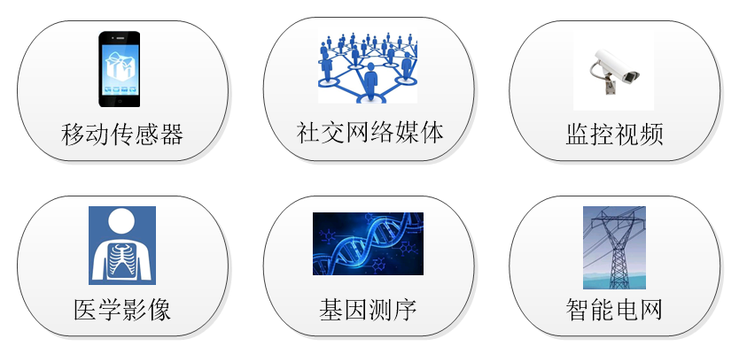
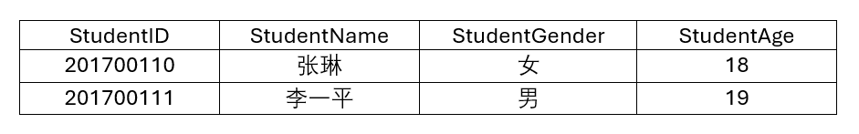
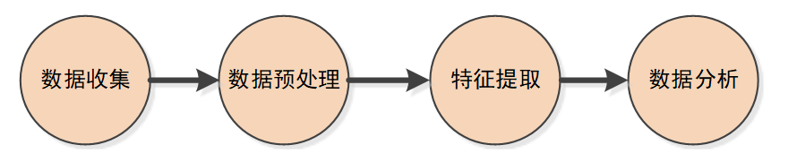

<!-- _class: lead -->
## 人工智能与大数据

---

## **大数据**

>数据正在以越来越快的速度不断增。随着数据化运营所带来的利好日益明显，越来越多的机构开始重视海量数据背后蕴藏的无限"财富"，包括中国、美国等许多国家都将数据资源的开发提高到了战略的高度，纷纷出台大数据战略。由此，数据产业在近年来得到了迅速的发展。

---

## **大数据**

>这些不断增长的庞大数据中包含着各种丰富的信息，使得从大数据中提取有价值信息的研究成为了一件非常有趣的工作。例如，可以通过收集一个人的日常数据，来预测他的喜好或者他下一步要做什么（你最直接的感受可能是：当在网上购买了某件用品之后，这个网址接着就会向你推荐类似的其它商品）。

---

## **大数据**

>数据的大容量和动态性为改变商业、政府、科学和人们的日常生活带来了可能，但对这些庞大数据的存储和管理不是一件很容易的事情，而要从海量数据中提取有价值的信息，需要各种数据分析技术，更是一件非常具有挑战的工作。

---

### **什么是大数据？**

>数据科学家维克托·迈尔-舍恩伯格（Viktor Mayer-Schönberger）在他编写的《大数据时代》中指出：大数据（Big Data）是那些在小规模数据基础上无法完成而只有在大规模数据基础上才能够做到的事情。

+ 你希望假期乘飞机出去度假旅行，按照一般的概念，你认为越早订票，票价会越便宜，所以你在确定好度假计划后第一时间就订了机票。但上飞机后，你突然发现左右邻座的机票都比你买的机票价格低，是不是顿时就会有一种不舒服的感觉？

---

### **什么是大数据？**

>知名的人工智能研究人员奥伦·埃齐奥尼（Oren Etzioni）也碰到了类似的事情，为此他开始研究利用数据来预测飞机票的价格变化趋势。他收集了近十万亿条价格记录来预测美国国内航班的票价，预测准确度达到75％，从而使利用这个预测系统购买机票的旅客，平均每张机票节省了50美元。

+ 这个例子想说明的是：大数据并不是一个完全确切的概念。研究大数据的原因是因为要处理的数据越来越多，超出了一般个人计算机所具有的内存容量，从而不得不研究一些新的数据处理技术，如谷歌（Google）的MapReduce和开源Hadoop平台。这些技术使我们能够处理的数据量大大增加。

---

### **什么是大数据？**

>全球最著名的管理咨询公司麦肯锡（McKinsey&Company）对大数据的定义是：大数据是具有大规模、分布式、多样性和或时效性的数据。一般来讲，大数据应具有如下显著特征：

+ 数据体量巨大（Volume）。大数据的数据量远不止成千上万行，而是动辄几十亿行，数百万列。其起始计量单位提出是PB（Petabyte，1PB=1024TB）、EB（Exabyte，1EB=1024PB）、甚或ZB（Zettabyte，1ZB=1024EB）、YB（Yottabyte，1YB=1024ZB）。

---

### **什么是大数据？**

+ 数据类型繁多（Variety）。数据的来源多样，数据类型和结构复杂（Complexity），涉及各种各样数据源、数据格式和数据结构。如网络日志、音频、视频、图片、地理位置信息等。多种不同类型的数据对数据的处理能力提出了更高的要求。

+ 价值密度低（Value）。大数据的第三个特征是数据价值密度相对较低，或者说是浪里淘沙却又弥足珍贵。随着互联网以及物联网的广泛应用，信息感知无处不在，信息海量，但价值密度较低，如何结合业务逻辑并通过强大的机器算法来挖掘数据价值，是大数据时代最需要解决的问题。

---

### **什么是大数据？**

+ 新数据的创建和增长速度快（Velocity）。大数据的第4个特征是数据增长速度和处理速度快，时效性要求高。比如搜索引擎要求几分钟前的新闻能够被用户查询到，个性化推荐算法尽可能要求实时完成推荐。

这就是大数据的所谓4V（Volume，Variety，Value，Velocity）特征。研究大数据的目的是为了从这些海量数据中发掘出有价值的信息（如从大量机票售价记录中发掘票价变化走势）。

---

### **数据的组织形式**

>如今，能够产生大数据的源头很多。比如我们每天使用的手机（你的位置信息、上网信息、在微信等社交网站上发的贴等）、满布城市各个角落的监控视频、医学影像、人类基因测序等。



---

**1. 结构化数据**

结构化数据是指有固定格式和有限长度的数据，以行为单位，一行表示一个实体（一个具体的对象），每一行数据都有相同的属性。例如我们经常填的表格就是结构化数据。所以，结构化数据是由二维表结构来表达和实现的数据，它严格遵循数据格式与长度规范，主要通过关系型数据库进行存储和管理。



---

**2. 非结构化数据**

顾名思义，非结构化数据就是没有固定结构的数据，没有预定义的数据模型，难以用二维逻辑表来表示。现在越来越多的数据是非结构化数据。例如网页，有时候非常长，有时候又非常短，长度和格式都不固定。各种文本文件、图片、视频、音频等都属于非结构化数据。随着网络技术的发展，未来80%-90%的增长数据会属于非结构化数据类型。

非结构化数据的管理总体上可以包括文件管理、特定的数据库管理（如NoSQL数据库）[^3]、通过索引来查找的搜索引擎管理。对非结构化数据，通常需要先进行一定的清理、整合、分类、索引等策略来提高数据管理效率和准确性。

---

**3. 半结构化的数据**

半结构化数据是结构化数据的一种形式，它不符合如二维表格或关系数据库形式关联起来的数据模型结构，但包含相关标记（如XML），可以用来分隔语义元素以及对记录和字段进行分层。因此，它也被称为自描述的半结构化数据。

---

**3. 半结构化的数据**

半结构化数据可以用树或图的数据结构存储。例如在以下的xml文件中，\<person\>标签是树的根节点，\<stuid\>、\<name\>、\<age\>和\<gender\>标签是子节点。通过这样的数据格式，可以自由地表达很多有用的信息，包括自我描述信息。所以，半结构化数据具有很好的扩展性。

```html
<person>
  <stuid>20</stuid>
  <name>A</name>
  <age>13</age>
  <gender>female</gender>
</person>
```

---

**3. 半结构化的数据**

虽然从结构上可以将数据分为这三种类型，但不断增长的大部分数据都可以说是混合类型。例如我们上网时产生的鼠标点击流数据，既包含有非结构化的原始日志（LOG），也有如浏览器的类型信息等取值有一定规律的结构化数据；又如某个典型的二维表格中可能存储有XML格式的文件等。

 
目前，对结构化数据的存储、分析技术已非常成熟。但大数据的增长越来越非结构化，对这类数据的分析还需要不同的技术来应对。

---

### **数据分析的生命周期**

大量的数据，如果仅仅"存着"是没有什么意义的，只有想办法将这些数据"用"起来，数据才变得有价值。那么，数据怎么样才能对人有用呢？举个例子：世界各地的证券交易所中，每天都会产生大量的股票交易数据。这些交易数据经过整理，以图的形式（交易曲线）显示出来，为关心股票行情的人提供各类股票涨跌的信息。对绝大多数人来讲，看这些曲线只是了解一下各种股票的变化情况。但对一个数据科学家，他可能会更关注如何从大量的交易信息中发掘出某种规律，从而去判断（预测）股票未来的涨落。从信息中提取出的规律，可以称为知识。有了这些知识，就可以将其用于实战了。例如，通过对大量历史交易数据的分析，就可能预测出股票未来的涨跌趋势，这样就可以赚钱了。

---

**数据分析**

从这个例子中可以看出，要让数据变的有用，首先需要尽可能收集到更多的数据（试想只看到一次股票交易数据，如何能判断其下一次是涨还是跌？）；然后，对收集到的结构化或非结构化数据要进行整理；再利用各种方法从中提取出潜在的知识。



---

**1. 数据收集与存储**

收集数据并不是一件很容易的事情。在许多IT企业中，数据是集中存放在业务性数据库中并有专人管理。进行数据分析首先需要获得访问这些数据的权限，同时，为了不影响生产业务，数据分析往往需要将数据从业务性数据库中提取出来，进行加工整理，再导入到分析性数据库（数据仓库）。这个过程称为ETL（Extract、Transform、Load）。

---

**1. 数据收集与存储**

在有些情况下，数据可能并没有现成存在，需要用专门的技术进行采集和存储。收集数据的方法一般有两种。一种方法是利用各种工具从网上爬取。这类从网上爬取数据的工具称为**网络爬虫**。它是一种按照一定规则、自动抓取万维网信息的程序。例如我们熟悉的搜索引擎就是这样一种程序。搜索引擎首先从网上抓取大量的信息下载到它自己的数据中心，并对数据进行一定的组织和处理。然后再根据你给出的搜索查询，按一定的顺序将查询结果反馈给你。

---

**1. 数据收集与存储**

另一种收集数据的方法是推送。有很多种传感设备可以记录数据并将收集到的数据推送的数据中心。例如电子手环，可以将记录的你每天跑步的数据、心跳数据、睡眠数据等都上传到它自己的数据中心；你每天在各个网站上浏览的网页信息也都存放在网站的日志数据库中。

数据正在变得越来越重要，购物网站能够知道你想买什么就是因为它有你的历史交易数据。这也就是为什么要研究数据管理的原因。

---

**2. 数据预处理**

数据分析领域中的数据预处理也称为数据清洗和整理。虽然数据是一笔巨大的财富，但无论是通过网络爬取还是各种传感设备推送的数据都称为原始数据。原始数据大多杂乱无章，且来自多个不同的数据源。如：不同的历史数据、不同的模式和不同的格式约定等。要对这些数据进行分析以挖掘出有价值的信息，首先需要将这些数据整理成一个单一、一致、高质量的数据集。

---

**2. 数据预处理**

考虑一个由各种医院、诊所和药店组成的医疗机构，患者的各类信息由多个系统存储，包括人口统计数据、实验室数据、索赔数据和药房数据等。医生、护士和药剂师等在输人各自的数据时不能保证数据一致且没有人为错误。事实上，由于可能存在的简单的数据输入错误，使各种基准值，包括实验室结果、血压、体重指数等，都不再具有有效的临床价值。这样的"脏数据"将会极大影响数据分析的有效性。因此，必须要在数据分析之前花费一定时间来探索数据的质量，并应用各种技术清洗和规范其输入数据集。

---

**3. 特征提取**

数据分析的目的是从大量数据中发掘出有价值的知识，并为未来的决策提供支撑。换句话讲，就是基于对已发生的历史数据的分析，去预测正在进行的同类事件未来可能的结果。这些工作需要借助各种分析模型和算法。所有的模型或算法都需要输入数据，为了确保分析结果的有效性，必须考虑输入的数据具有哪些特征以及这些特征是否与分析或预测的结果（输出）存在关联性，亦即需要选择出最适合任务的变量或数据特征。有时这些特征已经存在于数据集中；有时需要通过组合多个现有特征来创建或设计出新的特征。

---

**3. 特征提取**

例如，某移动通信运营商准备建立客户流失模型。该运营商的数据库中已收集有过去6个月内所有客户呼叫的完整日志数据，数据集中包含客户编号、客户使用该平台的起始日期、当前使用的移动设备、月平均通信时长、付款计划和邮政编码等信息变量。这些变量可以作为客户流失预测模型的输入特征，也可以从中派生出一些复杂特征，或者对这些变量进行一些复杂计算产生新特征。例如可以从这些原始变量中提取出"最后一个月的电话呼出次数"待征或"某客户通话规律"特征等。

从数据中寻找特征的工作称为特征工程，通常会涉及到统计学、信息理论、可视化和文本分析等各种技术，是数据科学中最困难和最重要的任务之一。提取哪些特征以及提取多少特征，核心原则就是这些特征会使你构建的特定模型预测效果最好。

---

**4. 数据挖掘与数据分析**

从数据中发现各种知识的技术有个专门的名词，叫做**数据挖掘**（Data Mining），它和数据分析有很多相似之处，只是研究的侧重点和实现手法有一些区分。

（1）相比于数据挖掘，数据分析更针对的是体量巨大的数据。因此，分析时不可能用单台机器完成而是需要多台计算机同时运算，也就是所谓的分布式运算。

（2）数据挖掘一般通过自己编写程序来实现，而数据分析更多的是借助现有的分析工具进行。

---

**4. 数据挖掘与数据分析**

（3）数据分析要求对所从事的行业有比较深的了解和理解，并且能够将数据与自身的业务紧密结合起来；而数据挖掘不需要有太多的行业专业知识。

（4）数据挖掘更多注重于技术（算法）层面的结合以及数学和计算机的集合，数据分析需要结合统计学、营销学、心理学以及金融、政治等方面进行综合分析。

---

**4. 数据挖掘与数据分析**

数据挖掘和数据分析都是从数据中提取有价值的知识，它们的界限正在变得越来越模糊，很多数据分析人员开始使用编程工具进行数据分析，而数据挖掘人员在结果表达及分析方面也会借助数据分析的手段。事实上，数据挖掘是大数据分析的理论基础，所采用的算法模型都很类似。上述这些区别的主要根源就是大数据分析的体量和多样性。大数据分析主要需解决的是海量数据在多台机器上的分布式存储和并行处理，其基本原理还是数据挖掘技术。考虑到本书并不是大数据分析的专业教材，以下将不再对这两个名词做区分描述，而统一称为数据分析。

---

**4. 数据挖掘与数据分析**

Google首席经济学家Hal Varian曾说过，数据是广泛可用的，所缺乏的是从中提取出知识的能力。数据收集和整理的根本目的是为从海量数据中提取出有价值信息奠定基础。已有很多学者对从数据中提取知识的方法进行研究，研究出了各种有效的数据分析算法。沃尔玛超市从大量用户购买行为数据中，发现男性顾客在购买尿布时常常会同时购买啤酒。由此他们调整了柜台的摆放，将啤酒和尿布的柜台放置在相邻位置，从而提升了这两种产品的销售量。从大量购物数据中发掘出这两种看上去完全无关的货物之间所存在的相互关系的方法，就是数据挖掘技术中非常经典的关联分析。

---

**4. 数据挖掘与数据分析**

无论是数据挖掘还是数据分析，核心就是模型构建。这里的模型是一种泛指，一个模型是对现实的一种抽象。构建模型是人们通过一组规则和条件来模仿所观察到的真实场景中发生的事件行为。这些规则和条件通常分为若干类技术，例如关联分析、分类、聚类、回归等。

数据分析的核心工作就是选择一种或一系列适合于特定研究的候选基础模型或分析技术，将其应用于获取的数据集，通过训练、测试和验证，构建出针对特定问题的数据分析模型，并将分析结果以可视化形式展示给用户。

---

### **人工智能拥抱大数据**

一个神经网络的设计除了结构（如：隐藏层的层数，每个隐藏层包含的神经元个数）设计之外，还需要对神经网络中的各种参数（如：神经元之间的连接权重，激活函数系数等）进行学习优化（调参），也就是模型训练。参数调整的工作量复杂且非常庞大，需要的计算量会随着网络节点和输入数据的规模变得非常巨大，如果在个人计算机上进行模型训练，可能做一轮训练就需要花费几天时间，甚至在可接受的时间内无法完成。特别是对隐藏层超过3层的深度神经网络更是如此。这就需要用到大数据平台了。大数据平台可以汇聚多台机器的力量一起来计算，以实现在有限时间内得到想要的结果。

---

**1. 大数据需要云计算**

>微型计算机是我们日常接触最多，事实上也可能是惟一使用的通用计算设备，它完全能够满足一般的数据处理、数据分析。例如对一个年级的学生的网络在线课程学习行为分析、一个小型选课系统的管理等。但是，当处理的数据量达到一定量级时（如PB、EB等），一台个人计算机或服务器就完全不能满足要求，这个时候就用到云计算了。

大数据的体量巨大，为了实现对大量数据的处理，有一种方法当然是自己拥有足够多的计算设备。例如：某公司可以购置1000台计算机做定期财务状况分析。但由于财务状况分析1个月才做一次，这1000台计算机1个月才使用一次，造成很多的浪费。

---

**1. 大数据需要云计算**

>如果能够仅在需要的时候拥有这1000台机器，用完后再还回去，它们就可以去做其他事情了。这不仅可以实现资源的有效利用，还可以省很多钱。这正好就是云计算的特点。

云计算利用虚拟化技术将众多计算设备"包裹"在一起，可以为大数据的处理提供灵活的资源，同时也可以将大数据平台（如Hadoop）部署在"云"上。现在主要的公有云平台上基本都有大数据解决方案。对上述需要定期做财务状况分析的公司，不需要再购买1000台机器，只要到公有云上选择一下，就可以调用1000台已经部署好大数据分析平台的机器，公司只需要把待分析的数据放进去运算就可以了。由此，大数据和云计算就自然而然地联系在了一起。

---

**2. 人工智能需要大数据**

人工智能的发展和应用高度依赖于大数据。没有大量数据的支持，人工智能的许多应用都将受到限制和制约，特别是当前迅速发展的生成式人工智能技术，更是需要通过对大量数据的学习和训练，才能使模型够自动捕捉数据中的规律和特征，从而生成与输入数据相似或全新的数据。如AlphaGo，lphaFold和ChatGPT等这些我们耳熟能详的产品，都表现出了较强的内容生成能力（即"无中生有"能力）。

---

**2. 人工智能需要大数据**

AlphaGo利用数百万人类围棋专家的棋谱，经过对大量围棋对弈数据进行训练，实现根据当前落子局势，从已有落子的学习中合成一个策略，以更好应对当前落子；AlphaFold从蛋白质的基因序列和其三维空间结构的配对数据中进行学习，可以实现按照给定的基因序列输入，合成一个刻画生命功能的蛋白质三维结构；ChatGPT是一个复杂的神经网络大语言模型（Large Language Model，LLM），按照"共生则关联"的原理，挖掘出句子中单词间的共生概率知识，以机器智能实现统计关联下的语言合成，推动了人工智能由识人辨物和预测决策等向内容合成跃升，即人工智能内容合成。

---

**2. 人工智能需要大数据**

训练数据集大小和训练参数数量是衡量模型的性能和训练效果的关键指标。著名的**大语言模型ChatGPT4的**训练基于一个包含13万亿个token（token代表了一种基本单元或标识符，在LLM中，1个token可以是一个单词、字母、数字、标点符号等）的庞大数据集，涵盖互联网上的大量网页、书籍、新闻报道等多种类型的数据。**使用了1.8万亿个训练参数。**

---

**3. 大数据、云技术、人工智能**


人工智能可以做的事情很多。如：垃圾邮件鉴别，黄色暴力文字和图片鉴别，机器翻译，语音识别与合成等。不同的应用可以有不同的算法，但无论哪种算法，实现人工智能要依赖大量数据，如果没有数据，就算有人工智能算法也无能为力。

大量的数据需要存储和处理，这就用到了云技术。对积累了大量数据的大数据公司，需要利用人工智能算法来提供服务。而人工智能算法既需要大量的数据，也需要存储了大量数据的云计算平台来完成模型的训练。这样，云计算、大数据、人工智能就整合在了一起，彼此相关、相互依存。而无论是数据的采集、存储、或分析处理，都离不了计算系统。
