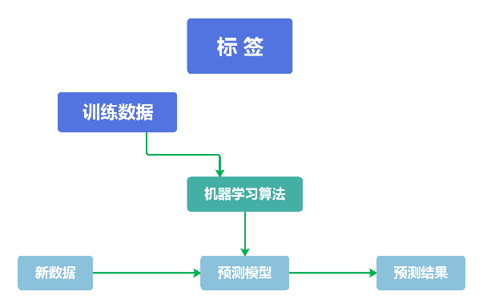
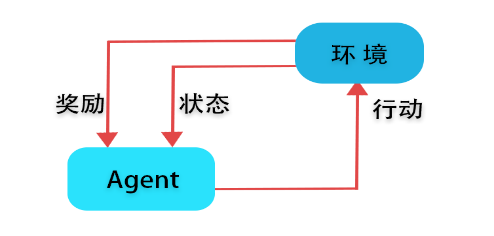
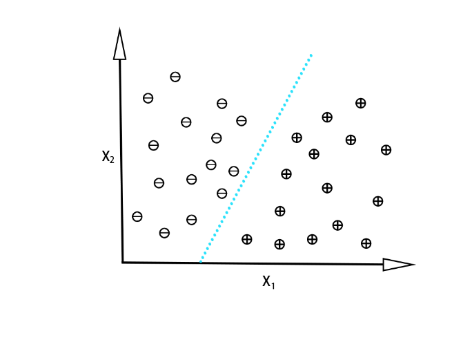
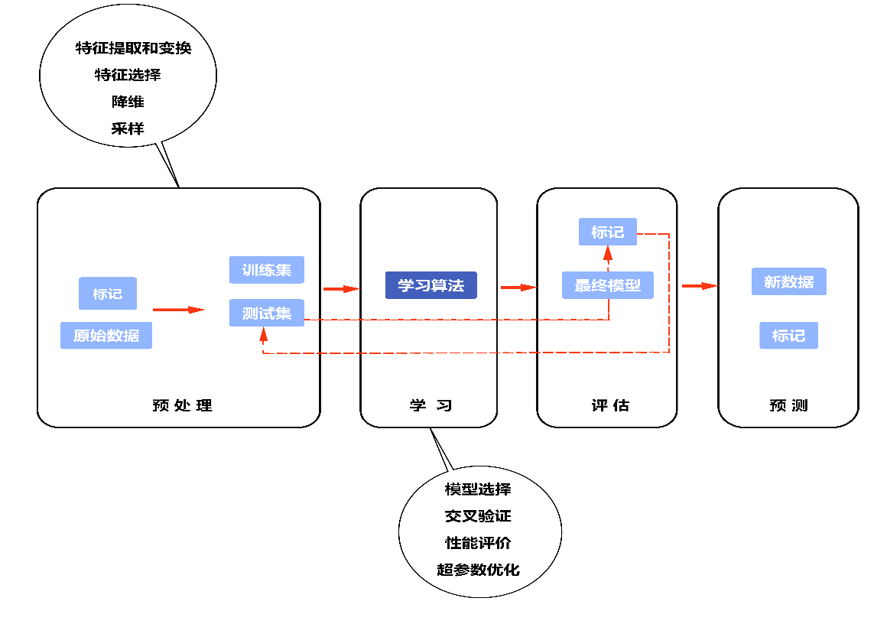

<!-- _class: lead -->
## 概述

---

### **机器学习的三种类型**

>机器学习旨在为现实世界中的应用找到数据模式。人工可以从小数据集中发现模式，但机器学习会在大型复杂数据集中发现数据模式。
+ 本节我们将简单讲述机器学习的三种类型：*监督学习、无监督学习和强化学习*。

---

### **有监督学习**

+ 有监督学习：有监督学习使用带有*标记*（label）的数据来训练模型。在模型的训练过程中，事先为每个数据样本（通常称为训练数据）提供相关的输出（通常称为标签或响应）。
+ 监督学习的主要目标是学习一个训练数据和相应的标签之间的关联规则。也就是说用一组已知结果的数据来训练模型，再训练过程中其反馈是直接的。模型建立之后，我们使用该模型来预测一个未知结果的数据。

---

---

### **有监督学习**

+ 有监督学习的主要目标是从标记的训练数据中学习一个模型，使能够对看不见的或未来的数据进行预测。
+ 在这里，术语"监督"是指一组训练示例（数据输入），其中所需的输出信号（标签）是已知的。图7-1总结了一个典型的监督学习工作流程，其中标记的训练数据被传递给机器学习算法，以拟合一个预测模型，该模型可以对新的、未标记的数据输入进行预测。

---

### **强化学习**

+ 在强化学习算法中，经过训练的Agent与特定环境进行交互。Agent的工作是与环境交互，一旦被观察到，它就会对该环境的当前状态采取行动。
+ 强化学习是一个决策的过程。它使用奖励机制（系统）来学习，其目标是学习一系列的行为。强化学习受行为心理学启发，其原理是执行有用操作会获得奖励，执行不利操作则会受到惩罚。
+ 举一个人类的例子，当孩子在成绩单上取得好成绩时，他们通常会得到奖励，但表现不佳有时会导致惩罚，从而强化了取得好成绩的行为。

---

### **强化学习**

>强化学习对于探索计算机程序或机器人如何与动态环境交互很有用。一个例子是负责开门的机器人，它在开门失败时受到惩罚，在开门成功时受到奖励。随着时间的推移，经过多次尝试，机器人"学习"了开门所需的一系列动作。

---

### **无监督学习**

>无监督学习与监督学习方法相反，在学习或训练的过程中，不需要任何预先标记的训练数据。

+ 在这种方法中，机器学习模型或算法试图在没有任何监督的情况下从给定的原始数据中学习模式和关系。
+ 虽然这些模型的结果存在很多不确定性，但我们也可以获得很多有用的信息，比如数据中的各种未知模式、对分类有用的特征等等。
+ 使用没有标记的数据，因此也就没有学习和反馈。无监督学习用于发现数据之间的内在联系和隐藏的关系（结构）。

---

### **无监督学习**

>在监督学习中，训练模型时事先知道正确的答案；在强化学习中，为代理执行的特定操作定义奖励度量。然而，在无监督学习中，需要处理未标记的数据或未知结构的数据。

+ 使用无监督学习技术，能够探索我们的数据结构以提取有意义的信息，而无需已知结果变量或奖励函数的指导。
+ *聚类*是一种探索性数据分析技术，它允许我们将一堆信息组织成有意义的子集（集群），而无需事先了解它们的成员身份（或类别）。在分析过程中出现的每个聚类定义了一组具有一定相似性但与其他聚类中的对象更不相似的对象，这就是聚类有时也称为无监督分类的原因。

---

### **无监督学习**

>聚类是结构化信息和从数据中获取有意义的关系的一种很好的技术。例如，它允许营销人员根据他们的兴趣发现客户群，以便开发不同的营销计划。

---

### **无监督学习**

+ 无监督学习的另一个子领域是降维。我们会经常处理高维度数据，因为每个观察都伴随着大量的测量，这对有限的存储空间和机器学习算法的计算性能提出了挑战。
+ 无监督降维是特征预处理中常用的一种方法，用于从数据中去除噪声，同时提高某些算法的预测性能，但其将数据压缩到更小的维度子空间，同时保留大部分相关信息。有时，降维也可用于可视化数据，例如可以将高维特征集投影到一维、二维或三维特征空间，以便通过2D或3D散点图或直方图对其进行可视化。

---

### **分类和回归问题**

>分类和回归问题是监督学习中最基本也是最重要的2个问题。
+ 分类问题的目标是根据过去的观察数据，预测新实例的分类类别标签。这些类标签是离散的、无序的值，就是实例的类别。
+ 例如垃圾邮件检测可以是一个二值分类任务，分类器通过学习一组规则将邮件分为2类：垃圾邮件和非垃圾邮件。

---

### **分类问题**

给定了30个训练样本，15个训练样例被标记为负类（减号），15个训练样例被标记为正类（加号）。可以使用有监督的机器学习算法来学习一个规则，用虚线表示的决策边界可以将这两个类分开，并根据x1和x2值将新数据分类为这两个类别中的某一个。

---

### **分类问题**

+ 分类算法当然也可以是多类别的。多类分类任务的一个典型例子是英文字母的手写识别。我们可以收集一个训练数据集，其中包含字母表中每个字母的多个手写示例。每个字母（"A"、"B"、"C"等）将代表我们想要预测的不同的类别标签。
+ 现在，如果用户输入一个新的手写字符，我们的预测模型将能够以一定的准确度预测该字母是哪一个字母。但是，如果最初的训练集里没有包含数字手写的训练数据，那么该机器学习系统将无法正确识别0到9之间的任何数字。

---

### **回归问题**

>回归问题是机器学习中的一个重要概念，它主要用于预测一个连续的数值型变量。回归分析的目标是建立一个数学模型，该模型能够根据给定的输入特征（自变量）来预测一个连续的目标变量（因变量）。
+ 例如，根据房屋的面积、房间数量、房龄等特征来预测房屋的价格，这里房屋价格就是连续的目标变量，而面积、房间数量、房龄等则是输入特征。通过分析大量的历史数据，找到这些特征与目标变量之间的关系，从而对新的、未知的数据进行预测。

---

### **线性回归**

>线性回归是最基本的回归算法之一。它假设目标变量与输入特征之间存在线性关系，通过最小化预测值与实际值之间的均方误差来确定模型的参数。

`y=beta_0 + beta_1*x`，其中y是目标变量，x是输入特征，beta_0和beta_1是待估计的参数。

---

### **多项式回归**

>多项式回归是线性回归的扩展，它允许模型拟合输入特征的多项式函数，从而能够处理更复杂的非线性关系。例如，二次多项式回归模型可以表示为

`y=beta_0 + beta_1*x + beta_2*x`

回归问题在各个领域都有着广泛的应用，通过建立准确的回归模型，可以帮助人们更好地理解数据之间的关系，并对未来的趋势进行预测和决策。

---

### 
**机器学习的一般过程**

---

### **数据的预处理**

>原始数据很少能够直接用于学习算法，通常需要对数据进行处理以满足学习算法的要求（如格式和性能）。

+ 数据的预处理是任何机器学习应用程序中最关键的步骤之一。为了确定机器学习算法是否不仅在训练数据集上表现良好，而且对新数据的泛化能力也很好，我们将数据集随机划分为单独的训练和测试数据集。
+ 使用训练数据集来训练和优化机器学习模型，同时将测试数据集保留到最后以评估最终模型。

---

### **通过学习算法训练模型**

>目前已经开发了许多不同的机器学习算法来解决不同的问题。但是每种分类算法都有其固有的缺陷，如果不对任务做出任何假设，任何单一的分类模型都不会有优势。

+ 因此，在实践中，必须至少比较几种不同的算法，以便训练和选择性能最佳的模型。但在比较不同的模型之前，首先必须决定一个衡量性能的指标。
+ 最后，也不能期望软件库提供的不同学习算法的默认参数对于特定问题任务是最优的。因此，将频繁使用超参数优化技术来帮助微调模型的性能。

---

### **对模型进行评估**

>经过学习或训练，得到了一个最终的拟合模型之后，就使用测试数据集来估计或评价该模型的表现，从而估计所谓的泛化误差。如果对其性能感到满意，就可以使用该模型来预测新的数据。
+ 需要注意的是，前面提到的特征参数，例如特征缩放和降维，此前应用于训练数据集的变换，应该重新应用相同的参数来转换测试数据集以及任何新的数据实例。否则，根据测试数据预测的结果可能会有较大的偏差。

### **对新数据进行预测**
