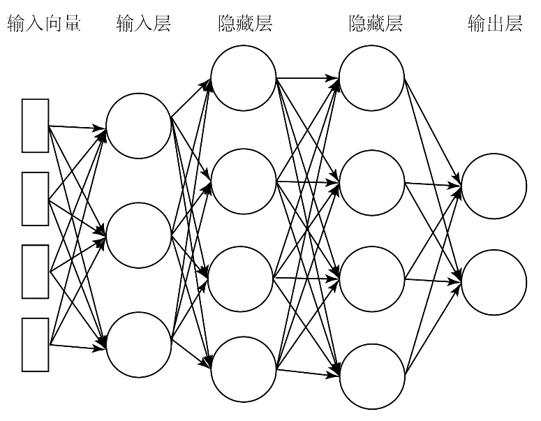

<!-- _class: lead -->
## 人工神经网络概述

---
### **ANN**

>**人工神经网络（Artificial neural networks，ANNs）** 是机器学习工具包中的强大工具，以多种方式用于完成图像识别、自然语言处理和智能游戏等应用。

+ ANN的学习方式与其他机器学习算法类似：通过使用训练数据。它们最适合用于难以理解特征之间如何相互关联的非结构化数据。
+ *深度学习*是在不同架构中使用人工神经网络来实现目标的算法。
+ 包括人工神经网络在内的深度学习可用于解决监督学习、无监督学习和强化学习问题。

---

### **ANN**

>人工神经网络受到自然现象的启发，就是我们的大脑和神经系统。

+ 神经系统是一种生物结构，可以让我们感受周围环境，是我们大脑运作的基础。
+ 我们整个身体都有神经，大脑中的神经元也有类似的行为。神经网络由相互连接的神经元组成，这些神经元通过使用电和化学信号传递信息。
+ 神经元将信息传递给其他神经元并调整信息以完成特定功能。

---

### **ANN**

+ 当你拿起杯子喝一口水时，数以百万计的神经元会处理你想做的事情的意图，完成它的物理动作，以及确定你是否成功的反馈。
+ 想想小孩子学习用杯子喝水。他们通常一开始很难完成，抓不住杯子。然后他们学会用两只手抓住它。渐渐地，他们学会了单手拿起杯子喝一口，没有任何问题。这个过程需要几个月的时间。
+ 此时的情况就是，他们的大脑和神经系统正在通过练习或训练来学习。

---

### **ANN**

+ *神经网络的输入层只接受数字*。因此，所有输入数据都必须转换为数字才可以输入。+ 文本、语音、图片都要转换为数字。
+ 神经网络将数字作为*向量、矩阵或张量*。这些可以看作和数组中维数相对应的名称。*向量*是一维数组，例如数字列表。*矩阵*是一个二维数组，就像黑白图像中的像素一样。
+ *张量*是任何三个或更多维度的数组，例如，一堆矩阵，其中每个矩阵都具有相同的维度。

---

### **ANN**

>而深度学习网络（深度仅仅意味着神经网络在输入层和输出层之间有一层或多层隐藏层）通过深入研究隐藏层，能够获得更高的准确度。深度神经网络可以表示为可视化的有向图。

+ 根节点是输入层，终端节点是输出层。
+ 输入和输出之间的层称为隐藏层或深度层。
+ 一个四层的DNN架构看起来像这样：

---

### **ANN**

一个DNN的示意图。输入向量含有4个分量（特征），输入层3个节点，2个隐藏层每个4个节点，输出层2个节点。

---

### **ANN**

+ 首先，假设每一层中的每个神经网络节点，除了输出层，都是相同类型的神经网络节点。
+ 还将假设每一层的每个节点都连接到下一层的每个其他节点。称为**全连接神经网络(fully connected neural network，FCNN)**。
+ 例如，如果输入层有三个节点，下一层（隐藏）层有四个节点，那么第一层的每个节点都连接到下一层的所有四个节点，也就是总共有12个连接（3×4）。
+ 深度神经网络和卷积神经网络被称为**前馈神经网络**。前馈意味着数据在一个方向上顺序地从输入层通过网络移动到输出层。

---

### **ANN**

+ *输入形状和输入层容易引起混淆*，它们不是同一件事。更具体地说，输入层中的节点数不需要与输入向量的形状相匹配。
+ 这是因为输入向量中的每个元素都会被传递到输入层中的每个节点。
+ 例如，如果输入层是10个节点，同时使用13元素作为输入向量，那么输入向量和输入层之间将有130个连接(10×13)。
+ 输入向量中的一个元素和输入层中的一个节点之间的每个连接都有一个**权重**（weight，本书通常用w表示权重），输入层中的每个节点都有一个**偏置**（bias，本书通常用b表示偏置）。

---

### **ANN**

+ 将输入向量和输入层之间的每个连接以及层之间的连接视为向前发送一个信号，表明它认为输入值对模型预测的贡献程度。
+ 我们需要测量这个信号的强度，这就是权重的作用。它是一个与输入值相乘的系数层，以及后续层的先前值。
+ 现在，这些连接中的每一个都像x-y平面上的一个向量。理想情况下，我们希望这些向量中的每一个都在同一中心点（例如，0原点）穿过y轴。但实际并非如此，所以使用偏置来达到这个目的。
+ 偏置是每个向量相对于y轴中心点的偏移量。权重和偏置是神经网络在训练期间"学习"的内容。
+ **权重和偏置也称为参数**。这些值在训练后保留在模型中。

---

### **ANN**

假设输入层有10个节点，并将一个13元素向量（13个特征）作为输入，该向量连接到10个节点的第二层（隐藏层），然后连接到一个节点的第三层（输出层）。输出层只需要一个节点，因为它将输出一个实际值（例如，房屋的预测价格）。此时，将使用神经网络作为回归器，这意味着神经网络将输出单个实数。对于输入层和隐藏层，一般而言可以选择任意数量的节点。拥有的节点越多，神经网络的学习效果就越好。但是更多的节点意味着更高的复杂性，更多的训练和预测时间。

