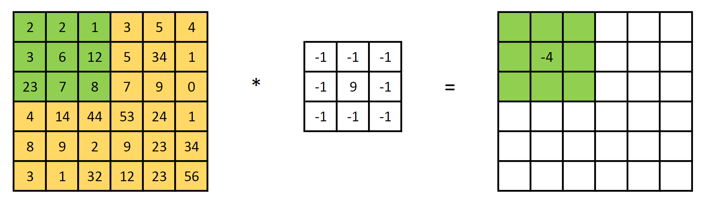
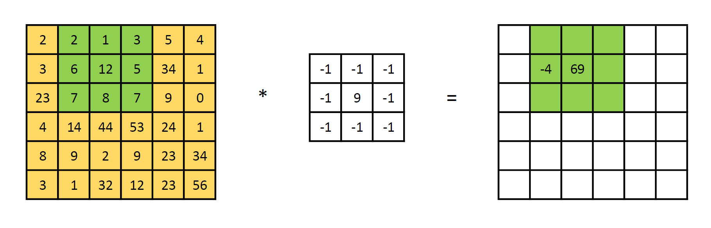
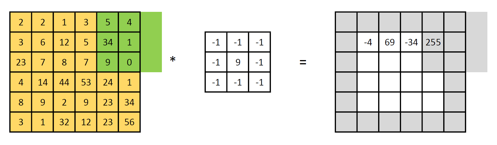
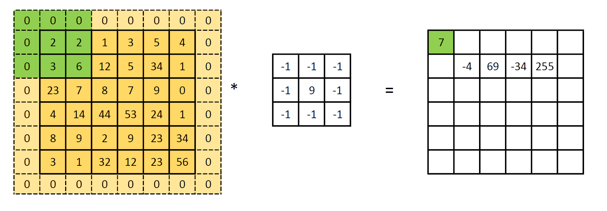
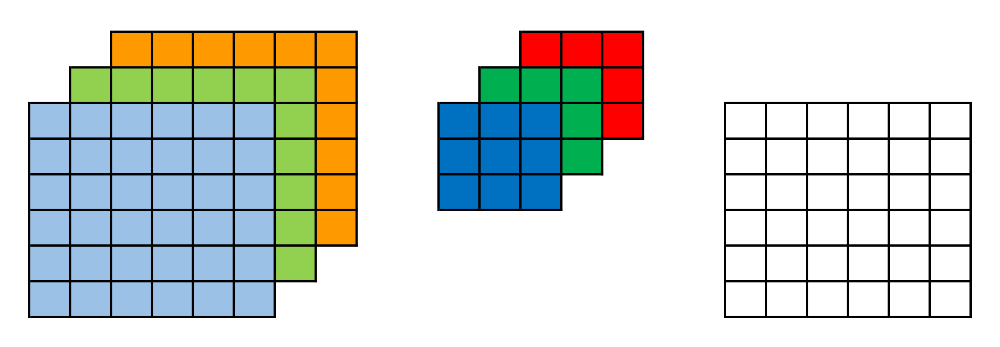
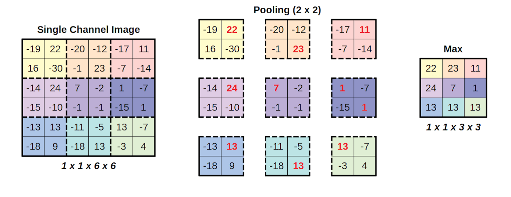
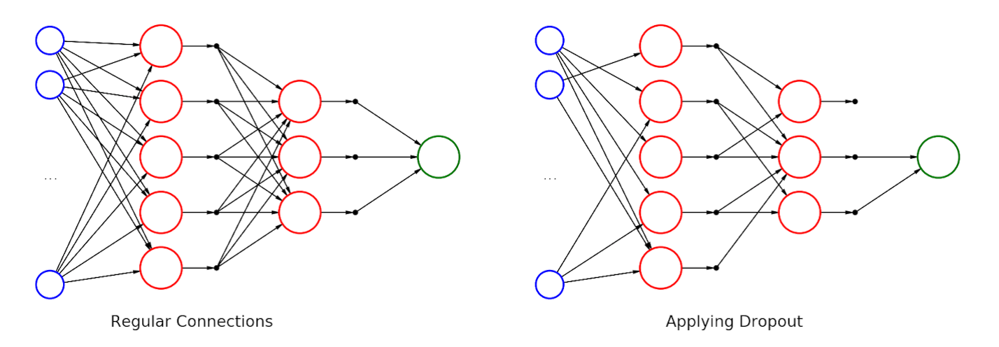

<!-- _class: lead -->
## 卷积神经网络（CNN）

---
### **概述**
### 虽然98%已经达到了一个不错的结果，但仍然有近200张图像没有被正确识别。可以做的再好吗？
### 我们注意到在输入的时候，我们扁平化了图像，这使得图像像素之间的二维关系丢失，为此我们可以使用*卷积神经网络（Convolutional Neural Network，CNN）*。

---

### **卷积**

+ 卷积是"对两个函数(f和g)的数学运算，产生第三个函数(f*g)，表示其中一个函数的形状如何被另一个修改"。
+ 在图像处理中，卷积矩阵也称为卷积核或滤波器。典型的图像处理操作，如模糊、锐化、边缘检测等，都是通过在核函数和图像之间进行卷积来完成的。
+ 在计算机视觉领域，卷积核、滤波器通常为较小尺寸的矩阵，比如3×3、5×5等，数字图像是相对较大尺寸的2维（多维）矩阵（张量）。

---

### **卷积的计算**

+ 将卷积核放置在图像的某个像素点上，并将卷积核中心点与该像素点重合。将卷积核中的每个数值与对应的像素值相乘，再将所有结果相加，得到一个新的像素值。
+ 将卷积核向下或向右移动一个像素，重复上述步骤，直到卷积核遍历完整个图像。将所有新的像素值组成一个新的图像，即为卷积后的图像

---

### **卷积的计算**



---

### **卷积的计算**



---

### **卷积的计算**
在边缘的位置，由于缺少计算数据，是无法计算卷积的。因此，图中6\*6的矩阵核3\*3的卷积核运算之后的矩阵是4\*4的



---

### **卷积的计算**

+ 此外，在上面的计算中，每次向右滑动了一步，*称为步长为1*（stride=1）。也可以选取不同的步长，如2或3。然而不同的步长也会影响最后矩阵的形状尺寸。对于上图，当步长为2时只够移动1次，所以最后计算出的矩阵是2\*2的。

+ 如果希望计算出的矩阵和原来的大小一致该怎么做？也就是说不想改变图像的尺寸。这时*可以填充矩阵（padding）*。
+ 最简单的，可以在矩阵的外围增加1圈0，对矩阵进行扩充后再进行卷积

---

### **填充（padding）**



---

### **填充（padding）**

+ 而填充的方式也是有多种的，并不是简单的填充为0。首先*可以选择填充的行数或列数*，也就是可以填充多行多列。
+ 其次除了填充0之外还*可以拷贝边缘的数据到填充处，或是镜像复制数据*。具体的请参见PyTorch的文档。

---

### **填充（padding）的计算**

+ 现在假设图像的高为h，宽为w，卷积核是正方形大小是f，填充按四边同样大小填充，填充大小为p，卷积步长为s，则图像卷积之后的大小按如下公式计算（式中(h+2\*p-f)/s的结果如果不是整数，则需要向下取整）：

$$ (h,w)*f = (\frac{h + 2*p - f}{s} + 1, \frac{w + 2*p - f}{s} + 1) $$

---

### **多通道卷积**

+ 以上是1个通道的图像的卷积（灰度图）。如果图形具有多个通道，例如彩色图通常由3个通道，那么在这上面卷积就是一个多通道的卷积。
+ 多通道卷积主要需要注意的是1个3通道的图像和一个3\*3\*3的卷积核卷积后，结果是单通道的，不是3通道的！
+ 如图7-25所示，每个通道和对应的卷积核进行卷积，之后会将3个卷积结果相加得到1个通到的数据。因此，如果需要多通道的结果，需要提供更多组的卷积核。

---

### **多通道卷积**



---

### **PyTorch的卷积函数和卷积层**

+ PyTorch提供了卷积函数，`torch.nn.functional.conv2d`：
```python
    import torch
    import torch.nn.functional as F
    kernel = torch.randn(8, 4, 3, 3)
    inputs = torch.randn(1, 4, 5, 5)
    convolved = F.conv2d(inputs, kernel, stride=1)
```

---

### **PyTorch的卷积函数和卷积层**

+ 该函数的第一个参数是输入的图像，第二个是卷积核，步长默认为1。输入的图像和卷积核*必须是一个4维的张量*，和上一节的一致，即NCHW格式的4维张量。
+ 对于卷积核，第一个维度指输出维度，第2个是输入维度（这个维度默认一般应该和图像的通道数相同）最后2位是卷积核的大小。例子中使用8个4\*3\*3的卷积核输出了1个含有8个通道的3\*3的图像（1，8，3，3）。

---

### **填充函数**
```python
    padded = F.pad(image, pad=(1, 1, 1, 1), mode='constant', value=0)
```
+ 第一个参数是要填充的图像，第二个人是要填充的位置和大小，4个位置依次是左右上下，第三的参数是填充方式，可以是常数，可以复制，循环等方式。

---

### **卷积层**

```python
    conv = nn.Conv2d(in_channels=1, out_channels=1, kernel_size=3, stride=1)
```
+ 4个参数的含义在上面已经表述清楚了。输入通道数，需要和输入的图像一致，输出通道数根据需要决定，卷积核大小和步长。还有一个可选的参数是padding，默认是0。
+ 但是它和函数的卷积完全不一样！函数的卷积是给出图像和卷积核，然后计算卷积得到新的图像，这个过程和传统的图像处理是一致的。
+ 而卷积层的卷积核并不是指定数值的，*它是用来学习的*。也就是说系统会*随机的初始化一个卷积核*，然后根据损失以及梯度下降来学习和调整卷积核的参数，就如同我们前面的线性模型里的那些参数一样。

---

### **池化（pooling）和抛弃（dropout）**

+ 有时图像过大对导致计算量巨大，此时我们需要缩小图像。前面已经看到使用卷积，特别是步长大于1的卷积可以缩小图像。除此此外，缩小图像还可以*使用池化*。
+ 池化将图像分割成小块，对每个块执行操作(生成单个值)，并将块组合在一起作为结果图像

---

### **池化**



---

### **池化**

+ 图中执行的是*最大池化*，就是在每个子块中取最大值作为这个子块的值。子块的大小是2*2。如果不指定步长，则步长的大小默认和块的大小是一致的，即步长是2。
+ 除此之外，另外一个常用的就是平均池化，也就是取块的平均值。

---

### **池化**

PyTorch对应的函数和层是：
```python
    pooled = F.max_pool2d(conv_padded, kernel_size=2)
    # 层一样也得到一个层的实例， 然后作用于图像
    maxpool4 = nn.MaxPool2d(kernel_size=4)
    pooled4 = maxpool4(conv_padded)
```
池化并不需要训练，所以池化层和池化函数的计算结果是一样的。

---

### **抛弃（Dropout）**

+ 对于计算量的降低还有一个手段，就是抛弃（Dropout）。然而，Dropout更重要的是*防止过拟合*。
+ 过拟合就是模型对训练数据表现的很好，而在实际应用中却不太好。导致这个情况的原因简单的说，就是如果不加以控制，一个模型会试图找到"简单的出路"来实现目标。这意味着它可能最终依赖于少数特征，因为这些特征在训练集中被发现和目标更相关。
+ 但这种更相关，也许他们是的，也许不是，也许知识训练数据的统计特性。所以，为了使模型更加健壮，一些特性被随机地否定它。从而迫使模型必须以不同的方式实现目标。

---

### **抛弃（Dropout）**

+ 它使训练更加困难，但它应该*导致更好的泛化*。也就是是模型更加通用。也就是说，在处理未知数据(如验证集中的数据点)时，模型应该表现得更好。对于PyTorch，需要一个Dropout层，只需要指定一个抛弃概率即可。
```python
nn.Dropout(p=0.5)
```

---

### **抛弃（Dropout）**



