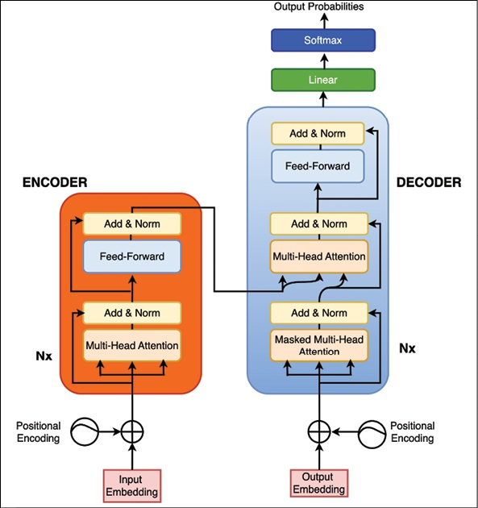
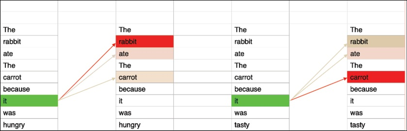

<!-- _class: lead -->
## Transformers

---

### **从序列到序列** 

> 到此为止，本书已经讲述了很多AI方面，尤其是机器学习方面的知识。作为一门大学计算机的基础课，已经足够多了。但对于AI，这只是一个简单的开始。在第7章的结束，本书介绍了RNN网络，用来处理序列问题。我们只是讲述了一个序列分类的问题，也就是*通过RNN将一个序列编码为了一个隐藏状态*，最后利用这个编码的结果来分类。还有另一类更复杂的问题，*从序列产生序列*。

+ 序列到序列问题比我们在前面处理的问题要复杂得多。现在有两个序列：源和目标。我们用前者来预测后者，它们甚至可能有不同的长度。一个序列序列问题的典型例子是*机器翻译*。一个句子输入单元，另一个句子输出出来。这个问题可以用编码解码体系结构来解决。

---

### **编码解码体系**

+ 编码解码器包含2个模型，*编码模型和解码模型*。编码器的目标是生成一个源序列的表示,即编码源序列。这其实就是RNN所做的，RNN处理输入序列，*最终生成了一个隐藏的状态，这个状态就是输入序列的表示*。解码器的目标是从初始表示生成目标序列，也就是说解码它。而这个初始表示，则正是编码器生成的最终表示。
+ 解码器同样使用RNN来解码。在第一步中，*初始隐藏状态是编码器的最终隐藏*。第一个循环将输出一个新的隐藏状态。这*既是这个单元的输出，也是下一个单元格的输入之一*。同时这个单元的隐藏输出经过一个线性层的转换，即成为预测序列的第一个输出。该输出和隐藏状态同时作为下一次的输入输入到RNN中产生第二个预测序列值，直到所有的预测序列值产生。

---

### **Transforms 结构**

> 在上面的编码解码模型中，解码器只是使用了编码器的最后一个输出来解码，也就是产生预测序列。实际上，编码器在编码的过程中，每一步编码都产生了一个隐藏状态。如果这些隐藏状态都能够对后边的解码提供帮助，无疑会做的更好。

因此，在每次解码得到隐藏状态后，不是直接将这个隐藏值经过线性变换后得到输出而是用这个隐藏值对编码过程中的所有产生的隐藏值计算相关度，并将计算结果形成一个所谓的上下文向量。这个向量和本次计算出的隐藏向量连接起来在经过线性变换后才是本次的预测输出。这就是著名的*Attention机制*。

---

### **Attention机制**

>这里有一个激进的想法:如果我们用Attention机制替换RNN会怎么样？这就是Vaswani,A.等人著名的"Attention Is All You Need"论文的主要主张。它引入了基于自注意力机制（self-Attention）的Transformers架构，该架构很快完全主导了NLP领域。

---

### **Transforms 结构**

+ Transformer采用了编码器-解码器的架构，图左边为编码器，右边为解码器。编码器负责将输入序列编码成一个连续的向量表示，解码器则根据编码器的输出以及之前生成的输出序列来生成下一个输出。
---

### **Transforms 结构**

+ 编码器由多个相同的编码器层堆叠而成，在图中以Nx表示，N代表堆叠层数。每个编码器层都有两个主要子层，分别是自注意力子层和前馈神经网络子层。在这两个子层之间还有残差连接和层归一化操作，图中的Add&Norm层。
+ 解码器也由多个相同的解码器层堆叠而成。每个解码器层有三个主要子层，分别是掩码自注意力子层、编码器-解码器注意力子层和前馈神经网络子层。在掩码自注意力子层部分，输入经过嵌入层和*位置编码*后进入掩码自注意力模块，这里的*掩码操作是为了防止在生成当前位置时看到未来位置的信息*。

---

### **Transforms 结构**

+ 输入序列首先通过一个嵌入层（Input Embedding），将每个单词转换为一个低维向量表示，然后再加上位置编码。位置编码是为了让模型能够捕捉到单词在序列中的位置信息，因为Transformer本身不具有对序列顺序的内在感知能力。
+ 解码器的最后一个输出经过一个线性变换和softmax函数，得到输出序列中每个位置上的*单词概率分布*，从而生成最终的输出。
+ Transformer能够*并行计算*，大大提高了训练和推理的速度。它不像循环神经网络（RNN）或长短期记忆网络（LSTM）那样需要顺序地处理每个时间步，而是可以同时处理整个序列。

---

### **Self-Attention**

+ 自注意力机制是Transformer的核心组成部分，它可以让模型在处理一个位置的信息时，同时考虑到输入序列中其他位置的信息，从而自适应地计算每个位置的表示。简单来说，就是计算当前位置与其他位置之间的关联程度，给不同位置赋予不同的权重。

下面举一个简单的例子。假设有下面2个句子：

> Rabbit ate the carrot because it was hungry.Rabbit ate the carrot
> because it was tasty.

---

### **Self-Attention**

>在第一个句子中，当处理"it"这个单词时，模型会给"兔子"赋予比其他单词更高的权重；而在第二个句子中，模型会给"美味的"赋予更高的权重。

---
### **Self-Attention**

在实际的计算中，对于输入序列中的每个位置，首先将其通过三个不同的线性变换，得到查询向量（Q）、键向量（K）和值向量（V）。然后进行如下的计算：

---
### **Self-Attention**

- 注意力分数计算：计算每个位置的查询向量与其他位置的键向量的点积，然后通过一个缩放因子（通常是键向量维度的平方根的倒数）进行缩放，得到注意力分数。这个分数表示了当前位置与其他位置之间的相关性。

- 权重计算：将注意力分数通过softmax函数进行归一化，得到每个位置的权重。这些权重表示了当前位置在计算表示时应该对其他位置赋予的重要程度。

- 输出计算：将权重与对应位置的值向量进行加权求和，得到当前位置的自注意力输出。

---

### **Transforms 结构**

+ Transformer架构既是革命性的，也是颠覆性的。BERT和GPT模型放弃了循环网络层，用self-attention代替。Transformer模型的表现优于rnn和cnn。
+ Attention head可以在单独的gpu上运行，打开了十亿参数模型和万亿参数模型的大门。
+ OpenAI在拥有10,000个gpu和285,000个CPU内核的超级计算机上训练了一个1750亿参数的GPT-3 Transformer模型。
+ 因此，Transformer为参数驱动人工智能的新时代铺平了道路。学习理解数以亿计的单词如何组合成句子需要大量的参数。

---

### **Transformer家族**

**1. 编码器-解码器构架**

+ 最初的Transformer论文采用了一种复杂的架构，称为编码器-解码器架构。也被称为序列到序列模型，它*同时使用编码器和解码器*。
+ 从序列到序列的最典型任务就是机器翻译。在Transformers之前，机器翻译领域的最佳成果是由循环神经网络（RNN）取得的，比如长短期记忆网络（LSTM）和门控循环单元（GRU）。采用了Transformer和自注意力机制后，机器翻译便展现出了更好的效果，同时表明其在扩展性和训练方面要容易得多。卓越的性能、稳定的训练以及易于扩展等重要因素，正是Transformer能够迅速兴起并应用于多种任务的原因。

---

**2. 仅编码器架构**

+ 编码器模型专门用于从文本序列中获取丰富的表示，可用于诸如分类等任务，或者为大量可在检索系统中使用的文档准备语义嵌入。最著名的Transformer编码器模型可能是BERT。BERT是 Bidirectional Encoder Representations from Transformers的缩写，即基于变换器的双向编码器表征。它是谷歌在 2018年发布的一种预训练语言模型。BERT模型的创新性在于它能够通过双向训练方式，基于大规模文本数据学习到文本的深层次语义表示，打破了以往语言模型单向训练的局限。这使得BERT在众多自然语言处理任务上，如文本分类、命名实体识别、问答系统等，都取得了显著的性能提升。例如在文本分类任务中，对于判断一段影评是正面还是负面评价，BERT可以更准确地理解影评中的语义，从而给出更精准的分类结果。

---

**3. 仅解码器架构**

+ 它仅使用Transformer架构中的解码器层。文本生成是仅解码器模型最常见的应用领域，包括生成文章、故事、对话等。例如，OpenAI的GPT系列模型在文本生成任务上表现出色，能够生成连贯、有逻辑的自然语言文本。

+ 仅解码器模型常被用于语言模型预训练，通过在大规模文本数据上学习预测下一个词元的任务，模型可以学习到语言的语法、语义和上下文信息。预训练的语言模型可以作为初始化模型，在各种下游自然语言处理任务中进行微调，以提高模型在这些任务上的性能。

---

## **迁移学习**

>对于诸如电影评论分类这样的任务，传统方法受限于标记数据的可用性。一个模型会在大量标记示例的语料库上从头开始训练，尝试直接从输入文本中预测标签，也就是监督学习。然而，它有一个显著的缺点：它*需要大量标记数据才能有效地进行训练*。这是一个问题，因为标记数据既昂贵又耗时。在许多领域甚至可能根本没有可用的数据。

---

## **迁移学习**

+ 为了满足对大量标记数据的需求，研究人员开始寻找一种方法，在现有数据上对模型进行预训练，然后针对特定任务进行微调（或调整）。这种方法被称为**迁移学习**，它是许多领域（如自然语言处理和计算机视觉）中现代机器学习的基础。
+ 自然语言处理的早期工作侧重于为语言模型预训练阶段寻找特定领域的语料库，但像ULMFiT这样的论文表明，即使在诸如维基百科这样的通用文本上进行预训练，当模型在下游任务（如情感分析或问答）上进行微调时，也能产生令人满意的结果。这为Transformer的兴起奠定了基础，事实证明Transformer非常适合学习丰富的语言表示。

---

## **迁移学习**

+ 预训练的思路是在一个大型无标记数据集上训练一个模型，然后将其微调至一个新的目标任务，而对于这个目标任务，所需的标记数据要少得多。
>在应用于自然语言处理之前，迁移学习在构成现代计算机视觉支柱的卷积神经网络中已经取得了成功。在这种情况下，首先在分类任务中使用大量标记图像训练一个大型模型。通过这个过程，模型学习到可以在不同但相关的问题上利用的通用特征。例如，我们可以在数千个类别上对模型进行预训练，然后对其进行微调，以分类一张图片是否是热狗的图片。

---

## **迁移学习**

+ 有了Transformer，通过自监督预训练（使用无标签数据进行训练），事情又向前推进了一步。我们可以在大量无标签文本数据上对模型进行预训练。
+ 给定一个文本语料库，我们可以在一个序列之后*屏蔽词元*，并训练模型学会预测这些词元。就像在计算机视觉的情况一样，预训练为模型提供了基础文本的有意义表示。
+ 然后，可以对模型进行微调，以执行另一项任务，比如以推文风格或特定领域（例如，公司的聊天内容）生成文本。鉴于模型已经学习到了语言的一种表示，微调所需的数据比从头开始训练要少得多。
