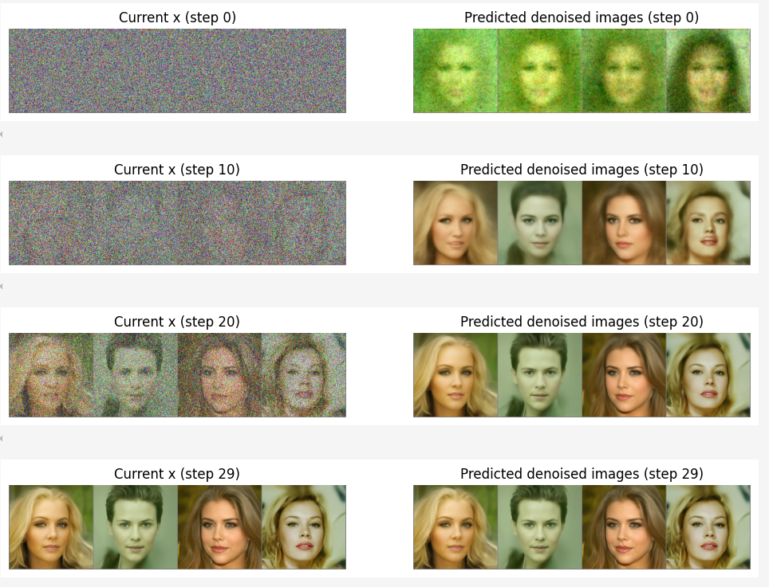

<!-- _class: lead -->
## 图像和音频生成

---

### **GPU和CUDA**

+ **GPU（Graphic Process Unit，图形处理单元）**：是一种专门为处理图形数据和执行并行计算而设计的处理器。它具有大量的核心和高速的内存带宽，能够同时处理多个计算任务，特别适合处理具有高度并行性的数据，如在图像和视频处理、深度学习等领域。

+ **CUDA（Compute Unified Device Architecture，统一计算设备架构）**：是英伟达公司推出的一种并行计算平台和编程模型，包含了CUDA指令集架构以及GPU内部的并行计算引擎。开发人员可以使用C、C++等语言来为CUDA架构编写程序，让程序在支持CUDA的英伟达GPU上以超高性能运行，大大提高计算效率。

---

### **GPU和CUDA**

+ 大模型生成图片涉及大量矩阵运算和数据处理，GPU的并行计算能力可同时处理众多任务，大幅缩短生成时间。同时，生成高分辨率图像需大量计算资源，GPU能提供足够计算能力和显存，保证图像细节与质量。其并行处理能力可在合理时间内完成复杂视觉效果和风格迁移计算，提供丰富创作选项。

+ CUDA为开发人员提供了一种便捷的方式来利用GPU的强大计算能力。通过CUDA，开发人员可以将大模型中的计算任务并行化，将其分配到GPU的多个核心上同时执行，从而大大提高模型的训练和推理速度，进而加速图片的生成过程。以下是系统安装CUDA和cuDNN的方法（以Windows系统为例）：

---

### **GPU和CUDA**

**安装前准备：**

- 确认硬件支持：确保计算机配备NVIDIA GPU，且该GPU支持CUDA。在Windows系统中，打开命令提示符（CMD），输入`"nvidia -smi"`命令可查看GPU型号及驱动版本。

- 选择合适的版本：CUDA和cuDNN的版本需相互兼容，且与操作系统、GPU型号以及使用的深度学习框架相匹配。可通过NVIDIA官方网站查询支持的CUDA版本，再根据深度学习框架选择合适的版本。

---

### **GPU和CUDA**

**安装CUDA和cuDNN**

- 下载CUDA安装包：访问NVIDIA官方网站的CUDA Toolkit下载页面，选择适合操作系统和GPU型号的CUDA版本，通常是exe文件。
- 安装CUDA：双击安装包，按提示进行安装。
- 验证CUDA安装：打开命令提示符（CMD），输入"nvcc -V"，若返回版本信息，说明CUDA安装正确。

- 访问NVIDIA cuDNN下载页面，下载cuDNN的安装程序，运行安装即可。

---

### **潜空间表示**

>本节我们来讨论图像、视频或文本任务的*高效数据*表示。为什么高效的表示很重要呢？我们希望在保留数据本质特征的同时，减少需要存储和处理的信息量。

+ 像ZIP或JPEG这样的传统压缩方法专注于特定的数据类型，并使用手工设计的算法来减小文件大小。然而，这些传统方法不会从它们所压缩的数据中学习，并且除了减小大小之外，无法自动适应不同类型的内容，也不能针对特定任务进行优化。而这些缺点，可以通过机器学习模型来解决。

---

### **潜空间表示**

+ *自动编码器*是一类机器学习模型，由一个"压缩"数据的编码器和一个重建数据的解码器组成。编码器学习它需要关注的数据的基本特征，解码器能够逆转这些变换。
+ 这种训练方法是一种无需依赖手工设计算法就能自动构建压缩器的方式。压缩信息（即使是以有损的方式）本身就很有用，但一旦拥有了紧凑的数据集表示，还能做一些其他有趣的事情。

---

### **潜空间表示**

+ 如果系统经过正确训练，并且解码器能够从压缩表示中恢复原始数据，这意味着所学的表示已经捕获了基本信息。因此，对表示进行操作等同于对原始数据进行操作，*但所需的内存和计算量要少得多*。这是像稳定扩散（Stable Diffusion）这类模型的关键设计方面之一。在后续章节，我们可以生成和处理大图像，但大部分计算发生在表示所在的较小的潜在空间中。

---

### **潜空间表示**

+ 可以拆分编码器和解码器，并将编码器用作特征提取组件。在编码器的输出之上添加一个小型网络，能够针对不同的任务（如文本或图像分类）来训练模型。这些小型网络*不是对整个输入图像进行操作，而是对编码器获得的基本特征进行操作*。

---

### **潜空间表示**

+ 下面将使用图像数据来展示自动编码器和变分自动编码器的工作原理，但这些技术不仅限于图像，还可以应用于任何数据。
+ 自动编码器（AutoEncoder）是一种无监督学习的神经网络模型，主要由编码器和解码器两部分组成，其工作原理如下：

---

### **潜空间表示**

**编码过程：**
编码器的作用是将输入数据压缩成一个低维的表示，这个过程也被称为特征提取。它会学习输入数据的内在结构和特征，将原始数据映射到一个潜在空间中。例如，对于一幅图像，编码器会自动识别图像中的边缘、颜色、纹理等基本特征，并将这些特征用一个低维向量来表示。在这个过程中，编码器通过一系列的线性或非线性变换，将高维的输入数据逐步压缩成低维的编码向量。

---

### **潜空间表示**

**解码过程：**解码器的任务是根据编码器生成的低维编码向量，尝试重建出原始的输入数据。它是编码器的逆过程，通过学习将低维编码向量映射回原始数据空间。例如，对于前面编码后的图像向量，解码器会根据这个向量尝试恢复出原始的图像。它会通过一系列的反变换，将低维向量逐步扩展成与原始输入数据相同维度的输出。

---

### **潜空间表示**

**训练过程：**自动编码器的训练目标是最小化重建误差，即让解码器输出的结果尽可能接近原始输入数据。在训练过程中，通过不断调整编码器和解码器的参数，使得重建误差逐渐减小。例如，使用均方误差（MSE）作为损失函数，计算原始输入与重建输出之间的差异，并通过反向传播算法来更新神经网络的权重，使得损失函数的值不断降低。通过大量的数据训练，自动编码器能够学习到数据的有效表示，使得编码器提取的特征能够包含足够的信息，让解码器准确地重建出原始数据。通过这种方式，自动编码器能够学习到数据的高效表示，在保留数据本质特征的同时实现数据的压缩和重建，并且可以将编码器作为特征提取器用于其他任务，如分类、聚类等。

### **变分自动编码器**

> 在上一小节，实现了一个简单的自动编码器如何在低维潜在空间中学习输入数据的高效表示。自动编码器能够如实地对任何样本进行编码，并在之后对其进行恢复（或解码）。这对于特征提取或数据表示来说效果很好，但有时*并不太适合生成新的样本*。

+ 原因在于自动编码器没有能力将表示分离到潜在空间中一致的部分。在潜在空间中，相似输入的表示通常聚集在彼此附近，但也存在大量的重叠和空白区域，分配给每个类别的潜在空间数量上也存在很大的差异。如果在潜在空间中选择一个随机点，并将其输入解码器，无法如实地预测会得到什么结果。

---

### **变分自动编码器**

+ 变分自动编码器（Variational AutoEncoders，VAEs）通过学习潜在空间中每个特征的概率分布来解决这个问题。变分自动编码器不是将输入映射到特定的点，而是用高斯分布来表示每个特征，以此捕捉数据中该特征的可变性。

---

### **变分自动编码器**

+ 例如，一个由多种犬类和猫类图像组成的数据集。我们不知道编码器会提取出哪些特征，但可以想象，有些特征可能会用来表示诸如毛茸茸的斑块、眼睛、耳朵、腿或尾巴等特征。这些特征在数据集中的所有图像中可能会有很大程度的重叠（所有这些动物都有两只耳朵、四条腿和一条尾巴），但狗的耳朵和猫的耳朵在外观上也存在差异。"耳朵"这个特征可以用一个高斯分布来表示，这个分布涵盖了所有这些可变性，分布的均值代表了动物耳朵的平均形状。如果朝着不同的方向偏离均值，将会得到一个朝着各种可能出现在不同品种中的耳朵形状的连续且均匀的过渡。

---

### **变分自动编码器**

+ 使用这种方法，能够创建了一个更具结构化的潜在空间，从这些分布中进行采样使能够生成新的、合理的实例。与自动编码器一样，类别信息通常在变分自动编码器中也不被使用。现在看看如何对变分自动编码器进行编码和训练。

---

### **变分自动编码器**

+ 变分自动编码器（VAE）的编码器与上一节中的基本编码器非常相似。在上一节，使用了几个卷积层和一个全连接层（线性层）来投影到所需大小的潜在空间上。此处将使用相同的架构，唯一的区别在于不是使用一个线性层来预测图像的潜在空间，而是使用线性层来学习概率分布。一个概率分布由两个参数来表征，即均值和方差，所以需要两个线性层：一个线性层学习分布的均值。一个线性层学习分布的方差。

---

### **diffusion模型生成图像**

+ 扩散模型的核心概念是，它们接收带有噪声的模糊图像，并学习对这些图像进行去噪处理，输出清晰的图像。
+ 变分自编码器（VAEs）或生成对抗网络（GANs），通过模型的单次前向传播生成最终输出。这意味着模型必须在第一次尝试时就把所有事情都做对。如果它犯了错误，就无法回头去修正。
+ 扩散模型通过许多步骤的迭代来生成输出。这种迭代细化使模型能够纠正前一步中的错误，并逐步改进输出。

---

### **diffusion模型生成图像**

+ 加载ddpm-celebahq-256模型，这是最早共享的用于图像生成的扩散模型之一。该模型使用CelebA-HQ数据集进行训练，这是当时流行的高质量名人图像数据集，因此它生成的图像看起来就像是来自该数据集。我们将使用这个模型从噪声中生成一张图像

---

### **diffusion模型生成图像**

生成过程进行了1000步。必须经过1000次细化步骤（和前向传播）才能得到最终的图像。与生成对抗网络（GANs）相比，这是普通扩散模型的主要缺点之一，它们需要很多步骤才能生成高质量的图像，这使得模型在推理时速度较慢。

---

### **diffusion模型生成图像**

+ 可以逐步重新创建这个采样过程，以便更好地理解其内部发生的情况。在扩散过程开始时，用四张随机图像初始化样本x（换句话说，采样一些随机噪声）。我们将运行30步，逐步对输入图像去噪，最终得到来自真实分布的样本：

---

### **diffusion模型生成图像**

---

### **diffusion模型生成图像**

+ 可以看到给定步骤的输入（从随机噪声开始）。在右侧看到模型对最终图像的预测。第一行的结果并不是特别好。在给定的扩散步骤中，*不是直接跳到最终预测的图像*，而是仅朝着预测的方向对输入x（显示在左侧）进行少量修改。然后将这个新的、稍好一些的x再次输入模型进行下一步，希望能得到稍好一些的预测，从而可以进一步更新x，依此类推。经过足够多的步骤，模型可以生成一些逼真的图像。

---

### **生成音频**

- 文本转音频：文本转语音可以扩展为文本转音频（TTA），即基于一个提示，模型可以生成旋律、音效和歌曲。
- 语音克隆：保留一个人的声音，包括语调、音高和韵律，以生成新的声音。
- 音频分类：模型对提供的音频进行分类。典型的例子有命令识别和说话人识别。
- 语音增强：模型从音频中去除噪声，使语音更清晰。
- 音频翻译：模型接收源语言X的音频，并输出目标语言Y的音频。
- 说话人分离：模型识别特定时间的说话人。

---

### **生成音频**

+ 由于多种原因，音频相关任务颇具挑战性。首先，处理原始音频信号比处理文本更为复杂，也不那么直观。对于许多应用而言，音频模型需要实时运行或在设备上运行，这会限制模型的大小和推理速度。例如，如果想将当前的扩散模型用于交互式翻译，其速度会太慢。最后，评估生成式音频模型也颇具难度。如何衡量模型生成的歌曲质量是否良好呢？

---

### **生成音频**

+ 在语音处理与生成领域，如今能够借助丰富多样的工具，以及海量开放获取的模型和数据集，高效完成各类复杂任务。
+ 在数据集方面，由Mozilla基金会推出的"通用语音库"（Common Voice）堪称众包数据集的典范，它汇聚了全球志愿者贡献的超过2000小时音频文件及对应文本，覆盖一百多种语言，为多语言语音研究提供了坚实基础。
+ LibriSpeech、VoxPopuli和GigaSpeech等广受欢迎的音频数据集也备受研究者青睐，它们各自聚焦不同领域，适用于多样化的应用场景。

---

### **生成音频**

+ 在模型层面，有基于英文的Meta的Wav2Vec2、OpenAI的Whisper、微软的SpeechT5，也有颇具创新力的Suno公司开发的Bark模型。
+ 此外，扩散模型在音频生成领域的应用也令人瞩目，例如将Stable Diffusion技术迁移至歌曲生成，还有Dance Diffusion和AudioLDM等，这些模型为音频创作带来了全新思路和无限可能。

---

### **生成音频**

>英文和中文毕竟还是有很大的差别的，国内应用广泛的开源中文语音模型及其特点，简要叙述如下：

**语音识别（ASR）模型**

- DeepSpeech：开发者为百度，基于端到端架构，支持多语言（含中文），提供预训练模型和训练框架。主要应用于实时语音转写、语音助手。

- Wenet：开发者为阿里巴巴达摩院，支持流式和非流式识别，提供中文预训练模型，适配低资源场景。主要应用于智能客服、会议纪要生成。

---

### **生成音频**

- Paraformer：开发者为字节跳动，基于Transformer架构，在中文普通话识别上精度领先，支持标点预测。主要应用于长文本语音识别、视频字幕生成。

**语音合成（TTS）模型**

- Bark：开发者为Suno（国际团队，但社区有中文优化版本）。支持文本到语音和歌声合成，可生成富有情感的中文语音。主要应用场景于有声书制作、短视频配音。

---

### **生成音频**

- VITS：开发者Meta（国际），但国内有大量中文微调版本。端到端语音合成，支持多说话人，中文音色自然度高。主要应用场景于语音助手、广播剧配音。

- Chinese-VITS2：开发者为国内社区。基于VITS2架构，专注中文语音合成，支持自定义音色训练。主要应用场景于游戏语音、虚拟主播。

